# Issue prompts to perform Data Science and Machine Learning tasks

## Introduction

In this lab, you will issue a sequence of prompts to Data Science Agent to perform data science and machine learning tasks. You will run a complete machine learning workflow using natural language, progressing from general questions about the data in the `OMLUSER` schema to model training, model building, evaluation, and scoring.

By the end of this lab, you will see how Data Science Agent supports a novice user in exploring the dataset present in the `OMLUSER` schema and in building and evaluating a machine learning model. You will use natural language to prepare data, generate SQL, create visualizations, train models, interpret model results, and score prospects.

>**Note:** This is an agent-driven workflow. Outputs can vary by model, profile, seed, data state, and previous conversation context. Your generated object names and model results may differ. Use the names shown in your response.

Estimated Time: X

### Objectives

In this lab, you will:
* Set the goal and context for a Data Science Agent conversation
* Explore the `CLIENTS`, `CONTACTS`, `PAST_CAMPAIGNS`, and `PROSPECTS` tables
* Frame subscription likelihood as a machine learning problem
* Create a single modeling table from multiple source tables
* Perform feature validation and prepare a clean modeling view
* Split data into training, validation, and test sets
* Train and evaluate a model to predict subscription likelihood
* Score prospects by using the trained model

### Prerequisites

This lab assumes you have:
* Completed all previous labs
* Access to Data Science Agent
* The `CLIENTS`, `CONTACTS`, `PAST_CAMPAIGNS`, and `PROSPECTS` tables added as Associated Objects
* Access to the `OMLUSER` schema

>**Note:**  The output in this lab are examples. The suffixes, selected algorithm, metrics, row counts, and names of models and views may differ when you run the workshop in your environment. Use the object names generated in your session wherever needed.

## Task 1: Set the conversation goal and context

In this task, continue the `Predict Subscription` conversation you created in Lab 3: Create a Data Science Conversation. Provide enough context for the agent to understand your role, your experience level, and the data you want to explore. This helps the agent tailor its response and explain the machine learning workflow in an accessible way.

1. Open the `Predict Subscription` conversation, and review the tips displayed in the chat interface.

    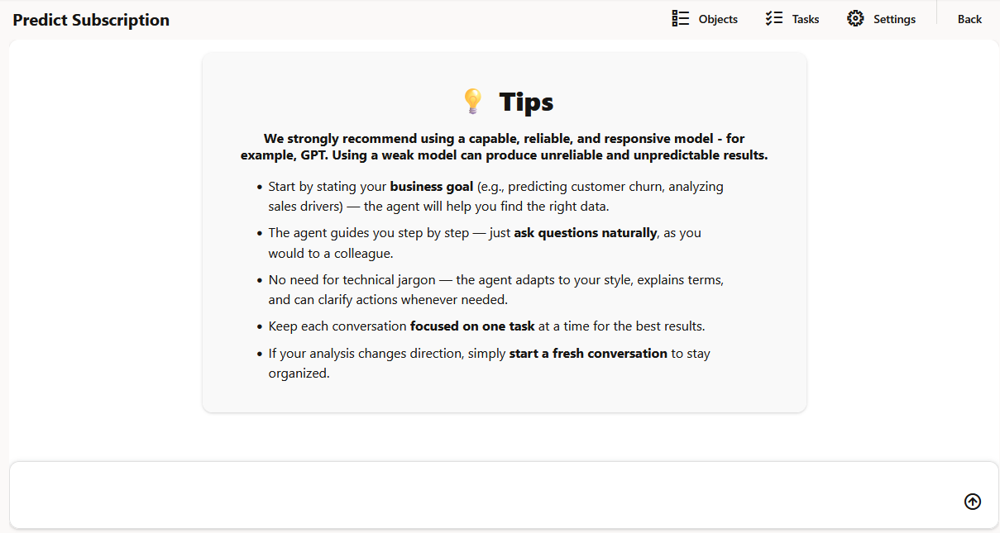

2. Enter the following prompt to set the goal and context for the conversation. This prompt tells Data Science Agent that you are an analyst without a data science background. It asks to explain the data and you can use it to solve a business problem.

    ```text
    <copy>
    I'm an analyst without a data science background. Using our client, contact, past campaign, and prospect data, explain what we have and how it could be used to solve a business problem.
    </copy>
    ```

    In this example, Data Science Agent summarizes the available tables, describes key columns, and explains how the data can be framed as a supervised machine learning problem.

3. Review the summary of the data in each table and the key columns identified by Data Science Agent. Also, review the explanation on how to use this data to solve business problems. 

    Data Science Agent lists the four tables - CLIENTS, CONTACTS, PAST_CAMPAIGNS, and PROSPECTS. It provides a crisp summary of what data the table contains, and how it can be used to understand and solve a business problem.

    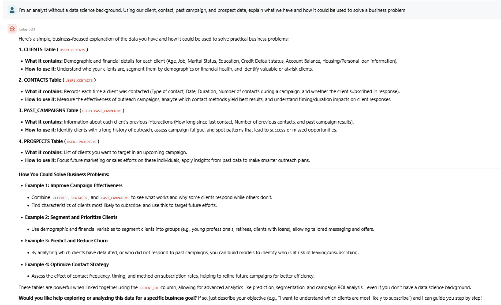

## Task 2: Create a single modeling table

In this task, you will ask Data Science Agent to create a single view to use it to train a model. A single modeling table or view is useful because model training typically requires one row per training example with the target variable and input features in the same dataset.

1. Enter the following prompt to create a single view by joining the CLIENT, CONTACTS, and PAST_CAMPAIGN data for every client who has been contacted.

    ```text
    <copy>
    Create a single view joining the client, contact, and campaign data for every client who has been contacted, so we can use it to train a model. Exclude DURATION_SECONDS and CONTACT_DATE, since we won't have call duration or a contact date for prospects who haven't been reached yet.
    </copy>
    ```

    Here, Data Science Agent creates a view named `DSAGENT$CLIENTS_CONTACTS_CAMPAIGNS_E6B9` by combining client demographics, contact history (excluding call duration and contact date), and past campaign data for every client who has ever been contacted.

2. Review the response. Data Science Agent provides a crisp summary of what is included in the view and how you can use it. 

    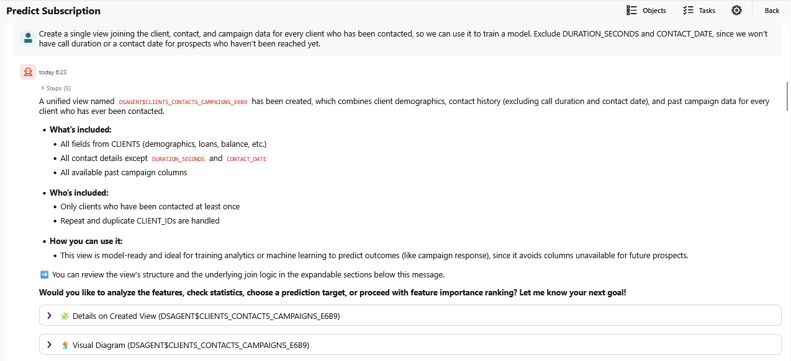

3. Expand the **Details on Created View** section to view the SQL code defining the view.

    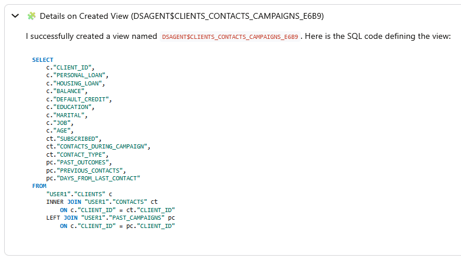

4. Expand the **Visual Diagram** section to view the workflow visual of the view.

    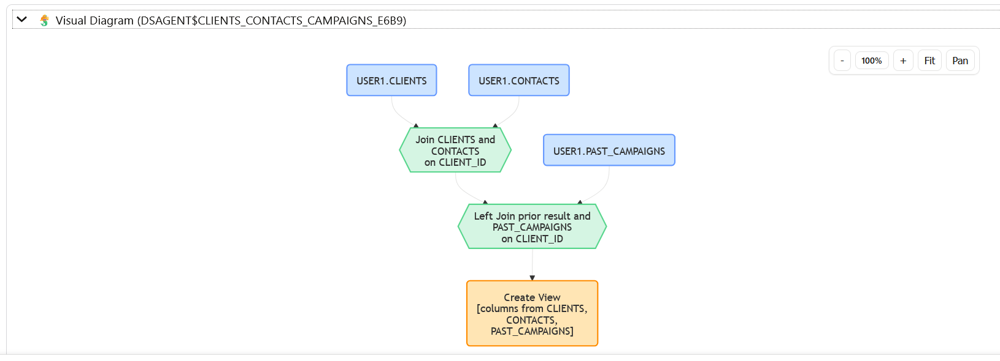

## Task 3: Explore the dataset

In this task, you will ask Data Science Agent to explain the basic statistics for the view `DSAGENT$CLIENTS_CONTACTS_CAMPAIGNS_E6B9`.

1. Enter the following prompt to explore the dataset and understand the basic statistics.

    ```text
    <copy>
    Provide the basic statistics for this data..
    </copy>
    ```

    In response to this prompt, Data Science Agent provides a descriptive summary of the datastet. It describes the dataset in the following categories - Demographics, Financials, Contact & Campaigns, Outcomes, and Missing Values. It is a highly imbalanced client marketing dataset combining demographic, financial, contact-history, and campaign-response features, with substantial missing values in previous campaign information. It is suitable for predicting offer subscription and analyzing factors associated with campaign success.

    [Prompt 3 response showing machine learning problem framing and target variable](images/t3-p1-r1.png "Prompt 3 and response")

2. Expand the **Attribute Analysis** section for a detailed description and analysis of the attributes.

    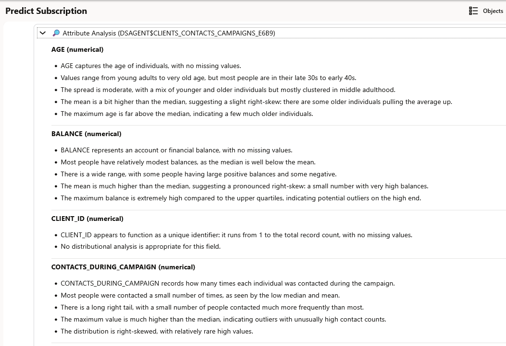

3. Review the **Attribute Statistics** section for a detailed view of the attributes. For each attribute, it shows the data distribution and statistics, along with a statistical visualization - boxplot, bar chart etc as applicable.

    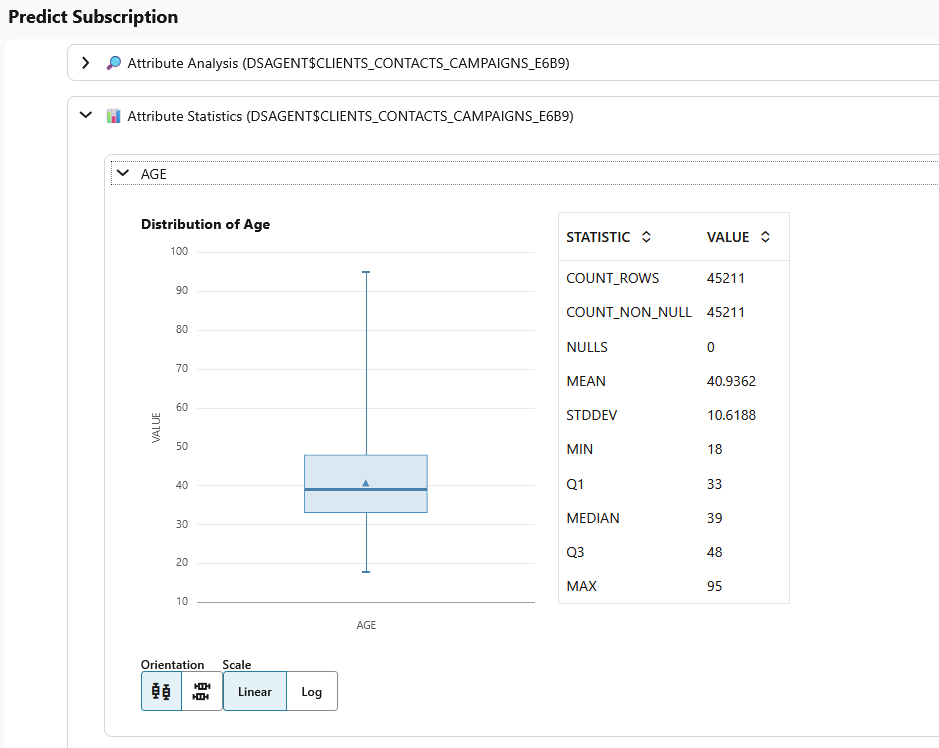

    The agent also asks if you would like to analyze the relationship between these features and a particular outcome,  or proceed to identify the most influential factors for prediction.

## Task 4: Perform predictive modeling

In this task, you will ask Data Science Agent to create a predictive model.

1. Enter the following prompt to ask Data Science Agent to create a predictive model.

    ```text
    <copy>
    Proceed to predictive modeling.
    </copy>
    ```

    In response to this prompt, Data Science Agent asks you to confirm the target for prediction. It also mentions that the most common business goal here would be to predict whether a contacted client will subscribe (the `SUBSCRIBED` column).

    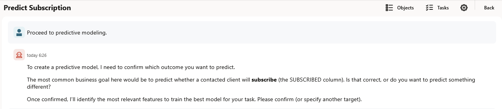

2. Enter the following prompt to confirm.

    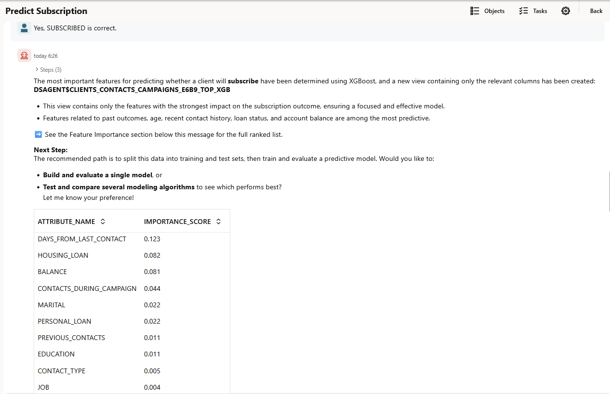

    ```text
    <copy>
    Yes, SUBSCRIBED is correct.
    </copy>
    ```

    In this example, Data Science Agent determines the most important features for predicting the likelihood of subscription by using XGBoost, and creates the view `DSAGENT$CLIENTS_CONTACTS_CAMPAIGNS_E6B9_TOP_XGB`.

    > **Note:** Views and objects created by Data Science Agent have the prefix `DSAGENT$`.

    
    >**Note:**  The outputs in this lab are examples only. The suffixes, selected algorithm, metrics, and row counts may differ in your environment. Use the object names generated in your session wherever needed.

    Data Science Agent suggests the next recommended path - to split the data into training and test sets, then train and evaluate a predictive model. It also asks whether to proceed with building and evaluating a single model, or test and compare several modeling algorithms to check their best performance.

## Task 5: Perform feature engineering for model improvement

In this task, you will ask Data Science Agent to identify features to enhance the model. Feature engineering helps in identifying columns that are suitable for modeling and prepares a clean view for downstream training.

>**Note:**  The outputs in this lab are examples only. The view names, suffixes, selected algorithm, metrics, and row counts may differ in your environment. Use the object names generated in your session wherever needed.

1. Enter the following prompt to proceed with new feature identification and modeling.

    ```text
    <copy>
    Before ranking, identify any new features that would improve the model, and remove any that are not useful.
    </copy>
    ```

    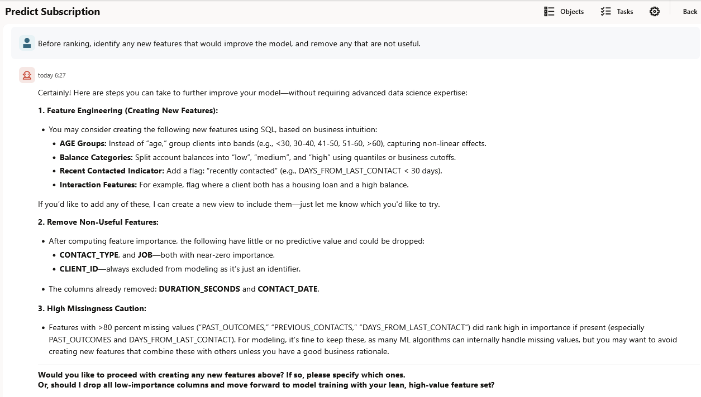

    In response to this prompt, Data Science Agent suggests new features for feature engineering, identifies non-useful features, and lists features with >80 percent missing values. The agent asks whether to proceed with feature engineering or drop all low-importance columns and move forward to model training with the existing lean, high-value feature set.
2. Review the response and enter the following prompt to ask Data Science Agent to proceed with feature engineering after dropping the low-importance columns.

    ```text
    <copy>
    Add the recent contacted indicator, and drop the low-importance columns. Then move forward with model training.
    </copy>
    ```

    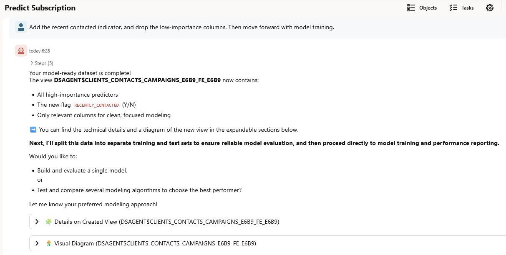

    In response to the prompt, Data Science Agent updates the view `DSAGENT$CLIENTS_CONTACTS_CAMPAIGNS_E6B9_FE_E6B9` with only the high-importance predictors, adds the new engineered feature `RECENTLY_CONTACTED`, and relevant columns for clean, focused modeling.

3. Expand the **Details on Created View** section to view the SQL code used for creating the view `DSAGENT$CLIENTS_CONTACTS_CAMPAIGNS_E6B9_FE_E6B9`.

    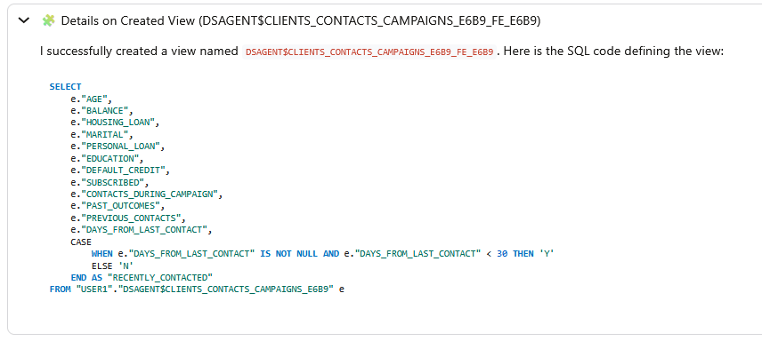

4. Expand the **Visual Diagram** section to view the workflow visual of the view `DSAGENT$CLIENTS_CONTACTS_CAMPAIGNS_E6B9_FE_E6B9`.

    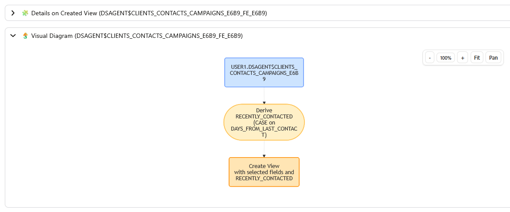

    Data Science Agent also provides you the next steps: whether to build and evaluate a single model, or to test and compare several modeling algorithms to choose the best performing model.


## Task 6: Model Evaluation and Training

In this task, you will ask Data Science Agent evaluate the model.

>**Note:**  The outputs in this lab are examples only. The view names, model names, suffixes, selected algorithm, metrics, and row counts may differ in your environment. Use the object names generated in your session wherever needed.

1. Enter the following prompt to evaluate the model.

    ```text
    <copy>
    Compare several algorithms and pick the best one.
    </copy>
    ```

    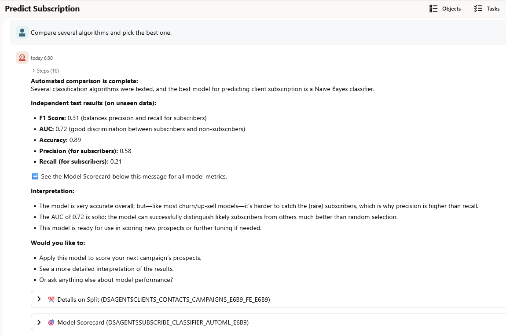
    In response to this prompt, Data Science Agent evaluates the model and determines the best model for predicting client subscription is a Naive Bayes classifier. It splits the data into train set, validation set, test set, and an unlabeled view and presents the following:
    * An independent test result
    * An interpretation of the model evaluation
    * The model scorecard

2. Expand the **Details on Split** section to review the split details `DSAGENT$CLIENTS_CONTACTS_CAMPAIGNS_E6B9_FE_E6B9`

    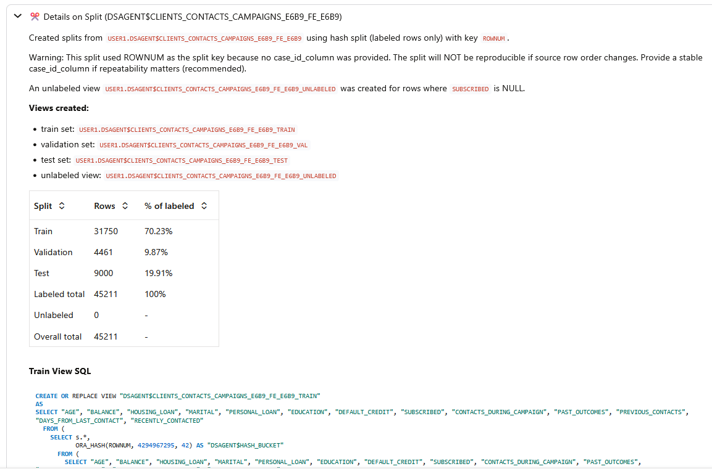

3. Expand the **Model Scorecard** to review the scorecard for the model `DSAGENT$SUBSCRIBE_CLASSIFIER_AUTOML_E6B9`:

    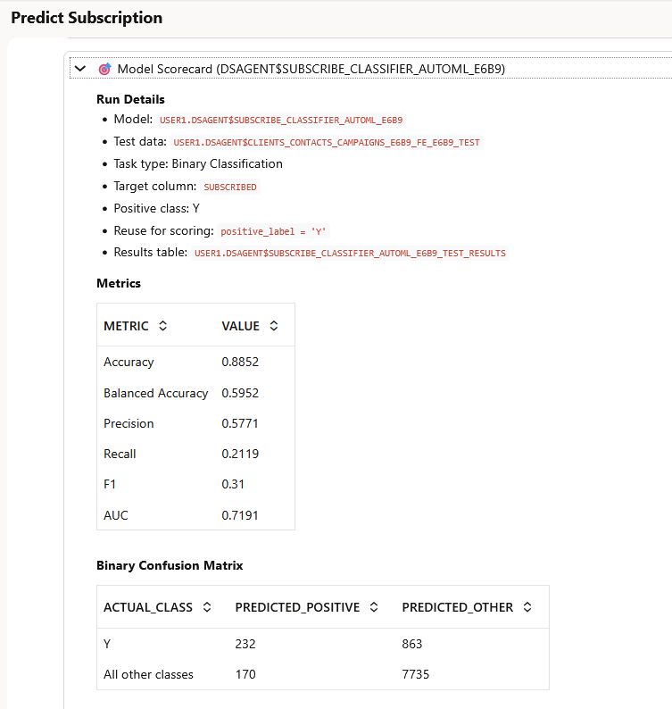

## Task 7: Score prospects to predict subscription likelihood

In this task, you will ask Data Science Agent to score the prospects for the next campaign.

>**Note:**  The outputs in this lab are examples only. The view names, model names, suffixes, selected algorithm, metrics, and row counts may differ in your environment. Use the object names generated in your session wherever needed.

1. Enter the following prompt to score the xxx

    ```text
    <copy>
    Score the prospects for our next campaign. Who should we prioritize reaching out to?
    </copy>
    ```

    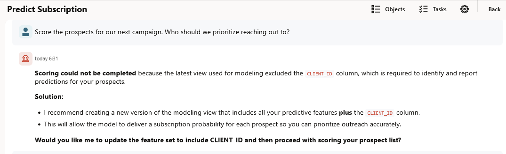

    In this example, Data Science Agent could not perform scoring. It correctly states the reason for this - it is because the latest view used for modeling excluded the CLIENT_ID column. This column is required to identify and report predictions for the prospects. 

2. Prompt "Yes" in response to the agent's suggestion "Would you like me to update the feature set to include CLIENT_ID and then proceed with scoring your prospect list?"

    ```text
    <copy>
    Yes
    </copy>
    ```
    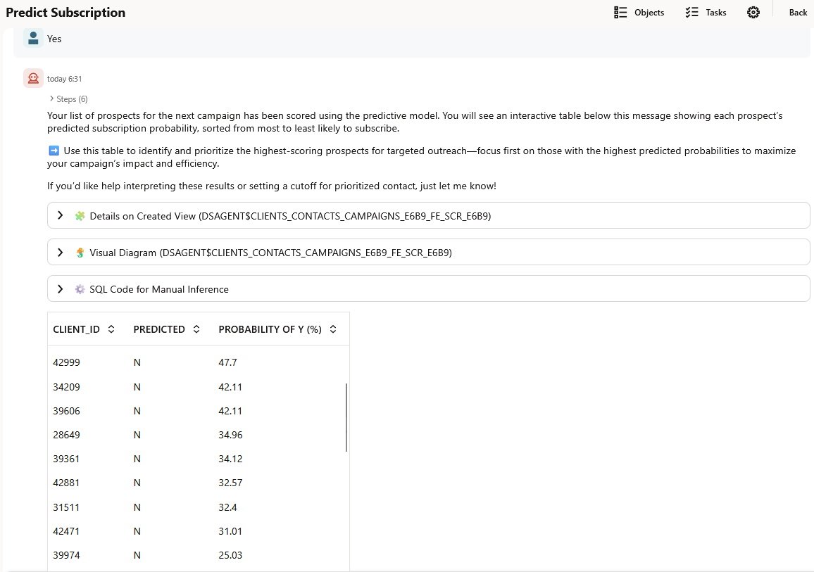

    Here, Data Science Agent performs scoring using the predictive model and presents the list of prospects for the next campaign. 

3. Expand the **Details on Created View** section to review the details of the view `DSAGENT$CLIENTS_CONTACTS_CAMPAIGNS_E6B9_FE_SCR_E6B9`.

    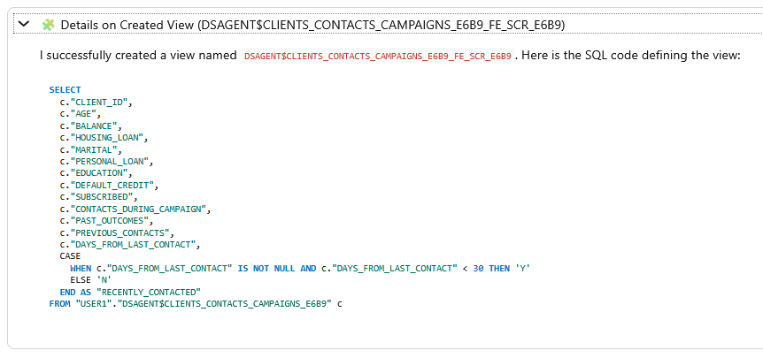


4. Expand the **Visual Diagram** section to view the workflow visual of the view `DSAGENT$CLIENTS_CONTACTS_CAMPAIGNS_E6B9_FE_SCR_E6B9`.

    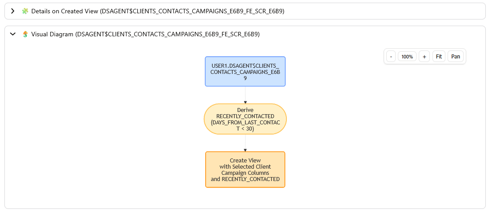

5. Expand the **SQL Code for Manual Inference** section to review the SQL query to run the inference manually.

    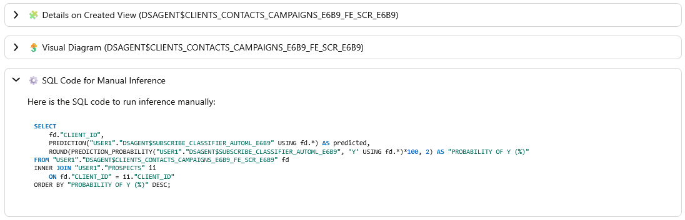

6. Review the prediction table showing the probability of subscription for the prospects.

    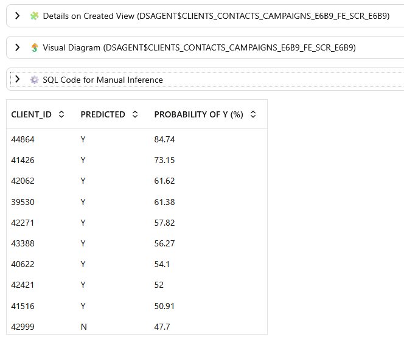

    In this example, Data Science Agent returns the following:

    | CLIENT_ID | PREDICTED | PROBABILITY OF Y (%) |
|---:|:---:|---:|
| 44864 | Y | 84.74 |
| 41426 | Y | 73.15 |
| 42062 | Y | 61.62 |
| 39530 | Y | 61.38 |
| 42271 | Y | 57.82 |
| 43388 | Y | 56.27 |
| 40622 | Y | 54.1 |
| 42421 | Y | 52 |
| 41516 | Y | 50.91 |
| 42999 | N | 47.7 |
| 34209 | N | 42.11 |
| 39606 | N | 42.11 |
| 28649 | N | 34.96 |
| 39361 | N | 34.12 |
| 42881 | N | 32.57 |
| 31511 | N | 32.4 |
| 42471 | N | 31.01 |
| 39974 | N | 25.03 |
| 43021 | N | 24.82 |
| 28092 | N | 24.81 |
| 28803 | N | 22.63 |
| 19884 | N | 21.09 |
| 9900 | N | 21.09 |
| 33871 | N | 20.17 |
| 26416 | N | 19.78 |
| 28122 | N | 19.19 |
| 35610 | N | 18.55 |
| 33972 | N | 18.37 |
| 34337 | N | 17.81 |
| 32596 | N | 17.21 |
| 7803 | N | 16.73 |
| 9371 | N | 16.73 |
| 18373 | N | 16.73 |
| 42756 | N | 16.19 |
| 38445 | N | 15.96 |
| 43531 | N | 15.88 |
| 19187 | N | 15.73 |
| 19727 | N | 15.41 |
| 13147 | N | 15.3 |
| 8245 | N | 14.92 |
| 43691 | N | 14.92 |
| 27938 | N | 14.69 |
| 33429 | N | 14.46 |
| 29635 | N | 13.72 |
| 34756 | N | 13.07 |
| 15737 | N | 12.96 |
| 44398 | N | 12.4 |
| 13506 | N | 11.64 |
| 28653 | N | 10.54 |
| 18175 | N | 10.28 |
| 3245 | N | 10.16 |
| 23636 | N | 9.9 |
| 13693 | N | 9.57 |
| 23692 | N | 9.56 |
| 6609 | N | 9.36 |
| 19622 | N | 9.11 |
| 29400 | N | 9.11 |
| 33840 | N | 9.11 |
| 19347 | N | 8.62 |
| 35998 | N | 8.17 |
| 32365 | N | 8.14 |
| 34426 | N | 8.14 |
| 26727 | N | 8.04 |
| 21997 | N | 7.71 |
| 10157 | N | 7.69 |
| 11472 | N | 7.52 |
| 32507 | N | 7.52 |
| 12261 | N | 7.25 |
| 35599 | N | 7.09 |
| 33168 | N | 7.09 |
| 27509 | N | 7.09 |
| 5756 | N | 6.73 |
| 23828 | N | 6.27 |
| 36589 | N | 6.1 |
| 20560 | N | 5.7 |
| 21200 | N | 5.66 |
| 11943 | N | 5.47 |
| 300 | N | 5.06 |
| 5346 | N | 5.06 |
| 15421 | N | 4.26 |
| 18254 | N | 4.25 |
| 5752 | N | 4.18 |
| 23293 | N | 4.06 |
| 3122 | N | 3.8 |
| 38629 | N | 3.66 |
| 12945 | N | 3.63 |
| 24120 | N | 3.44 |
| 16154 | N | 3.17 |
| 17138 | N | 3.17 |
| 19715 | N | 2.56 |
| 34440 | N | 2.46 |
| 12686 | N | 2.37 |
| 4712 | N | 2.37 |
| 3995 | N | 2.21 |
| 1522 | N | 2.15 |
| 35231 | N | 1.93 |
| 33149 | N | 1.75 |
| 35627 | N | 1.53 |
| 38748 | N | 1.09 |
| 15249 | N | 0.6 |

## Learn More

* [Oracle Machine Learning](https://docs.oracle.com/en/database/oracle/machine-learning/)
* [Oracle Data Science Agent](https://docs.oracle.com/en/database/oracle/machine-learning/data-science-agent/index.html)
* [Oracle Autonomous Database](https://docs.oracle.com/en/cloud/paas/autonomous-database/)
* [Oracle LiveLabs](https://livelabs.oracle.com/ords/r/dbpm/livelabs/home)

## Acknowledgements

* **Author** - Moitreyee Hazarika, Consulting User Assistance Developer, Oracle AI Database User Assistance Development
* **Contributors** - Mark Hornick, Senior Director, Data Science and Machine Learning; Marcos Arancibia Coddou, Product Manager, Oracle Data Science; Sherry LaMonica, Consulting Member of Tech Staff, Machine Learning
* **Last Updated By/Date** - Moitreyee Hazarika, September 2026
