# Introduction to Oracle Machine Learning Notebooks Classic

## Introduction

This lab walks you through the steps to sign into Oracle Machine Learning, create an Oracle Machine Learning (OML) Notebook Classic from scratch, create an OML Notebook Classic based on the example template notebooks, and create jobs to schedule notebooks to run at specific day and time.

Estimated Time: 15 minutes

### About Oracle Machine Learning Notebooks Classic

Oracle Machine Learning Notebooks Classic is a collaborative user interface supporting data scientists, analysts, developers, and DBAs. You can work with SQL, PL/SQL, Python, and R in the same notebook—using the most appropriate language for the problem at hand. You can also view notebook changes by team members in real time, interactively. Data science team members can explicitly share notebooks and version notebooks as well as schedule notebooks to run at a set time or a repeating schedule. By virtue of being included in Oracle Autonomous Database, machine learning functionality is automatically provisioned and managed. Through Oracle Machine Learning Notebooks, you have access to the in-database algorithms and analytics functions to explore and prepare data, build and evaluate models, score data, and deploy solutions.

### Objectives

In this lab, you will learn how to:
* Sign into Oracle Machine Learning User Interface
* Create an Oracle Machine Learning Notebook Classic from scratch
* Create a Notebook Classic based on an example template
* Check and update the interpreter binding settings for a notebook
* Schedule a notebook to run at a specific time using the Jobs interface

### Prerequisites

This lab assumes you have:
* An Oracle Machine Learning account
* Access to Oracle Machine Learning USER account.

## Task 1: Sign into Oracle Machine Learning User Interface

A Notebook Classic is a web-based interface for data analysis, data discovery, data visualization, and collaboration. You create and run notebooks using Oracle Machine Learning Notebooks, which is accessed through the Oracle Machine Learning user interface on Oracle Autonomous Database.

<if type="freetier">

1. Sign into your OCI account, click the Cloud menu on the left to open the left navigation pane, and click **Oracle Database**. On the right pane under Autonomous Database, click **Autonomous Data Warehouse**.

	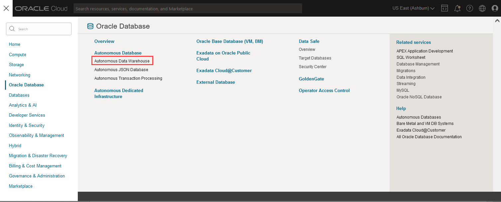

2. The Autonomous Database dashboard lists all the databases that are provisioned in the tenancy. Click the Oracle Autonomous Database that you have provisioned.

  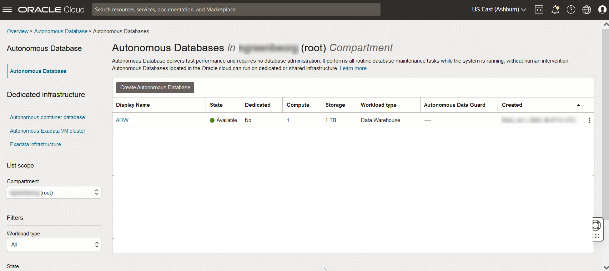        	  

3. On your Oracle Autonomous Database instance page, click **Database Actions**. The Launch DB Actions dialog opens. Wait till the Database Actions opens.

	

4. On the Database Actions page, go to the Development tab and click **Oracle Machine Learning**. This opens the Oracle Machine Learning sign in page.

	

5. Enter your user credentials and click **Sign in**.

	> **Note:** The credential is what you have defined while creating the Oracle Machine Learning user.

	

	This opens the Oracle Machine Learning user interface home page.
	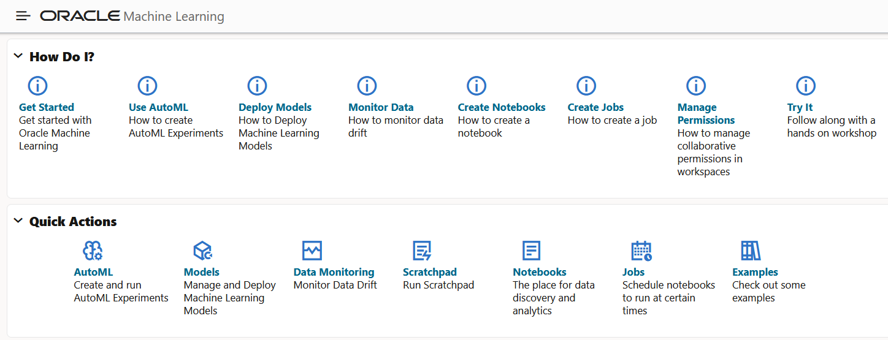
</if>

<if type="livelabs">
1. On your workshop page, click **Launch Workshop** under **My Reservations**.

   

2. On the **Get Started - LiveLabs login** page, click **View Login Info** at the top left.

	

3. In the panel that opens with the **Reservation Information**, click at the bottom of the panel on the **OML Notebooks** link.

	

4. In the page that opens up, enter your user credentials and click **Sign in**. This opens the Oracle Machine Learning home page.

	> **Note:** The username is `OMLUSER`, and password is `AAbbcc123456`.

	

</if>
This completes the task of accessing Oracle Machine Learning user interface.

## Task 2: Create a Notebook Classic and define paragraphs using the md, SQL, PL/SQL, Python, and R interpreters

To create a notebook:

1. On the Oracle Machine Learning user interface, click the Cloud menu icon  on the top left corner of the home page to open the left navigation menu. Expand Projects and then click **Notebooks Classic**.

	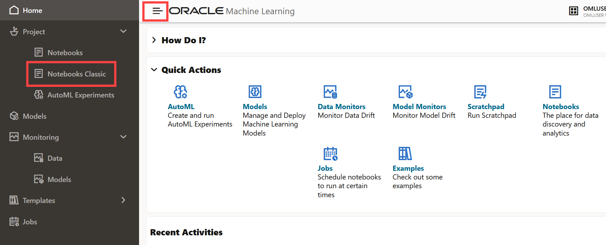
>> Note: Observe the entry **Notebooks** on the left navigation menu. To learn how to use Oracle Machine Learning Notebooks - an enhanced web-based notebook platform, refer to [Get Started with Notebooks](https://docs.oracle.com/en/database/oracle/machine-learning/oml-notebooks/omlug/get-started-notebooks-ea-data-analysis-and-data-visualization.html#GUID-B309C607-2232-43E2-B4A1-655DB295B90B).

2. On the Notebooks Classic page, click **Create**. The Create Notebook dialog opens.

	<if type="livelabs"> </if>

	<if type="freetier"> </if>

3. In the Name field, enter **Test Notebook**.

4. In the **Comments** field, enter comments, if any.

5. In the **Connections** field, select a connection in the drop-down list. By default, the **Global** Connection Group is assigned.

6. Click **OK**. Your notebook is created and it opens in the notebook editor.

	You can now use it to create a Markdown paragraph, SQL paragraph, and Python paragraph

7. To call the Markdown interpreter and generate static html from Markdown plain text, in the Test Notebook, type ``%md`` and press Enter.

	

8. Type the following:   

	* To generate static html text, type the text `Hello World` inside double quotes, and press Enter.
	* To format the text in bold, type the text `Hello World` inside two asterisks pair, and press Enter.
	* To format the text in italics, type the text `Hello World` either inside an asterisk pair or an underscore pair, and click the Run  icon.

	Alternatively, you may copy the code and paste it in the notebook just below `%md`, and click the Run icon  as shown in the screenshot:

		<copy>
		"Hello World"
		**Hello World**
		*Hello World*
		_Hello World_
		</copy>

	

	After running the paragraph, the output is displayed, and a new paragraph is automatically created. Also, you can manually create additional paragraphs.

	

9. To display the text in a bulleted list, prefix * (asterisk) to the text `Hello World`, as shown in the screenshot below.

		<copy>
		* Hello World
		* We welcome you
		 </copy>

	

	> **Note:** You are not clicking the Run icon here.

10. Manually create another paragraph just below by hovering your cursor over the paragraph border. This brings up the Add Paragraph option. Click **Add Paragraph** to create a new paragraph, as shown in the screenshot.   

	

11. In this paragraph that you just created, the markdown tag ``%md`` is already present. Here, you will use Markdown tags to display the text in heading 1 (H1), heading 2 (H2) and heading 23 (H3). For H1, H2, and H3, add one, two, and three hashes before the text `Hello World` respectively. Or, you may copy the code below and paste it just below the tag ``%md``.

		<copy>
		# Hello World
		# Hello World
		### Hello World
		 </copy>

12. Now, scroll up the notebook and click the Run All icon present in the notebook toolbar, as shown in the screenshot here.  

	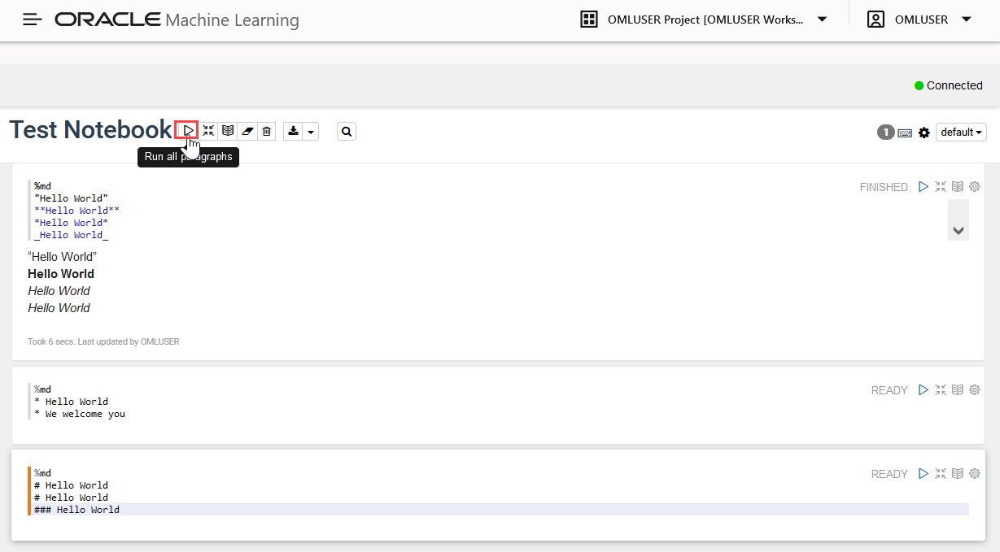

13. Click **OK** in the Run All dialog to confirm.

	

	The two paragraphs run and the output is displayed in the respective paragraphs, as shown in the screenshot.

	 

### Call the SQL Interpreter and run SQL Statements

Let’s create another paragraph to call the SQL interpreter and run SQL statements:

14. To create another paragraph, hover your cursor over the paragraph border. This brings up the Add Paragraph option. Click **Add Paragraph** to create a new paragraph.

	

15. Edit the existing paragraph tag, type ``%sql`` to call the SQL interpreter, and press Enter.

	

16. Type the following command and click the Run  icon. Alternatively, you can press Shift+Enter keys to run the paragraph.

	```
	<copy>
	select table_name from user_tables
	</copy>
	```
	 The command returns the table names in a tabular format, as shown in the screenshot:

	

### Call the PL/SQL Interpreter and run PL/SQL Scripts

Create another paragraph to call the PL/SQL interpreter and run PL/SQL scripts:
17. In the new paragraph, type ``%script`` to call the PL/SQL interpreter, and press Enter.

	

18. Type the following command and click . Alternatively, you can press Shift+Enter keys to run the paragraph.

		<copy>
		CREATE TABLE small_table
		(
		NAME VARCHAR(200),
		ID1 INTEGER,
		ID2 VARCHAR(200),
		ID3 VARCHAR(200),
		ID4 VARCHAR(200),
		TEXT VARCHAR(200)
		);

		BEGIN
		FOR i IN 1..100 LOOP
		INSERT INTO small_table VALUES ('Name_'||i, i,'ID2_'||i,'ID3_'||i,'ID4_'||i,'TEXT_'||i);
		END LOOP;
		COMMIT;
		END;
		</copy>

	

The PL/SQL script successfully creates the table SMALL_TABLE. The PL/SQL script in this example contains two parts:
* The first part of the script contains the SQL statement CREATE TABLE to create a table named ``small_table``. It defines the table name, table column, data types, and size. In this example, the column names are ``NAME, ID1, ID2, ID3, ID4, and TEXT``.
* The second part of the script begins with the keyword ``BEGIN``. It inserts 100 rows into the table ``small_table``

### Call the Python Interpreter and run Python Statements

Let’s create another paragraph to call the Python interpreter and run Python statements:
19. To call the python interpreter, edit the paragraph tag, type ``%python`` and press Enter.

	

20. Type the following command and click .

	```
	<copy>
	import pandas as pd
	import oml
	DATA = oml.sync(table = "SUPPLEMENTARY_DEMOGRAPHICS", schema = "SH")
	z.show(DATA.head())
	</copy>
	```

	The ``z.show`` command displays the SUPPLEMENTARY_DEMOGRAPHICS table present in the SH schema, as shown in the screenshot here. Use the ``z.show`` command to display Python objects, proxy object content, and to display the desired data in the notebook. You will learn more about ``z.show`` in the lab on Oracle Machine Learning for Python.

	

### Call the R Interpreter and run R Statements

Let’s create another paragraph to call the R interpreter and run R statements:
21. To connect to the R interpreter, type the following directive at the beginning of the notebook paragraph, and press Enter:

	```
	<copy>
	%r
	</copy>
	```
22. To verify the database connection, type the following command and press Enter:

	```
	<copy>
	ore.is.connected()
	</copy>
	```

23. To import R Libraries, run the following command:

	```
	<copy>
	library(ORE)
	</copy>
	```

24. To create a database table from a `data.frame` and get proxy object, run the following command:

	```
	<copy>
	ore.create(iris, table = "IRIS")
	cat("Class: ", class(IRIS))
	cat("\nShape: ", dim(IRIS))
	</copy>
	```

25. To list the available `data.frame` proxy objects, run the following command:

	```
	<copy>
	ore.ls()
	</copy>
	```

## Task 3: Create a Notebook using a Template Example

This task demonstrates how to create notebooks based on Example templates. You will learn how to:
* Create the OML4Py Classification notebook based on the OML4Py Classification DT example template. The template builds and applies the classification Decision Tree algorithm to build a classification model based on the relationships between the predictor values and the target values. The template uses the Sales History (`SH`) schema.
* Create the Time Series notebook based on the OML4SQL Time Series ESM example template. This template forecasts sales by using the Exponential Smoothing Algorithm for Time Series Data. It also used the `Sales` table in the SH schema.

### Create an OML4Py Notebook using the Classification DT Template Example

This step demonstrates how to create the OML4Py Classification notebook based on the OML4Py Classification DT (Decision Tree) Example template:

1. Go to the Examples page by clicking the Cloud menu icon  on the top left corner of the page to open the left navigation menu. On the left navigation menu, click **Templates** and then click **Examples**.

	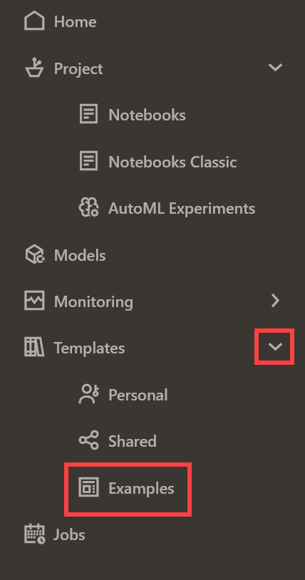

  Alternatively, on the Oracle Machine Learning home page, click **Examples** in the Quick Actions section to go Examples.

	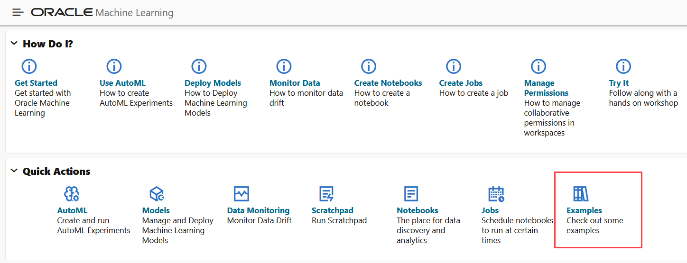


2. Navigate to the **OML4Py Classification DT** example template notebook. You can search for the notebook by typing in keywords in the search box on the upper right corner of the page. Click on the grey box around the notebook. This highlights the notebook and enables the **Create Notebook** button. Click **Create Notebook**.

	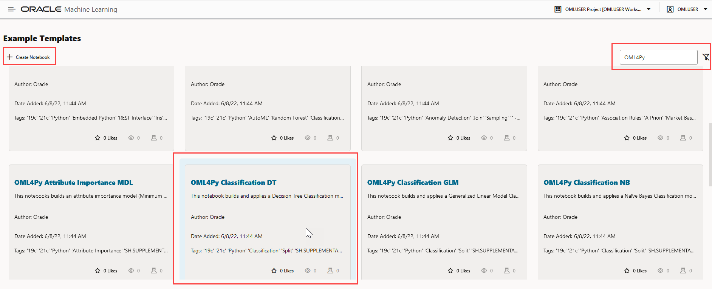

3. The Create Notebook dialog opens. The Name field displays the same name as the template with the suffix `(1)`. You can edit this name. In this example, we will retain the auto-generated name `OML4PY Classification DT (1)`. Click **OK**.

	> **Note:** In the Project field, the current user, project and workspace is selected by default. You have the option to choose a different project or a workspace by clicking the edit icon here.  

	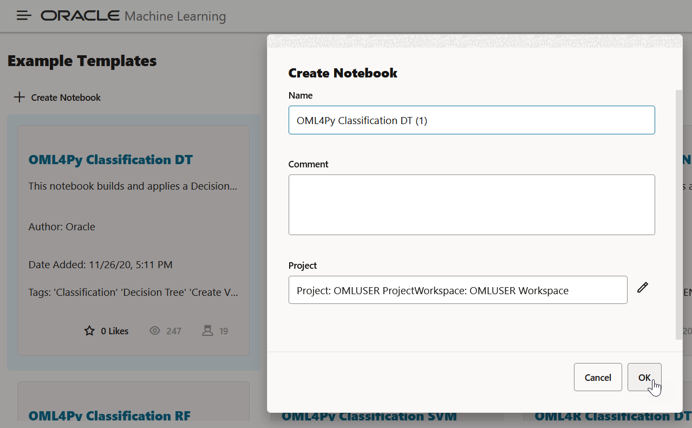

4. Once the notebook is created, the message _Notebook "OML4PY Classification DT (1)" created in project "OMLUSER Project"_ is displayed, as shown in the screenshot. The notebook is now available on the Notebooks page. You may also click **Open Notebook** in the message dialog to open the notebook directly from here.

	

5. To view the notebook that you just created, click the Cloud menu icon  on the top left corner of the page to open the left navigation menu. Click **Notebooks** to go to the Notebooks page.

	

6. The OML4PY Classification DT (1) notebook is now listed on the Notebooks page, as shown in the screenshot. Click it to open the notebook in the Notebooks editor. Note that you will run this notebook in the subsequent steps.

	<if type="livelabs">  </if>
	<if type="freetier">  </if>

This completes the task of creating a notebook from an Example template.

### Create a Time Series Notebook using the OML4SQL Time Series Template Example

These steps demonstrate how to create the Time Series notebook based on the Example template:

7. Click the Cloud menu icon  on the top left corner of the page to open the left navigation menu. Click **Examples** under Templates to open the Examples page. If you choose to go to the home page, then click **Home** on the left navigation pane, and then click **Examples**.

	<if type="livelabs">  </if>
	<if type="freetier">  </if>

8. Navigate to the **OML4SQL Time Series ESM** example template notebook. You may type ESM in the search box on the upper right corner of the page to get a list of the ESM-related notebooks. Click the grey box around the notebook. This highlights the notebook and enables the **Create Notebook** button. Click **Create Notebook**.

	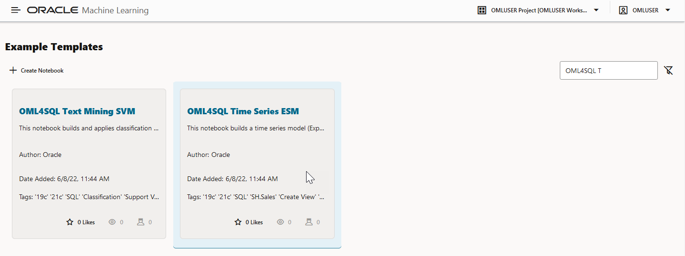

9. The Create Notebook dialog opens. By default, the **Name** field displays the same name as the template with the suffix `(1)`. You can edit this field. In this example, we will retain the auto-generated name **OML4SQL Time Series ESM (1)** and click **OK**.

	> **Note:** In the Project field, the current user, project and workspace is selected by default. You have the option to choose a different project or a workspace by clicking the edit icon here.  

	

10. Once the notebook is created, the message _Notebook "OML4SQL Time Series ESM (1)" created in project "OMLUSER Project"_ is displayed. The notebook is now available on the Notebooks page. You may also click **Open Notebook** in the message dialog to open the notebook directly from here.

	

11. To view the notebook, click the Cloud menu icon  on the top left corner of the page to open the left navigation menu. Click **Notebooks** to go to the Notebooks page.

	


12. The notebook **Notebook "OML4SQL Time Series ESM (1)** is now listed on the Notebooks page, as shown in the screenshot. Click on the notebook to open it in the Notebooks editor and work on it.

	<if type="livelabs"> </if>

	<if type="freetier"> </if>

This completes the task of creating the Time Series notebook from the OML4SQL Time Series ESM Example template.

## Task 4: Change Interpreter Bindings Order

An interpreter allows using a specific data processing language at the backend to process commands entered in a notebook paragraph. For the notebooks in Oracle Machine Learning, you use the following interpreters:

* SQL interpreter for SQL statements
* PL/SQL  interpreter for PL/SQL scripts/statements
* Python interpreter to process Python scripts
* R interpreter to run R commands and scripts
* md (MarkDown) interpreter for plain text formatting syntax so that it can be converted to HTML.

This is the initial binding order of the interpreters. You can change the order of the interpreter bindings by clicking and dragging an entry above or below others (turns from white to blue). You can also deselect a binding to disable it (turns from blue to white). This does not require dragging the enabled interpreters above the disabled ones.

* **Low** (Default): Provides the least level of resources for in-database operations, typically serial (non-parallel) running of database operations. It supports the maximum number of concurrent in-database operations by multiple users. The interpreter with low priority is listed at the top of the interpreter list, and hence, is the default.
* **Medium:** Provides a fixed number of CPUs to run in-database operations in parallel, where possible. It supports a limited number of concurrent users, typically 1.25 times the number of CPUs allocated to the Autonomous Database instance.
* **High:** Provides the highest level of CPUs to run in-database operations in parallel, up to the number of CPUs allocated to the Autonomous Database instance. It offers the highest performance but supports the minimum number of concurrent in-database operations, typically 3.

	> **Note:** The interpreter binding order that is set for a notebook applies to all the paragraphs in that notebook. However, you can override the binding of an individual paragraph also. This is an advanced topic, and is not covered in this workshop.

In this step, you learn how to set the interpreter bindings:
1. Go to the Notebooks page by clicking the Cloud menu icon on the top left corner of the page. On the left navigation menu, click **Notebooks**.

	

	

2. On the Notebooks page, click on the **OML4PY Classification_DT (1)** notebook to open it in the Notebook editor.

	<if type="livelabs"> 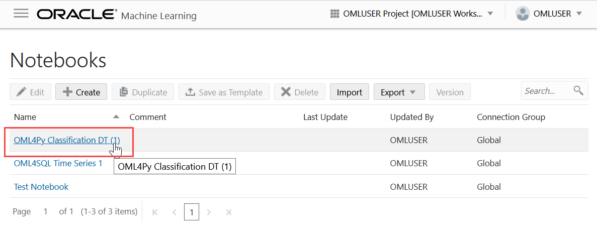 </if>

	<if type="freetier">  </if>

3. Click  on the top right corner of the notebook. This opens the interpreter settings.

	

4. Click **medium**, and drag and drop it on top of the list.

	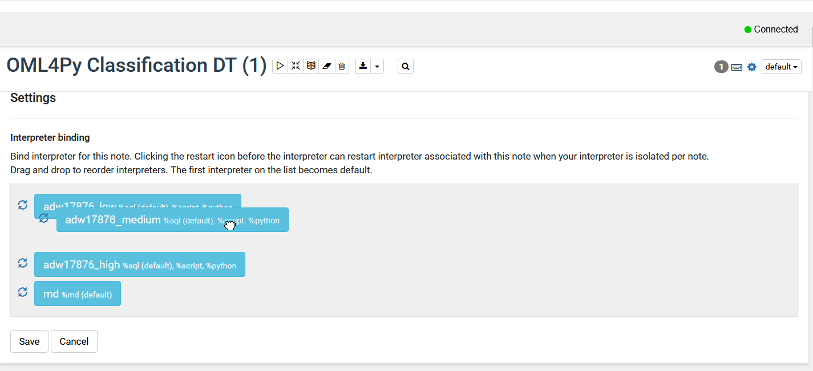

	> **Note:** You can disable a particular binding by deselecting it (turns from blue to white) or enable it by selecting it (turns from white to blue). However, this does not require dragging the enabled interpreters above the disabled ones.

	

5. Once you successfully drag and drop it on top of the list, click **Save**.

	

Clicking **Save** records the changes and hides the interpreter settings. You can verify it again by clicking the gear icon . This completes the task of changing the interpreter binding order.

## Task 5: Create Jobs to Schedule Notebook Run

Jobs allow you to schedule the running of notebooks. On the Jobs page, you can create jobs, duplicate jobs, start and stop jobs, delete jobs, and monitor job status by viewing job logs, which are read-only notebooks. In this lab, you will learn how to create a job to schedule the running of the notebook Classification_DT.

To create a job:

1. Click the Cloud menu icon  on the top left corner of the page to open the left navigation menu, and click **Jobs** to go to the Jobs page. You can also go to Jobs from the Oracle Machine Learning home page by clicking **Jobs**.

	

	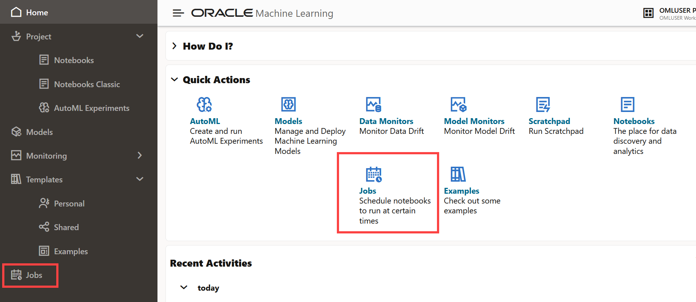

2. On the Jobs page, click **Create**. The Create Job dialog opens.

	

3. In the **Name** field, enter `Job1`. The number of characters in the job name must not exceed 128 bytes.

	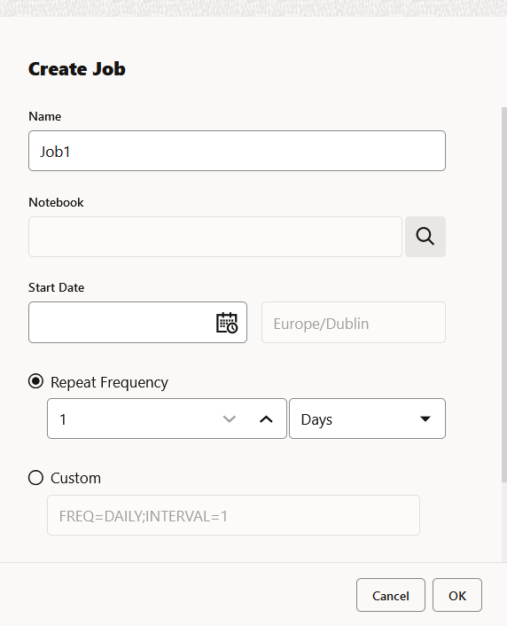

4. In the **Notebook** field, click the search icon. This opens the Search Notebook dialog. In the Search Notebook dialog, navigate through the OMLUSER workspace and OMLUSER project, select `OML4PY Classification_DT (1)`, and click **OK**.

	> **Note:** Only notebooks that are owned by the user or shared are available for selection.

	<if type="livelabs"> 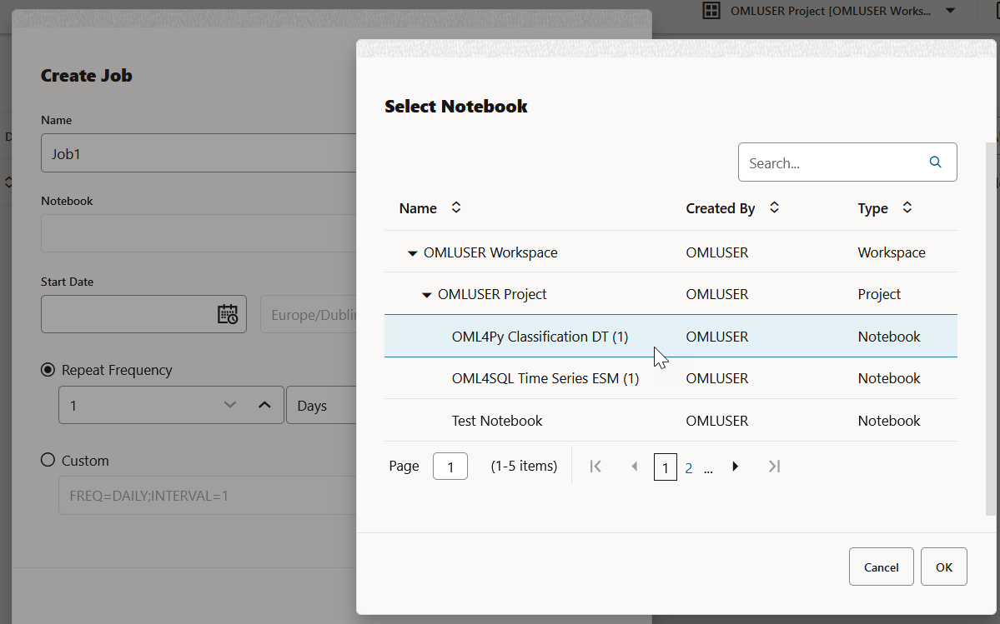 </if>
	<if type="freetier"> 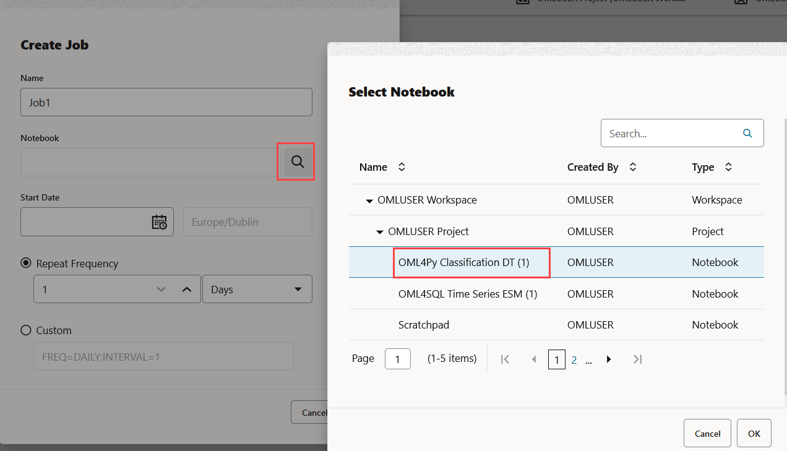 </if>

5. In the **Start Date** field, click the date-time editor to set the date and time for your job to commence. You can select the current date or any future date and time. Based on the selected date and time, the next run date is computed.

6. Select **Repeat Frequency** and enter **3**, and select **Days** to set the repeat frequency and settings. You can set the frequency in minutes, hours, days, weeks, and months.

7. Expand **Advanced Settings**, and specify the following settings:

	

	* **Maximum Number of Runs:** Select **3**. This specifies the maximum number of times the job must run before it is stopped. When the job reaches the maximum run limit, it will stop.  

	* **Timeout in Minutes:** Select **60**. This specifies the maximum amount of time a job should be allowed to run.

	* **Maximum Failures Allowed:** Select **3**. This specifies the maximum number of times a job can fail on consecutive scheduled runs. When the maximum number of failures is reached, the next run date column in the Jobs UI will show an empty value to indicate the job is no longer scheduled to run. The Status column may show the status as `Failed`.

		> **Note:** Select **Automatic Retry** if you do not wish to specify the maximum failures allowed manually.  

8. Click **OK**. The job is now listed on the Jobs page with the status SCHEDULED.

	

9. Click on the job row to enable the options to either **Edit**, **Duplicate**, **Start**, or **Delete** the selected job.

	

This completes the task of creating a job. You may now **proceed to the next lab**.

## Learn More

* [Oracle Machine Learning UI](https://docs.oracle.com/en/database/oracle/machine-learning/oml-notebooks/)
* [Interactive Tour - Oracle Machine Learning UI](https://docs.oracle.com/en/cloud/paas/autonomous-database/oml-tour/)

## Acknowledgements

* **Author** -  Moitreyee Hazarika, Principal User Assistance Developer, Database User Assistance Development
* **Contributors** -   Mark Hornick, Senior Director, Data Science and Machine Learning; Marcos Arancibia Coddou, Product Manager, Oracle Data Science; Sherry LaMonica, Consulting Member of Tech Staff, Machine Learning
* **Last Updated By/Date** - Moitreyee Hazarika, May 2024
