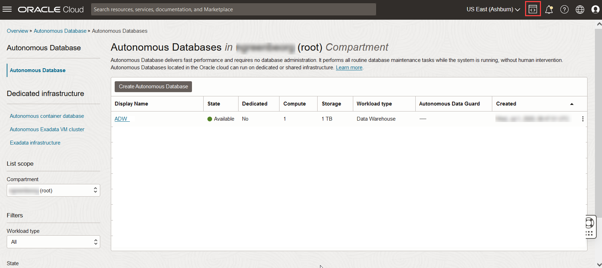
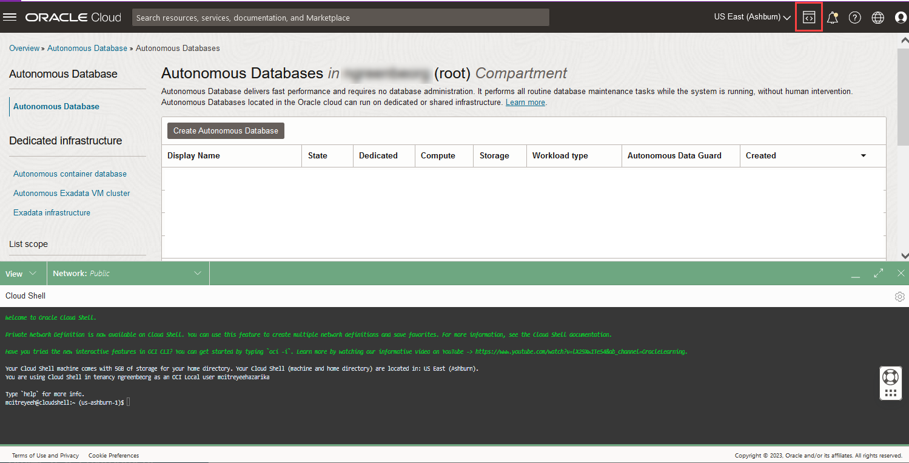
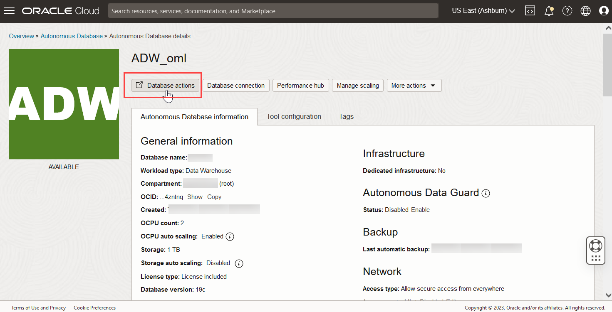
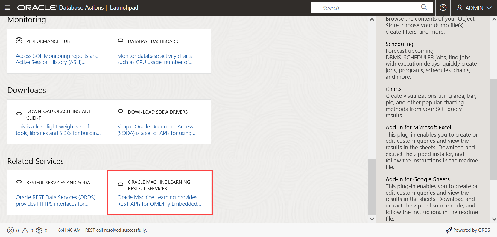
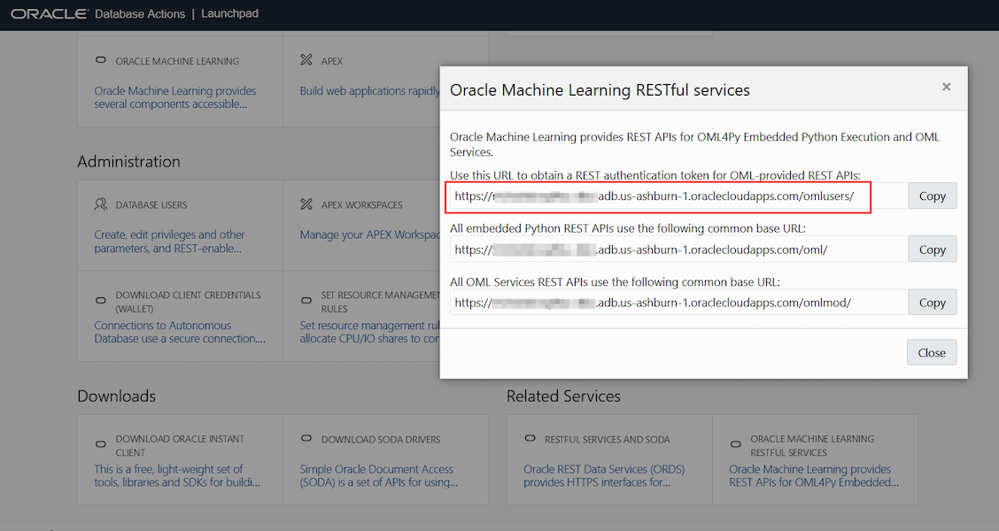

# Introduction to Oracle Machine Learning Services

## Introduction

 In this lab, you will get a quick tour of basic OML Services features. You will learn how to obtain an authentication token for your user account to get started with OML Services and then use OML Services to explore the APIs, get model information and score with a model. You will also get a chance to use Oracle's proprietary Cognitive Text model.

Estimated Time: 30 minutes

### About Oracle Machine Learning Services

OML Services extends OML functionality to support model deployment and model lifecycle management for both in-database OML models and third-party Open Neural Networks Exchange (ONNX) machine learning models via REST APIs. These third-party classification, regression or clustering models can be built using tools that support the ONNX format, which includes packages like Scikit-learn and TensorFlow, among several others.

Oracle Machine Learning Services provides REST endpoints through the Oracle Autonomous Database environment. These endpoints enable the storage of machine learning models along with their metadata, the creation of scoring endpoints for the model, and producing scores using these endpoints.

### Objectives

In this lab, you will:
* Authenticate your user account with your Autonomous Database instance to use OML Services.
    * Obtain authentication token.
    * Refresh authentication token.
    * Revoke authentication token.
* Explore APIs. Specifically:
    * View the API.
    * Get a list of saved models.
    * View a specific model by referencing the model ID.
    * Get a list of models filtered by model name.
    * Get a list of models filtered by version and namespace.
* Get a model scoring endpoint.
* Score data with a model.
    * Perform singleton scoring and mini-batch scoring.
    * Use Oracle's Cognitive Text functionality to discover keywords and get a summary for a given text string.
* Review OML Services support for ONNX format models

### Prerequisites

This lab assumes you have:
* OCI Cloud Shell, which has cURL installed by default. If you are using the Workshops tenancy, you get OCI Cloud Shell as part of the reservation. However, if you are in your own OCI tenancy or using a free trial account, ensure you have OCI Cloud Shell or install cURL for your operating system to run the OML Services commands.
* An Autonomous Database instance created in your account/tenancy if you are using your own tenancy or a free trial account. You should have handy the following information for your instance:
    * Your OML user name and password
    * OML server URL
* Completed all previous labs successfully.

## Task 1: Authenticate Your User Account with Your Autonomous Database Instance to Use OML Services

1.  This lab uses OCI Cloud Shell. To access the OCI Cloud Shell, select your compartment and click on the Cloud Shell icon.

	 

   On clicking the Cloud Shell icon, the OCI Cloud Shell command prompt is displayed in the lower half of the console as illustrated in the image below.

  

2. To access Oracle Machine Learning Services using the REST API, you must acquire an access token. To authenticate and obtain an access token, use cURL with the ``-d`` option to pass the user name and password for your Oracle Machine Learning Services account against the Oracle Machine Learning User Management Cloud Service token service. Use the following details to get an authentication token.
    * Your OML user name
    * Your OML password
    * OML server URL

   Here is the syntax:

     ```
     <copy>
     curl -X POST --header 'Content-Type: application/json' --header 'Accept: application/json'\
     -d '{"grant_type":"password", "username":"'${oml_username}'", "password":"'${oml_password}'"}'\
     "<OML server URL>/omlusers/api/oauth2/v1/token"
     </copy>
     ```

   In the syntax above, OML server URL is the Autonomous Database URL and points to the region where the Autonomous Database instance resides. The URL also contains the database name and tenancy ID. You can obtain this URL information from **Oracle Machine Learning RESTful services** on the Database Actions page. To access Database Actions, click **Database Actions** on your Oracle ADB instance details page.

  

   On the Database Actions page, and go to the **Related Services** tab and click **Oracle Machine Learning RESTful services**. The Oracle Machine Learning RESTful Services dialog opens.  

  

   On the Oracle Machine Learning RESTful Services dialog, copy the URL for your ADB instance. Paste the URL to a text editor, such as Notepad. From the URL, remove the ``/omlusers/`` segment.

  

   Now, go back to the Cloud Shell interface and run a command to obtain a token. First set variables for the parameters for ease of use in subsequent requests.

    ```
    <copy>export oml_username=OMLUSER
    export oml_password=AAbbcc123456
    export omlserver=<omlserver url></copy>

    ```

   In the command above,

     * OMLUSER is your OML user name.
     * AAbbcc123456 is your OML password.
     * omlserver url is the URL that you copied from the ADB console, without the /omlusers/ segment in it.

   An example of omlserver URL is https://aabbcc123456xyz-omllabs.adb.us-ashburn-1.oraclecloudapps.com. In this URL:
     * `aabbcc123456xyz` is the tenancy ID (not to be confused with the very long tenancy OCID)
     * `omllabs` is the database name, and
     * `adb.us-ashburn-1.oraclecloudapps.com` is the region name.

   Run the following command to obtain an authentication token using the variables set above and save the token string to the variable `token`.

    ```
    <copy>export token=$(curl -X POST -H 'Content-Type: application/json'  -d '{"grant_type":"password", "username":"'${oml_username}'",  "password":"'${oml_password}'"}' "${omlserver}/omlusers/api/oauth2/v1/token" | grep -o -P '(?<="accessToken":").*(?=","expiresIn)' )
    </copy>
    ```

   Successfully running the command above results in a token string that is saved to the variable ``token``. To visually inspect the token, run the command below:

    ```
    <copy>echo $token</copy>

    ```

   Running the command above should display the token string. Note that the token string displayed below is truncated for security reasons.

    ```
    eyJhbGci... KLbI1wQ==

    ```

3. A token is valid for an hour. You can refresh a token for up to 8 hours after generating it. Each refresh will extend its validity by an hour.

     Here's the command for refreshing a token:

    ```
    <copy>export token=$(curl -i -X POST --header 'Content-Type: application/json' --header 'Accept: application/json' --header "Authorization: Bearer ${token}" -d '{"grant_type":"refresh_token", "refresh_token":"'${token}'"}' "${omlserver}/omlusers/api/oauth2/v1/token" | grep -o -P '(?<="accessToken":").*(?=","expiresIn)' )</copy>
    ```

    To visually inspect the token, run the command below:

    ```
    <copy>echo $token</copy>

    ```

4. You can also revoke a token. You cannot use or refresh a token you have revoked. For this Workshop, do not perform this step. The syntax is provided for your reference.

    ```
    <copy>curl -i -X POST --header 'Content-Type: application/json' --header 'Accept: application/json' --header "Authorization: Bearer ${token}" "${omlserver}/omlusers/api/oauth2/v1/token/revoke"</copy>
    ```

   Running the command above produces a result similar to this:

    ```
    HTTP/1.1 200 OK
    Date: Mon, 06 Sep 2021 07:12:49 GMT
    Content-Type: application/json
    Content-Length: 15
    Connection: keep-alive
    Cache-Control: no-cache, no-store, must-revalidate
    Pragma: no-cache
    X-Frame-Options: SAMEORIGIN
    X-XSS-Protection: 1;mode=block
    Strict-Transport-Security: max-age=31536000; includeSubDomains
    X-Content-Type-Options: nosniff
    Content-Security-Policy: frame-ancestors 'none'

    {"status":"ok"}
    ```

## Task 2: Explore OML Services REST APIs

1. View the content of OML Services REST APIs. You can return the API content in a readable format by using the Linux utility jq.  

    > **Note:** If you are using OCI Cloud Shell, you don't need to install the jq utility as OCI Cloud Shell comes with jq pre-installed. If you are using your own tenancy or a trial account and if you are not using OCI Cloud Shell, you can check if jq is installed on Linux by running the command rpm -qa jq. If this command returns an empty value, jq is not installed. In that case, install the jq utility by running the following command.


    ```

    <copy>sudo yum install jq</copy>

    ```

   Run the curl command to view the APIs.

    ```
    <copy>curl -i -X GET --header "Authorization: Bearer ${token}" "${omlserver}/omlmod/v1/api" | head -n 50</copy>

    ```

   Here's the result, in a truncated form, of running the command above:

    ```
       "lifecycle": {
                   "type": "string",
                   "enum": [
                     "active",
                     "deprecated"
                   ]
                 },
                   "links": {
                     "type": "array",
                     "items": {
                       "$ref": "#/components/schemas/OMLResourceLink"
                 }
               }
             }
           },
           "ApiVersionCollection": {
             "required": [
              "items",
              "links"
            ],
            "properties": {
             "items": {
               "type": "array",
               "items": {
                 "$ref": "#/components/schemas/ApiVersion"
               }
       ...

    ```
2.  Get a list of saved models. For this step to return results, you need to have models deployed in your OML user account. If you have completed Lab 5, your account should include deployed models. Refer back to Lab 5 Using OML AutoML UI  to know how to quickly create and save a model.

    ```
    <copy>curl -X GET --header "Authorization: Bearer ${token}" "${omlserver}/omlmod/v1/models" | jq</copy>

    ```

   The result of running the command above is displayed below:

    ```
    {
      "items": [
        {
          "version": "1.0",
          "modelType": "OML",
          "createdBy": "OMLUSER",
          "modelId": "25e9bd6a-a8be-48af-8657-ee66c9201157",
          "modelName": "NaiveBayes_CUST360",
          "links": [
            {
              "rel": "self",
              "href": "https://aabbcc123456xyz-omllabs.adb.us-ashburn-1.oraclecloudapps.com/omlmod/v1/models/25e9bd6a-a8be-48af-8657-ee66c9201157"
            }
          ],
          "namespace": "DEMO",
          "shared": true,
          "storedOn": "XXXX-XX-XXT11:17:00.871Z"
        }
      ],
      "links": [
        {
          "rel": "self",
          "href": "https://aabbcc123456xyz-omllabs.adb.us-ashburn-1.oraclecloudapps.com/omlmod/v1/models"
        }
      ]
    }

    ```

3. View a model's details by providing its name in the REST API call. In this case, the model name is `NaiveBayes_CUST360`.

    ```
    <copy>curl -X GET --header "Authorization: Bearer $token" "${omlserver}/omlmod/v1/models?modelName=NaiveBayes_CUST360" | jq</copy>

    ```

   Running the command above displays the model details for the model `NaiveBayes_CUST360` as displayed below:

    ```
    {
      "items": [
        {
          "version": "1.0",
          "modelType": "OML",
          "createdBy": "OMLUSER",
          "modelId": "25e9bd6a-a8be-48af-8657-ee66c9201157",
          "modelName": "NaiveBayes_CUST360",
          "links": [
            {
              "rel": "self",
              "href": "https://aabbcc123456xyz-omllabs.adb.us-ashburn-1.oraclecloudapps.com/omlmod/v1/models/25e9bd6a-a8be-48af-8657-ee66c9201157"
            }
          ],
          "namespace": "DEMO",
          "shared": true,
          "storedOn": "XXXX-XX-XXT11:17:00.871Z"
        }
      ],
      "links": [
        {
          "rel": "self",
          "href": "https://aabbcc123456xyz-omllabs.adb.us-ashburn-1.oraclecloudapps.com/omlmod/v1/models"
        }
      ]
    }

    ```

4.  Next, get a list of models filtered by version=1.0 and namespace=`DEMO`.

    > **Note**: The namespace parameter is case-sensitive.


    ```
    <copy>curl -X GET --header "Authorization: Bearer $token" "${omlserver}/omlmod/v1/models?version=1.0&namespace=DEMO" | jq</copy>

    ```

   The command above applies the filters and produces the following result:

    ```
    {
      "items": [
        {
          "version": "1.0",
          "modelType": "OML",
          "createdBy": "OMLUSER",
          "modelId": "25e9bd6a-a8be-48af-8657-ee66c9201157",
          "modelName": "NaiveBayes_CUST360",
          "links": [
            {
              "rel": "self",
              "href": "https://aabbcc123456xyz-omllabs.adb.us-ashburn-1.oraclecloudapps.com/omlmod/v1/models/25e9bd6a-a8be-48af-8657-ee66c9201157"
            }
          ],
          "namespace": "DEMO",
          "shared": true,
          "storedOn": "XXXX-XX-XXT11:17:00.871Z"
        }
      ],
      "links": [
        {
          "rel": "self",
          "href": "https://aabbcc123456xyz-omllabs.adb.us-ashburn-1.oraclecloudapps.com/omlmod/v1/models"
        }
      ]
    }


    ```

## Task 3: Get Model Endpoint Details

1. Get model endpoint details for the model that you created in the preceding lab (Lab 4). Use the following values:

    * authentication token=generated in Task 1 or if expired then a refreshed or regenerated token
    * omlserver= OML server URL that you copied from the ADB console (in Task 1 Step 2), without the /omlusers/ segment in it. This URL is already saved to the ``omlserver`` variable so you don't have to copy it again. An example of an OML server URL is https://aabbcc123456xyz-db2.adb.us-ashburn-1.oraclecloudapps.com. In this example URL, ``aabbcc123456xyz`` is the tenancy ID, ``db2`` is the database name and ``adb.us-ashburn-1.oraclecloudapps.com`` is the region name.
    * model URI=`nb_cust360` (To get the URI for the model that you want the endpoint for, log in to OML Notebooks, go to the Models page,  Deployed tab.)

    ```
    <copy>curl -X GET "${omlserver}/omlmod/v1/deployment/nb_cust360" --header "Authorization: Bearer $token" | jq</copy>

    ```

   The endpoint details of the model with the model URI `nb_cust360` are displayed below:

    ```
    {
      "version": "1.0",
      "modelType": "OML",
      "createdBy": "OMLUSER",
      "modelId": "25e9bd6a-a8be-48af-8657-ee66c9201157",
      "modelName": "NaiveBayes_CUST360",
      "metadata": {
        "miningFunction": "CLASSIFICATION",
        "algorithm": "NAIVE_BAYES",
        "attributes": [
          {
            "name": "CUST_GENDER",
            "attributeType": "CATEGORICAL"
          },
          {
            "name": "CUST_MARITAL_STATUS",
            "attributeType": "CATEGORICAL"
          },
          {
            "name": "CUST_YEAR_OF_BIRTH",
            "attributeType": "NUMERICAL"
          },
          {
            "name": "EDUCATION",
            "attributeType": "CATEGORICAL"
          },
          {
            "name": "HOUSEHOLD_SIZE",
            "attributeType": "CATEGORICAL"
          },
          {
            "name": "OCCUPATION",
            "attributeType": "CATEGORICAL"
          },
          {
            "name": "YRS_RESIDENCE",
            "attributeType": "NUMERICAL"
          },
          {
            "name": "Y_BOX_GAMES",
            "attributeType": "NUMERICAL"
          }
        ],
        "output": {
          "name": "AFFINITY_CARD",
          "attributeType": "CATEGORICAL"
        },
        "labels": [
          "0",
          "1"
        ],
        "modelName": "NaiveBayes_CUST360"
      },
      "links": [
        {
          "rel": "self",
          "href": "https://aabbcc123456xyz-omllabs.adb.us-ashburn-1.oraclecloudapps.com/omlmod/v1/deployment/nb_cust360"
        }
      ],
      "namespace": "DEMO",
      "shared": true,
      "uri": "nb_cust360",
      "deployedOn": "XXXX-XX-XXT11:17:01.119Z"
    }


    ```

## Task 4: Score singleton and mini batch records against a model

1. Score a single record with a model. You need the following information handy to make a REST call to score with a model:

    * OML server name
    * Model URI of the model against which you are scoring
    * A valid authentication token
    * Input record to score

   Here's the syntax:

    ```
    <copy>
    curl -X POST "${omlserver}/omlmod/v1/deployment/${model_URI}/score" \
    --header "Authorization: Bearer ${token}" \
    --header 'Content-Type: application/json' \
    -d '{"topNdetails":n,"inputRecords":[{"XXX":value,"YYY":value}]}'| jq
    </copy>
    ```

  In the syntax above, the parameter `topNdetails` is optional. It fetches the top n prediction details for the record you are scoring. Prediction details refer to the attributes or features that impact a prediction. In the following example,  you specify the model URI `nb_cust360` and a valid token generated in Task 1. The model was built using the Supplementary Demographics data set. To score with a single record, for XXX use `YRS_RESIDENCE` with the value of 10 and for YYY  use `Y_BOX_GAMES` with a value of 0. You want to predict the probability that the person associated with this record will purchase the affinity card.

    ```
   <copy>curl -X POST "${omlserver}/omlmod/v1/deployment/nb_cust360/score"  --header "Authorization: Bearer ${token}" --header 'Content-Type: application/json'  -d '{"inputRecords":[{"YRS_RESIDENCE":10,"Y_BOX_GAMES":0}]}' | jq</copy>

    ```

   Here's the score for the data above. It indicates the probability value for each label.

    ```
    {
      "scoringResults": [
        {
          "classifications": [
            {
              "label": "0",
              "probability": 0.9893342613843232
            },
            {
              "label": "1",
              "probability": 0.010665738615676828
            }
          ]
        }
      ]
    }

    ```

2.  Next, score a mini-batch of 2 records with the same model URI. For the first record, use the same data as in the singleton scoring step above. For the second record and the prediction details parameter, use the data shown below. You want to return the top 3 attributes that impact the predictions and, therefore, set `topNdetails` to 3.:
    * `YRS_RESIDENCE`=5
    * `Y_BOX_GAMES`=1
    * `topNdetails` = 3

    ```
    <copy>curl -X POST "${omlserver}/omlmod/v1/deployment/nb_cust360/score" --header "Authorization: Bearer ${token}" --header 'Content-Type: application/json' -d '{"topNdetails":3, "inputRecords":[{"YRS_RESIDENCE":10,"Y_BOX_GAMES":0},{"YRS_RESIDENCE":5,"Y_BOX_GAMES":1}]}' | jq</copy>

    ```

    The scores for the above two records, along with the prediction details for each score, are displayed below:

    ```
    {
      "scoringResults": [
        {
          "classifications": [
            {
              "label": "0",
              "probability": 0.9893342613843232
            },
            {
              "label": "1",
              "probability": 0.010665738615676828
            }
          ],
          "details": [
            {
              "columnName": "YRS_RESIDENCE",
              "weight": 0.401
            },
            {
              "columnName": "CUST_YEAR_OF_BIRTH",
              "weight": 0.386
            },
            {
              "columnName": "Y_BOX_GAMES",
              "weight": 0.176
            }
          ]
        },
        {
          "classifications": [
            {
              "label": "0",
              "probability": 0.9993139062755378
            },
            {
              "label": "1",
              "probability": 0.000686093724462145
            }
          ],
          "details": [
            {
              "columnName": "CUST_YEAR_OF_BIRTH",
              "weight": 0.386
            },
            {
              "columnName": "Y_BOX_GAMES",
              "weight": 0.325
            },
            {
              "columnName": "YRS_RESIDENCE",
              "weight": 0.166
            }
          ]
        }
      ]
    }

    ```

3. In this task, use Oracle's proprietary Cognitive Text functionality. This functionality provides endpoints to score a string of text to obtain information such as most relevant keywords, topics, text summary, sentiment, similarity to another text string and text features. The supported languages for Cognitive Text include English (America), Spanish, French and Italian. In this step, pass a text string to obtain keywords and its summary using the relevant end points. Here's the syntax for using the keywords endpoint:

    ```
    <copy>
    curl -X POST "${omlserver}/omlmod/v1/cognitive-text/keywords" \
    --header 'Content-Type: application/json' \
    --header "Authorization: Bearer ${token}" \
    --data '{
         "topN":<n=number of top keywords to return>,
         "textList":["<text to score>"]
            }' | jq
    </copy>   

    ```

   In the syntax above,

    * topN is an optional parameter, which determines the number of most relevant keywords to return. If you don't specify this parameter, by default 5 keywords are returned.
    * textList is a required parameter to pass the text string to be scored.

   Run the following command to obtain the top 2 most relevant keywords in the provided text string.

    ```
    <copy>curl -X POST "${omlserver}/omlmod/v1/cognitive-text/keywords" --header 'Content-Type: application/json' --header "Authorization: Bearer ${token}" --data '{"topN":2,"textList":["With Oracle Machine Learning, Oracle moves the algorithms to the data. Oracle runs machine learning within the database, where the data reside. This approach minimizes or eliminates data movement, achieves scalability, preserves data security, and accelerates time-to-model deployment. Oracle delivers parallelized in-database implementations of machine learning algorithms and integration with the leading open source environments R and Python. Oracle Machine Learning delivers the performance, scalability, and automation required by enterprise-scale data science projects - both on-premises and in the Cloud."]}' | jq</copy>

    ```

   Here's the result of running the command above. Notice that the result includes a weight for each keyword returned.

    ```
    [
      {
        "text": "With Oracle Machine Learning, Oracle moves the algorithms to the data. Oracle runs machine learning within the database, where the data reside. This approach minimizes or eliminates data movement, achieves scalability, preserves data security, and accelerates time-to-model deployment. Oracle delivers parallelized in-database implementations of machine learning algorithms and integration with the leading open source environments R and Python. Oracle Machine Learning delivers the performance, scalability, and automation required by enterprise-scale data science projects - both on-premises and in the Cloud.",
        "keywordResults": [
          {
            "keyword": "data",
            "weight": 0.5521764418721277
          },
          {
            "keyword": "algorithms",
            "weight": 0.46610186622828115
          }
        ]
      }
    ]

    ```

4. Next, get a summary of the same text string that you passed in the previous step by using the summary endpoint. Run the following command:

    ```
    <copy>curl -X POST "${omlserver}/omlmod/v1/cognitive-text/summary" --header 'Content-Type: application/json' --header "Authorization: Bearer ${token}" --data '{"topN":2,"textList":["With Oracle Machine Learning, Oracle moves the algorithms to the data. Oracle runs machine learning within the database, where the data reside. This approach minimizes or eliminates data movement, achieves scalability, preserves data security, and accelerates time-to-model deployment. Oracle delivers parallelized in-database implementations of machine learning algorithms and integration with the leading open source environments R and Python. Oracle Machine Learning delivers the performance, scalability, and automation required by enterprise-scale data science projects - both on-premises and in the Cloud."]}' | jq</copy>

    ```

   Here's the result of running the command above. Two summary statements have been returned as the topN parameter was set to 2.
For each summary, an associated weight is also returned.

    ```
    [
      {
      "text": "With Oracle Machine Learning, Oracle moves the algorithms to the data. Oracle runs machine learning within the database, where the data reside. This approach minimizes or eliminates data movement, achieves scalability, preserves data security, and accelerates time-to-model deployment. Oracle delivers parallelized in-database implementations of machine learning algorithms and integration with the leading open source environments R and Python. Oracle Machine Learning delivers the performance, scalability, and automation required by enterprise-scale data science projects - both on-premises and in the Cloud.",
      "summaryResults": [
       {
        "sentence": "With Oracle Machine Learning, Oracle moves the algorithms to the data. ",
        "weight": 0.8011026647210766
       },
       {
        "sentence": "Oracle delivers parallelized in-database implementations of machine learning algorithms and integration with the leading open source environments R and Python. ",
        "weight": 0.7995010355715527
       }
      ]
     }
   ]

    ```

## Task 5: Deploy and score an ONNX Format Models

   Open Neural Network Exchange or ONNX is an open standard format of machine learning models. By using the Oracle Machine Learning Services REST API, you can deploy and score with your ONNX format models (both image and non-image).

   The REST API is exposed as part of the Oracle Machine Learning Services on Oracle Autonomous Database cloud service. The Oracle Machine Learning Services REST API supports ONNX format model deployment through REST endpoints for:

   * Classification models (both non-image models and image models)
   * Clustering models (non-image models)
   * Feature Extraction models (image models)
   * Regression models (non-image models)
   
In this example, you will learn how to deploy and score an ONNX format regression model.  

**Prerequisites:** 
Before deploying your ONNX model, ensure the following: 
  * Create the ONNX model zip file containing the `modelName.onnx` file, `metadata.json` file, and `label.txt` (optional) file. 
  * Ensure that the `metadata.json` file contains the following information:
    * `function`
    * `regressionOutput` 
    * `classificationLabelOutput`
    * `classificationProbOutput` 
    * `inputTensorDimNames` 
    * `height` 
    * `width` 
    * `channel` 
    * `mean`
    * `scale` 
    * `inputChannel` 
    * `clusteringDistanceOutput` 
    * `clusteringProbOutput`


To know more about the the `metadata.json` file, see:  [Specifications for ONNX Format Models](https://docs.oracle.com/en/database/oracle/machine-learning/omlss/omlss/onnx_spec.html)

To deploy and score an ONNX format regression model: 
1. Create the ONNX.zip file by using the following command: 

      ```
      <copy>
      zip -r modelName.zip modelName.onnx, metadata.json and label.txt
      </copy>
      ```
    The zip file must contain the following files:
    * `modelName.onnx` file (Mandatory). This is the ONNX model file. 
    * `metadata.json` file (Mandatory). 

  Example of a metadata.json file: 

      ```
      {
      "function": "classification",
      "classificationProbOutput": "dense/Sigmoid:0",
      "inputTensorDimNames": ["batch", "height", "width", "channel"],
      "height": 224,
      "width": 224,
      "channel": 3,
      "mean": [123.68, 116.779, 103.939],
      "scale": [1.0,1.0,1.0],
      "inputChannel": "BGR"
      }
      ```
    * `label.txt` file (Optional). This file stores labels for Classification or Clustering models. The labels should be listed in the same order as the model was trained. This file is not required if the scoring outputs contain label information. It those cases, it will be ignored.

    Example of a label.txt file: 

      ```
      scorpion-winter
      cinturato-winter
      ice-zero-fr
      winter-sottozero
      ```

  
2. Obtain a token by following the instructions provided in **Task 1 Authenticate.** This is the bearer token - a security token in the HTTP authentication scheme. You must send this token in the Authorization header when making requests. 

3. Store the ONNX model in the model repository in the database by sending a POST request to the Model Repository Service. 
  Here is an example of a `POST` request to store an ONNX format regresison model. 

    ```
    curl -X POST --header "Authorization: Bearer $token" 
    <oml-cloud-service-location-url>/omlmod/v1/models \
    -H 'content-type: multipart/form-data; boundary=Boundary' \
    -F modelData=@sk_rg_onnx.zip \
    -F modelName=onnxRegressionModel \
    -F modelType=ONNX \
    -F version=1.0 \
    -F 'description=onnx sk regression model version 1.' \
    -F shared=true
    ```

    > **Note:** When you store the model in the repository, a unique ID is generated. This is the `modelId` that you use when creating the model endpoint.
  
    In this example:
      * `$token` - Represents an environmental variable that is assigned to the token obtained through the Authorization API.
      * `sk_rg_onnx.zip` - This is the ONNX zip file.
      * `onnxRegressionModel` - This is the model name.

4. Create the model endpoint by sending a `POST` request to the Deployment Service. This request takes the `modelId` and `URI` as inputs.

    > **Note:** Only the model owner can deploy the model. The model owner is the user who stores the model. A new endpoint is created for the deployed model. 

    Example of POST request to deploy an ONNX model: 

    ```
    curl -X POST --header "Authorization: Bearer $token" 
    <oml-cloud-service-location-url> /omlmod/v1/deployment \
    -H 'Content-Type: application/json' \
    -d '{\
      "modelId": "29e99b4b-cfc2-4189-952a-bd8e50fb8046",\
      "uri": "onnxrg"\
        }' 
    ```

    In this example: 
      * `$token` - Represents an environmental variable that is assigned to the token obtained through the Authorization API.
      * `29e99b4b-cfc2-4189-952a-bd8e50fb8046` - This is the modelId. The `modelId` is generated when you store the model in the repository.
      * `onnxrg` - This is the URI.


5. Get the Open API document for this model endpoint by sending a `GET` request to `/deployment/{uri}/api`. 

    Example of getting the Open API document of a deployed ONNX regression model:

    ```
    curl -X GET --header "Authorization: Bearer $token" 
    <oml-cloud-service-location-url>/omlmod/v1/deployment/onnxrg/api

    ```

    In this example: 
    * `$token` - Represents an environmental variable that is assigned to the token obtained through the Authorization API.
    * `onnxrg` - This is the URI.


6. Score with the model by sending a POST request to `deployment/{uri}/score`. The GET response to `{uri}/api` provides detailed information about it.

    >**Note:** Prediction details are not supported for ONNX model scoring. 

    ```
    curl -X POST --header "Authorization: Bearer $token" 
    <oml-cloud-service-location-url> /omlmod/v1/deployment/onnxrg/score \
    -H 'Content-Type: application/json' \
    -d '{\
      "inputRecords": [\
        {\
          "input": [\
            [\
              -0.07816532,\
              0.05068012,\
              0.07786339,\
              0.05285819,\
              0.07823631,\
              0.0644473,\
              0.02655027,\
              -0.00259226,\
              0.04067226,\
              -0.00936191\
            ]\
          ]\
        },\
        {\
          "input": [\
            [\
              0.0090156,\
              0.05068012,\
              -0.03961813,\
              0.0287581,\
              0.03833367,\
              0.0735286,\
              -0.07285395,\
              0.1081111,\
              0.01556684,\
              -0.04664087\
            ]\
          ]\
        }\
      ]\
    }

    ```
    This is a deployed ONNX regression model with URI onnxrg. In this example: 
    * `$token` - Represents an environmental variable that is assigned to the token obtained through the Authorization API.
    * `POST` request is sent to `/deployment/onnxrg/score`.  

  This completes the task of scoring an ONNX regression model.


## Task 6: Use the Cognitive Image Functionality to Score a Mini Batch Containing base64 Encoded String

OML Services supports base64 encoded strings and image tensors (matrices) for image classification. In this example, you will learn how to score a mini batch of images that are converted to base64 encoded strings. Use the mini batch functionality to score multiple images, since it is not possible to upload multiple image files directly. Here, the images must be first converted to some form of text.

> **Note:** OML Services supports batch scoring for regression, classification, clustering, and feature extraction models.

The cognitive image module accepts three different kinds of image inputs - the image file, image tensors, and base64 encoded strings. You must then send a `POST` request to the `cognitive-image/classification` endpoint. 

This functionality uses the prebuilt ONNX image model for scoring.

> **Note:** Use the Linux utility `jq` to parse the JSON output into a readable format. The `jq` utility is included in all the major Linux distribution repositories. 

On Oracle Linux and Red Hat systems, you can install this utility by running this command: 

  ```
  <copy>
  $ sudo yum install jq
  </copy>
  ```

**Prerequisites:**

* Image Files. This example uses the following image files `cat.jpg`, `dog.jpg`, `flowers.jpg`. 
* Bash script `test.sh`. The bash script contains the json code, and is stored locally. 

To score a mini batch:

1. First, run the following command to view the content of the bash script:
    ```
    <copy>
    $ cat test.sh
    #!/bin/bash
    </copy>

    ```

    The script returns the following:

    ```
    # get the paths to the images
    image1="./cat.jpg"
    image2="./dog.jpg"
    image3="./flowers.jpg"
    # get base64 encoded strings
    base64_1=`base64 -w 0 $image1`
    base64_2=`base64 -w 0 $image2`
    base64_3=`base64 -w 0 $image3`
    json_data=$(mktemp)
    echo "{\"inputRecords\":[
    {\"input\": \"$base64_1\"},
    {\"input\": \"$base64_2\"},
    {\"input\": \"$base64_3\"}], \"topN\":3}" > "$json_data"
    ```


    In this script:


    * The paths to the images are set here: 
         ```
        image1="./cat.jpg"
        image2="./dog.jpg"
        image3="./flowers.jpg"

        ```

    * Then, the .jpg images are converted to base64 encoded strings. 
         ```      
        base64_1=`base64 -w 0 $image1`
        base64_2=`base64 -w 0 $image2`
        base64_3=`base64 -w 0 $image3`
        ```


    * In this part of the script, a temporary file `json_data` is created to which the input records comprising the base64 strings are added. It also specifies the topN class, and uses the `@$json_data` argument to fetch the content. During image classification, for each image the possible classes that the image belongs to will be sorted based on the probability. 


        ```
        json_data=$(mktemp)
        echo "{\"inputRecords\":[
        {\"input\": \"$base64_1\"},
        {\"input\": \"$base64_2\"},
        {\"input\": \"$base64_3\"}], \"topN\":3}" > "$json_data"
        ```


2. Next, run the following command to make the `test.sh` file executable: 

    ```
    <copy>
    $ chmod +x test.sh 
    </copy>

    ```

3. Run the bash script file test.sh: 

    ```
    <copy>
    Run script test.sh$ 
    ./test.sh
    </copy>
    ```

4. Now, obtain the authentication token, and run the following cURL command to score a mini batch containing base64 encoded strings in the input record: 

    ```
    <copy>
    $ curl -X POST "${omlservice}/omlmod/v1/cognitive-image/classification" \
    --header "Authorization: Bearer $token" \
    --header 'Content-Type: application/json' --data "@$json_data" | jq
    </copy>
    ```


  >**Note:** Here, you use the flag --data to fetch the input records from the temporary file json_data. Since the base64 encoded strings are very long, the application will throw the error Argument list too long. Hence, it is recommended to use the --data flag. 


5. Use the Linux utility jq to parse the JSON output into a readable format. The jq utility is included in all the major Linux distribution repositories. On Oracle Linux and Red Hat systems, you can install this utility by running this command: 
    ```
    <copy>
    $ sudo yum install jq
    </copy>
    ```

  The command returns the follwing scoring results:

  ```
  {
  "scoringResults": [
    {
      "classifications": [
        {
          "label": "Cat",
          "probability": 0.9999594688415527
        },
        {
          "label": "Felidae",
          "probability": 0.9997081756591797
        },
        {
          "label": "Whiskers",
          "probability": 0.9994940757751465
        }
      ]
    },
    {
      "classifications": [
        {
          "label": "Snout",
          "probability": 0.9996676445007324
        },
        {
          "label": "Dog",
          "probability": 0.996991753578186
        },
        {
          "label": "Vertebrate",
          "probability": 0.9954350590705872
        }
      ]
    },
    {
      "classifications": [
        {
          "label": "Pink",
          "probability": 0.9993271827697754
        },
        {
          "label": "Flowering plant",
          "probability": 0.9986602663993835
        },
        {
          "label": "Flower",
          "probability": 0.99815833568573
        }
      ]
    }
  ]
}

  ```


## Task 7: Create and Run a Data Bias Detection Job

The OML Services Data Bias Detector provides REST endpoints for creating bias detector jobs. To help address data biases and mitigate its effects in later stages of the modeling process, the bias mitigation method **Reweighing** has been added to the `data_bias` API. The Database Bias Detector calculates metrics to identify common types of data bias: Class Imbalance (CI), Statistical Parity (SP), and Conditional Demographic Disparity (CDD). 

Biased labels in data can come from various sources such as human annotators and social stereotypes. If machine learning models are trained on biased datasets, there is high chance that the biases are reproduced and reinforced during the inference stage. Proactively addressing data bias has multiple benefits:
* As AI/ML models are under increasing scrutiny and regulation, detecting and mitigating potential biases and issues can help in complying with relevant laws and guidelines.
* Detecting data biases, especially in the early stages of machine learning lifecycle, is important to understand potential impacts on fairness and equity.

In this example, you will learn how to:

* Create and run a data bias detection job.
* View the details of the data bias job.
* Query the output table to view the data bias details detected for the sensitive features.

**Prerequisites:**

* Access to the Adult dataset. The dataset used in this example— the **Adult** dataset, also known as the **Census Income** dataset, is a multivariate dataset. It contains census data of `30,940` adults. The prediction task associated with the dataset is to determine whether a person makes over `50K` a year.  
  This dataset can be accessed here at: 
* Obtain the authentication token 

To create and run a data bias detection job: 

1. Obtain the access token as described in **Task 1 Authenticate**. 

2. To create a job for data bias detection and data bias mitigation, send the following POST request to the `/omlmod/v1/jobs` endpoint in OML Services. 

    >**Note:** OML Services interacts with the `DBMS_SCHEDULER` to perform actions on jobs. 

    Here is an example of a data bias detection job request:

    ```
      curl -v -X POST <oml-cloud-service-location-url>/-H "Content-Type: 
      application/json" -H "accept: application/json" -d
        '{"jobProperties":{
	        "jobName":"jobNametest",
	        "jobType":"DATA_BIAS",
	        "jobServiceLevel":"MEDIUM",
	        "inputSchemaName":"OMLUSER",
	        "outputSchemaName":"OMLUSER",
	        "outputData":"adultbias_tab",
	        "jobDescription":"Data_Bias job,specify all parameters",
	        "inputData":"ADULT",
	        "sensitiveFeatures":["\"GENDER\""],
	        "strata":["\"MARITAL_STATUS\""],
	        "outcomeColumn":"INCOME",
	        "positiveOutcome":">50K",
	        "categoricalBinNum":6
	        "numericalBinNum":10}}'
            -H 'Authorization:Bearer <token>'
      ```

    Here is a sample response of the data bias detection job creation request:

    ```
    "jobId":"OML$53D60B34_A275_4B2B_831C_2C8AE40BCB53","links":[{"rel":"self","href":"http://<oml-cloud-service-location-url>/omlmod/v1/jobs/OML%2453D60B34_A275_4B2B_831C_2C8AE40BCB53"}]}
    ```

3. Now, run the following command to view job details:

    ```
    <copy>
    curl -v -X GET <oml-cloud-service-location-url>/omlmod/v1/jobs/'OML$53D60B34_A275_4B2B_831C_2C8AE40BCB53' 
    -H "Content-Type: application/json" -H 'Authorization:Bearer <token>'
    </copy>
    ```
    In this example:

      * `$token` - Represents an environmental variable that is assigned to the token obtained through the  Authorization API.
      * `OML$53D60B34_A275_4B2B_831C_2C8AE40BCB53` - This is the job ID


4. After the data bias job is submitted successfully, you must connect to the database to access the output table in the output schema. Note the In this example, `inputSchemaName`, `outputSchemaName`, and `outputData`:

    * inputSchemaName: `OMLUSER`
    * outputSchemaName: `OMLUSER`
    * outputData: This is the output data table. In this example, the name is `adultbias_tab`.


    Run the following SQL query to count the number of records in the output table: 

    ```
    <copy>
    select * from
      OML$53D60B34_A275_4B2B_831C_2C8AE40BCB53_ADULTBIAS_TAB;
    </copy>
    ```


    In this example,

    * `OML$53D60B34_A275_4B2B_831C_2C8AE40BCB53` - This is the job ID.
    * `ADULTBIAS_TAB` This is the output table name.

    Here is the data bias result for `GENDER` passed for the parameter `sensitiveFeature` , and `MARITAL_STATUS` passed for the parameter strata:

    ```
    {
    "metric": [
        {
            "group_a": "MALE",
            "CI": 0.33841,
            "SP": 0.19628
        },
        {
            "group_a": "FEMALE",
            "CI": -0.33841,
            "SP": -0.19628
        }
    ],
    "cdd": [
        {
            "strata": "MARITAL_STATUS",
            "result": [
                {
                    "group_a": "MALE",
                    "CDD": 0.092269,
                    "detail": [
                        {
                            "subgroup": "MARRIED-CIV-SPOUSE",
                            "DD": -0.0036665
                        },
                        {
                            "subgroup": "NEVER-MARRIED",
                            "DD": 0.11335
                        },
                        {
                            "subgroup": "DIVORCED",
                            "DD": 0.23977
                        },
                        {
                            "subgroup": "SEPARATED",
                            "DD": 0.38267
                        },
                        {
                            "subgroup": "WIDOWED",
                            "DD": 0.31675
                        },
                        {
                            "subgroup": "MARRIED-SPOUSE-ABSENT",
                            "DD": 0.18168
                        },
                        {
                            "subgroup": "",
                            "DD": 0.015385
                        }
                    ]
                },
                {
                    "group_a": "FEMALE",
                    "CDD": -0.092269,
                    "detail": [
                        {
                            "subgroup": "MARRIED-CIV-SPOUSE",
                            "DD": 0.0036665
                        },
                        {
                            "subgroup": "NEVER-MARRIED",
                            "DD": -0.11335
                        },
                        {
                            "subgroup": "DIVORCED",
                            "DD": -0.23977
                        },
                        {
                            "subgroup": "SEPARATED",
                            "DD": -0.38267
                        },
                        {
                            "subgroup": "WIDOWED",
                            "DD": -0.31675
                        },
                        {
                            "subgroup": "MARRIED-SPOUSE-ABSENT",
                            "DD": -0.18168
                        },
                        {
                            "subgroup": "",
                            "DD": -0.015385
                        }
                    ]
                }
            ]
        }
    ],
    "reweighing_matrix": [
        {
            "group_a": "MALE",
            "group_a_pos_weight": 0.78764,
            "non_group_a_pos_weight": 2.2,
            "group_a_neg_weight": 1.0935,
            "non_group_a_neg_weight": 0.85251
        },
        {
            "group_a": "FEMALE",
            "group_a_pos_weight": 2.2,
            "non_group_a_pos_weight": 0.78764,
            "group_a_neg_weight": 0.85251,
            "non_group_a_neg_weight": 1.0935
        }
    ]
}


    ``` 
In this example:


    * The Class Imbalance (CI) and Statistical Parity (SP) computed for the attribute `GENDER` and for the group MALE are positive. While CI and SP values for the group FEMALE are negative. This indicates that the disadvantaged groups (female) have fewer data points than the advantaged groups. During the machine learning training process, the models try to minimize the overall error rate. As a result, the model tends to be good at predicting the majority classes and perform poorly on the minority or disadvantaged classes.
    * The Conditional Demographic Disparity for the groups `MALE` and `FEMALE` are `0.092269` and `-0.092269` respectively. Note that the sum of the computed CDD for the strata `MARITAL_STATUS` is zero. This indicates that even after taking `MARITAL_STATUS` into account, the data is still biased towards the MALE group (as the CDD is positive), and is against the `FEMALE` group (as the CDD is negative).
    * For `GENDER`, reweighing matrix is computed. Reweighing is a method to mitigate data bias. Reweighing reduces the data bias by assigning greater weights to instances in the disadvantaged groups and with positive labels. Essentially, the classifier pays more attention to the instances with greater weights, and prioritize their correct classification. The goal is to ensure that the classifier does not favor the advantaged groups or allow existing biases against disadvantage groups. Here's how you can apply the reweighing matrix:

    Some machine learning packages accept row or sample weights as a training parameter for certain models. For example, in the Oracle `DBMS_DATA_MINING` package, you can set the `ODMS_ROW_WEIGHT_COLUMN_NAME` in Global Settings while training a generalized linear model (GLM). For Classification algorithms that cannot incorporate row weights in the training process, the weighing matrices can serve as guidance for resampling the data.


## Task 8: Create and Run a Data Monitoring Job


## Task 9: Create and Run a Model Monitoring Job


## Learn More

* [REST API for Oracle Machine Learning Services](https://docs.oracle.com/en/database/oracle/machine-learning/omlss/omlss/index.html)
* [Work with Oracle Machine Learning ONNX Format Models](https://docs.oracle.com/en/database/oracle/machine-learning/omlss/omlss/omls-example-onnx-ml.html)
* [Work with Oracle Machine Learning ONNX Image Models](https://docs.oracle.com/en/database/oracle/machine-learning/omlss/omlss/omls-example-onnx-image.html)
* [Create the proper ONNX files that work with OML Services](https://github.com/oracle/oracle-db-examples/blob/main/machine-learning/oml-services/SKLearn%20kMeans%20and%20GMM%20export%20to%20ONNX.ipynb)


## Acknowledgements

* **Author** - Suresh Rajan, Senior Manager, Oracle Database User Assistance Development
* **Contributors** -  Mark Hornick, Senior Director, Data Science and Oracle Machine Learning Product Management; Sherry LaMonica, Consulting Member of Technical Staff, Oracle Machine Learning; Marcos Arancibia Coddou, Senior Principal Product Manager, Machine Learning
* **Last Updated By/Date** - Marcos Arancibia, March 2023
