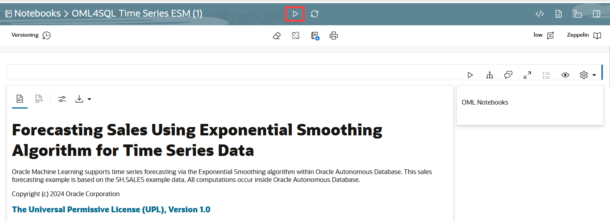
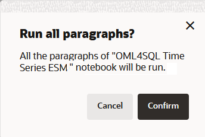
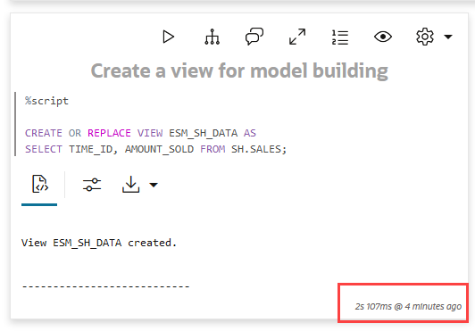

# Introduction to Oracle Machine Learning for SQL

## Introduction

 This lab walks you through the steps to explore, build, evaluate, and score data using OML4SQL from a Time Series example available in OML Notebooks. The data set used in this example is from the SH schema. The SH schema can be readily accessed in Oracle Autonomous Database. Oracle includes the Exponential Smoothing (ESM) algorithm for time series. Exponential smoothing is a forecasting method for time series data. It is a moving average method where exponentially decreasing weights are assigned to past observations.

Estimated Time: 30 minutes

### About Oracle Machine Learning for SQL (OML4SQL)
OML4SQL provides a powerful, state-of-the-art machine learning capability within Oracle Database. You can use OML4SQL to build and deploy predictive and descriptive machine learning models, add intelligent capabilities to existing and new applications. OML4SQL offers an extensive set of in-database algorithms for performing a variety of machine learning tasks, such as classification, regression, anomaly detection, feature extraction, clustering, and market basket analysis, among others. The programmatic interfaces to OML4SQL are PL/SQL for building and maintaining models and a family of SQL functions for scoring.

### Objectives

In this lab, you will:
* Explore the data using SQL queries
* Build a Time Series model
* Evaluate the model using standard diagnostic metrics
* Access the forecasts from the DM$VP view

### Prerequisites

This lab assumes you have:
* An Oracle Cloud account
* All previous labs successfully completed

## Task 1: Examine the Data

1. Click the hamburger icon  to open the left navigation menu and click **Notebooks**.

2. The Notebooks page opens with all the notebooks listed in it. Click the **OML4SQL Time Series ESM (1)** notebook to open it.

    

3. The _OML4SQL Time Series ESM (1)_ notebook opens in the notebook editor. Click the gear icon to view and set the interpreter binding order.

4. Click the play icon next to the **OML4SQL Time Series ESM (1)** title to run all paragraphs of the notebook.

  


5. Click **OK** in the confirmation window to run all paragraphs.

    

6. The paragraphs start running one by one and display the status next to the paragraph titles. When the paragraph is running, the status displays **PENDING** and when it finishes, it displays **FINISHED**.

    

    

In this notebook you are using the `SALES` table from the `SH` schema. You can access the table by running the `SELECT` statements in OML Notebooks.

The following table displays information about the attributes from the `SALES` table:

| Attribute Name | Information |
| --- | --- |
| `PROD_ID`  |The ID of the product  |
| `CUST_ID` |The ID of the customer | More text |
| `TIME_ID` | The timestamp of the purchase of the product in yyy-mm-dd hh:mm:ss format | More text |
| `CHANNEL_ID` | The channel ID of the channel sales data|
|`PROMO_ID` | The product promotion ID|
|`QUANTITY_SOLD` |The number of items sold|
|`AMOUNT_SOLD` |	The amount or sales data|

## Task 2: Prepare the Data

In this step, you will prepare the data by creating a view.
The following steps help you to create a view and view the data:
1. Prepare a view called `ESM_SH_DATA` by selecting the necessary columns from `SH.SALES` table. For this example, select `TIME_ID` and `AMOUNT_SOLD`.

    ```
    <copy>
    %script
    CREATE OR REPLACE VIEW ESM_SH_DATA AS
    SELECT TIME_ID, AMOUNT_SOLD FROM SH.SALES;

    </copy>

     ```

  The output is as follows:

    ```
    View ESM_SH_DATA created.
    --------------------------
    ```

    > **Note:** If you are reserving a workshop, some of the table views may already exist.

2. Count the number of rows to ensure that we have the same amount of data. Run the following query:

    ```
    <copy>
    %script
    SELECT count(*) from ESM_SH_DATA;
    </copy>
    ```

    The output is follows:

    ```
    COUNT(*)  
    918843

    ---------------------------
    ```

3. View the `ESM_SH_DATA`.

    ```
    <copy>
    %sql
    SELECT * from ESM_SH_DATA
    WHERE rownum <11;
    </copy>
    ```

	

## Task 3: Build Your Model

To build a model using the time series data, you will use the Exponential Smoothing algorithm on the `ESM_SH_DATA` view that is generated during the data preparation stage. In this example you build a time series model by applying the Holt-Winters model on time series aggregated on a quarterly interval.
1. Build a Holt-Winters model with the `ESM_SH_DATA` table, run the following script:

    ```sql
        <copy>
        %script

        BEGIN DBMS_DATA_MINING.DROP_MODEL('ESM_SALES_FORECAST_1');
        EXCEPTION WHEN OTHERS THEN NULL; END;
        /
        DECLARE
              v_setlst DBMS_DATA_MINING.SETTING_LIST;
        BEGIN
    &nbsp;
             -- algorithm = exponential smoothing
             v_setlst('ALGO_NAME')            := 'ALGO_EXPONENTIAL_SMOOTHING';

                 -- accumulation interval = quarter
                 v_setlst('EXSM_INTERVAL')        := 'EXSM_INTERVAL_QTR';

                 -- prediction step = 4 quarters
                 v_setlst('EXSM_PREDICTION_STEP') := '4';                 

                 -- ESM model = Holt-Winters
                 v_setlst('EXSM_MODEL')           := 'EXSM_WINTERS';      

                 -- seasonal cycle = 4 quarters
                 v_setlst('EXSM_SEASONALITY')     := '4';                 

    &nbsp;
             DBMS_DATA_MINING.CREATE_MODEL2(
                MODEL_NAME           => 'ESM_SALES_FORECAST_1',
                MINING_FUNCTION      => 'TIME_SERIES',
                DATA_QUERY           => 'select * from ESM_SH_DATA',
                SET_LIST             => v_setlst,
                CASE_ID_COLUMN_NAME  => 'TIME_ID',
                TARGET_COLUMN_NAME   =>'AMOUNT_SOLD');
        END;
        </copy>

    ```

    The output is as follows:

    ```
        PL/SQL procedure successfully completed.
        ---------------------------
        PL/SQL procedure successfully completed.

    ```

    Examine the script:
    - `v_setlist` is a variable to store `SETTING_LIST`.
    - `SETTING_LIST` specifies model settings or hyperparameters for the model.
    - `DBMS_DATA_MINING` is the PL/SQL package used for machine learning. These settings are described in [`DBMS_DATA_MINING — Algorithm Settings: Exponential Smoothing`](https://docs.oracle.com/en/database/oracle/oracle-database/21/arpls/DBMS_DATA_MINING.html#GUID-A95A0A38-8A5A-4470-B49F-80D81C588BFC).
    - `ALGO_NAME` specifies the algorithm name. Since you are using Exponential Smoothing as the algorithm, the value of the setting is `ALGO_EXPONENTIAL_SMOOTHING`.
    - `EXSM_INTERVAL` indicates the interval of the data set or a unit of interval size. For example, day, week, month, and so on. You want to predict for quarterly sales. Hence, the setting is `EXSM_INTERVAL_QTR`. This setting applies only to the time column with datetime type.
    - `EXSM_PREDICTION_STEP` specifies how many predictions to make. You want to display each value representing a quarter. Hence, a value of 4 gives four values ahead prediction.
    - `EXSM_MODEL` specifies the type of exponential smoothing model to be used. Here the value is `EXSM_HW`. The Holt-Winters triple exponential smoothing model with additive trend and multiplicative seasonality is applied. This type of model considers various combinations of additive and multiplicative trend, seasonality and error, with and without trend damping. Other options are `EXSM_SIMPLE`, `EXSM_SIMPLE_MULT`, `EXSM_HOLT`, `EXSM_HOLT_DMP`, `EXSM_MUL_TRND`, `EXSM_MULTRD_DMP`, `EXSM_SEAS_ADD`, `EXSM_SEAS_MUL`, `EXSM_HW`, `EXSM_HW_DMP`, `EXSM_HW_ADDSEA`, `EXSM_DHW_ADDSEA`, `EXSM_HWMT`, `EXSM_HWMT_DMP`.
    - `EXSM_SEASONALITY` indicates how long a season lasts. The parameter specifies a positive integer value as the length of seasonal cycle. The value it takes must be larger than 1. For example, 4 means that every group of four values forms a seasonal cycle.
    - `EXSM_SETMISSING` specifies how to handle missing values. Time series data can contain missing values. The special value `EXSM_MISS_AUTO` indicates that, if the series contains missing values it is to be treated as an irregular time series. The Automatic Data Preparation (ADP) setting does not impact this data for time series.

    The `CREATE_MODEL2` procedure takes the following parameters:
    - `MODEL_NAME`: A unique name that you will give to the model. Name of the model in the form `[schema_name.]model_name`. If you do not specify a schema, then your own schema is used. Here, the model name is `ESM_SALES_FORECAST_1`.
    - `MINING_FUNCTION`: Specifies the machine learning function. Since it is a time series problem, select `TIME_SERIES`.
    - `DATA_QUERY`: A query that provides training data for building the model. Here, the query is SELECT * FROM `ESM_SH_DATA`.
    - `SET_LIST`: Specifies `SETTING_LIST`.
    - `CASE_ID_COLUMN_NAME`: A unique case identifier column in the training data. In this example, `case_id` is `TIME_ID`. If there is a composite key, you must create a new attribute before creating the model.
    - `TARGET_COLUMN_NAME`: Specifies the column that is to be predicted. Also referred to as the target variable of the model. In other words, the value the model predicts. In this example, you are predicting the sale of products in terms of their dollar price. Therefore, in this example, the `TARGET_COLUMN_NAME` is `AMOUNT_SOLD`.

    > **Note:** Any parameters or settings not specified are either system-determined or default values are used.

## Task 4: Evaluate Your Model

Evaluate your model by viewing diagnostic metrics and performing quality checks. To obtain more insights about the model and view model settings, you can query data dictionary views and model detail views. Specific model detail views display model statistics which can help you evaluate the model. Model detail views are specific to the algorithm. The names of model detail views begin with `DM$xx` where _xx_ corresponds to the view prefix. See [Model Detail Views](https://docs.oracle.com/en/database/oracle/machine-learning/oml4sql/21/dmprg/model-detail-views.html#GUID-AF7C531D-5327-4456-854C-9D6424C5F9EC).

1. You can review the model settings by running the following query:

    ```
    <copy>
    %sql
    SELECT SETTING_NAME, SETTING_VALUE
    FROM USER_MINING_MODEL_SETTINGS
    WHERE MODEL_NAME = UPPER('ESM_SALES_FORECAST_1')
    ORDER BY SETTING_NAME;
    </copy>
    ```
	

2. To view the model diagnostic view, `DM$VG`, and evaluate the model, run the following query:

    ```
    <copy>
    %sql
    SELECT NAME, round(NUMERIC_VALUE,4), STRING_VALUE
    FROM DM$VGESM_SALES_FORECAST_1
    ORDER BY NAME;
    </copy>
    ```

	

The `DM$VG` view for time series contains the global information of the model along with the estimated smoothing constants, the estimated initial state, and global diagnostic measures.

- `NAME`: Indicates the diagnostic attribute name.
- `NUMERIC_VALUE`: Indicates the calculated statistical value for the model.
- `STRING_VALUE`: Indicates alphanumeric values for the diagnostic parameter.

    A few parameters to note for an exponential smoothing algorithm are:
    - `ALPHA`: Indicates the smoothing constant.
    - `BETA`: Indicates the trend smoothing constant.
    - `GAMMA`: Indicates the seasonal smoothing constant.
    - `MAE`: Indicates Mean Absolute Error.
    - `MSE`: Indicates Mean Square Error.

In exponential smoothing, a series extends infinitely into the past, but that influence of past on future decays smoothly and exponentially fast. The smooth rate of decay is expressed by one or more smoothing constants. The smoothing constants are parameters that the model estimates. These smoothing constants are represented as _α_, _β_, and _γ_. Values of a smoothing constant near one put almost all weight on the most recent observations. Values of a smoothing constant near zero allow the distant past observations to have a large influence.

Note that _α_ is associated with the error or noise of the series, _β_ is associated with the trend, and _γ_ is associated with the seasonality factors.

## Task 5: Access Forecasts from Your Model

For a time series model, you use the `DM$VP` view to retrieve the forecasts for the requested time periods.
1. Query the `DM$VP` model detail view to see the forecast (sales for four quarters). The `DM$VP` view for time series contains the result of an ESM model. The output has a set of records such as partition, `CASE_ID`, value, prediction, lower, upper, and so on and ordered by partition and `CASE_ID` (time). Run the following statement:

    ```
    <copy>
    %sql
    SELECT TO_CHAR(CASE_ID,'YYYY-MON') DATE_ID,
           round(VALUE,2) ACTUAL_SOLD,
           round(PREDICTION,2) FORECAST_SOLD,
           round(LOWER,2) LOWER_BOUND, round(UPPER,2) UPPER_BOUND
    FROM DM$VPESM_SALES_FORECAST_1
    ORDER BY CASE_ID DESC;
    </copy>
    ```

	
	In this step, the forecast shows the amount sold along with the `case_id`. The forecasts display upper and lower confidence bounds showing that the estimates can vary between those values.

	Examine the statement:
	- `TO_CHAR(CASE_ID,'YYYY-MON') DATE_ID`: The `DATE_ID` column has timestamp or `case_id` extracted in year-month (yyyy-mon) format.
	- `round(VALUE,2) ACTUAL_SOLD`: Specifies the `AMOUNT_SOLD` value as `ACTUAL_SOLD` rounded to two decimal places.
	- `round(PREDICTION,2) FORECAST_SOLD`: Specifies the predicted value as `FORECAST_SOLD` rounded to two decimal places.
	- `round(LOWER,2) LOWER_BOUND, round(UPPER,2) UPPER_BOUND`: Specifies the lower and upper confidence levels rounded to two decimal places.

2. To see a visual representation of the predictions in OML Notebooks, run the same query above without ```DESC``` in the ```ORDER BY``` clause. Click the Line Chart graph and apply the following settings:
Click **settings** and drag `DATE_ID` to **keys** and `FORECASTED_SOLD`, `ACTUAL_SOLD`, `LOWER_BOUND`, and `UPPER_BOUND` to **values**. By default, the columns in the **values** field show `(sum)`. For example,  `ACTUAL_SOLD (sum)`. Click the column name and change it to `(avg)`. Change all the column names in the **values** field to show `(avg)`.

    ```
    <copy>
      %sql
      SELECT TO_CHAR(CASE_ID,'YYYY-MON') DATE_ID, VALUE ACTUAL_SOLD,
             round(PREDICTION,2) FORECAST_SOLD,
             round(LOWER,2) LOWER_BOUND, round(UPPER,2) UPPER_BOUND
        FROM DM$VPESM_SALES_FORECAST_1
        ORDER BY CASE_ID;
    </copy>
    ```

  

  

  

This completes the prediction step. The model has successfully forecast sales for the next four quarters. You may now **proceed to the next lab**.

## Learn More

* [Time series use case](https://docs.oracle.com/en/database/oracle/machine-learning/oml4sql/21/mlsql/time-series.html#GUID-B5AF253F-DF52-416C-A621-0B7F6ECFFF7E)
* [PL/SQL API Packages](https://docs.oracle.com/en/database/oracle/machine-learning/oml4sql/21/dmapi/DBMS_DATA_MINING.html#GUID-7B9145D4-831F-46B3-977F-01AF77ACA4A1)
* [Model Detail Views](https://docs.oracle.com/en/database/oracle/machine-learning/oml4sql/21/dmapi/model-detail-views.html#GUID-AF7C531D-5327-4456-854C-9D6424C5F9EC)
* [Exponential Smoothing](https://docs.oracle.com/en/database/oracle/machine-learning/oml4sql/21/dmcon/expnential-smoothing.html#GUID-65C7E533-E403-4F71-A5FE-EC034745904F)

## Acknowledgements

* **Author** - Sarika Surampudi, Principal User Assistance Developer, Oracle Database User Assistance Development
* **Contributors** -  Mark Hornick, Sr. Director, Data Science and Oracle Machine Learning Product Management; Sherry LaMonica, Consulting Member of Technical Staff, Machine Learning;  Marcos Arancibia, Senior Principal Product Manager, Machine Learning
* **Last Updated By/Date** - Marcos Arancibia, March 2023
