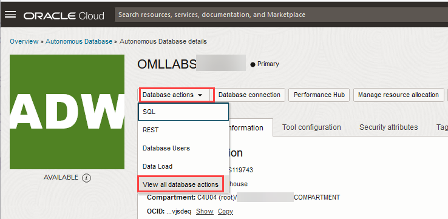

# Create and Run a Data Bias Detection Job Using Oracle Machine Learning REST API

## Introduction

The OML Services Data Bias Detector provides REST endpoints for creating bias detector jobs. To help address data biases and mitigate its effects in later stages of the modeling process, the bias mitigation method **Reweighing** has been added to the `data_bias` API. The Database Bias Detector calculates metrics to identify common types of data bias: Class Imbalance (CI), Statistical Parity (SP), and Conditional Demographic Disparity (CDD). 
 In this lab, you will learn how to create and run a data bias detection job, view the job details, and query the output table to view the data bias details.

Estimated Time: 40 minutes

### About Oracle Machine Learning Services

OML Services 

### Objectives

In this lab, you will:
* Create and Run a Data Bias Detection Job
    * Create and run a data bias detection job
    * View the details of the data bias job
    * Query the output table to view the data bias details detected for the sensitive features


### Prerequisites

This lab assumes you have:
* OCI Cloud Shell, which has cURL installed by default. If you are using the Workshops tenancy, you get OCI Cloud Shell as part of the reservation. However, if you are in your own OCI tenancy or using a free trial account, ensure you have OCI Cloud Shell or install cURL for your operating system to run the OML Services commands.
* An Autonomous Database instance created in your account/tenancy if you are using your own tenancy or a free trial account. You should have handy the following information for your instance:
    * Your OML user name and password
    * `oml-cloud-service-location-url`
* Completed all previous labs successfully.

## Task 1: Create and Run a Data Bias Detection Job in OML Services


In this example, you will learn how to:

* Create and run a data bias detection job
* View the details of the data bias job
* Query the output table to view the data bias details detected for the sensitive features

**Prerequisites:**

* Access to the Adult dataset. The dataset used in this example— the **Adult** dataset, also known as the **Census Income** dataset, is a multivariate dataset. It contains census data of `30,940` adults. The prediction task associated with the dataset is to determine whether a person makes over `50K` a year.  
  This dataset can be accessed here at: 
* A valid authentication token 
* oml-cloud-service-location-url

To create and run a data bias detection job: 

1. Obtain an authentication token by using your Oracle Machine Learning (OML) account credentials to send requests to OML Services. To authenticate and obtain a token, use `cURL` with the `-d` option to pass the credentials for your Oracle Machine Learning account against the Oracle Machine Learning user management cloud service REST endpoint `/oauth2/v1/token`. Run the following command to obtain the access token: 

    ```
    <copy>
    $ curl -X POST --header 'Content-Type: application/json' --header 'Accept: application/json' -d '{"grant_type":"password", "username":"'<yourusername>'", 
    "password":"' <yourpassword>'"}'"<oml-cloud-service-location-url>/omlusers/api/oauth2/v1/token"
    </copy>
    ``` 

  In the syntax above, `<oml-cloud-service-location-url>` is the Autonomous Database URL and points to the region where the Autonomous Database instance resides. The URL also contains the database name and tenancy ID. You can obtain this URL information from Oracle Machine Learning RESTful services on the Database Actions page. 
    * On your Oracle ADB instance details page, click **Database actions**  and then click **View all database actions.**

      
        
    * The Database Actions Launchpad opens in a different tab. Here, go to **Related Services** tab and then click **Oracle Machine Learning RESTful services**. The Oracle Machine Learning RESTful Services dialog opens.  

      

    * On the Oracle Machine Learning RESTful Services dialog, copy the URL for your ADB instance. Paste the URL to a text editor, such as Notepad. From the URL, remove the /omlusers/ segment.

      


2. To create a job for data bias detection and data bias mitigation, send the following POST request to the `/omlmod/v1/jobs` endpoint in OML Services. 

    >**Note:** OML Services interacts with the `DBMS_SCHEDULER` to perform actions on jobs. 

    _Example of a data bias detection job request:_

    ```
      curl -v -X POST <oml-cloud-service-location-url>/-H "Content-Type: 
      application/json" -H "accept: application/json" -d
        '{"jobProperties":{
	        "jobName":"jobNametest",
	        "jobType":"DATA_BIAS",
	        "jobServiceLevel":"MEDIUM",
	        "inputSchemaName":"OMLUSER",
	        "outputSchemaName":"OMLUSER",
	        "outputData":"adultbias_tab",
	        "jobDescription":"Data_Bias job,specify all parameters",
	        "inputData":"ADULT",
	        "sensitiveFeatures":["\"GENDER\""],
	        "strata":["\"MARITAL_STATUS\""],
	        "outcomeColumn":"INCOME",
	        "positiveOutcome":">50K",
	        "categoricalBinNum":6
	        "numericalBinNum":10}}'
            -H 'Authorization:Bearer <token>'
      ```

    _Sample response of the data bias detection job:_

    ```
    "jobId":"OML$53D60B34_A275_4B2B_831C_2C8AE40BCB53","links":[{"rel":"self","href":"http://<oml-cloud-service-location-url>/omlmod/v1/jobs/OML%2453D60B34_A275_4B2B_831C_2C8AE40BCB53"}]}
    ```
  The parameters used in this command are:

    * `jobName` - The name of the OML job. In this example, the name is jobNametest.
    * `jobType` - Specifies the type of job to be run. It is set to DATA_BIAS for data bias jobs.
    * `jobServiceLevel` - MEDIUM
    * `inputSchemaName` - OMLUSER
    * `outputSchemaName` - OMLUSER
    * `outputData` - This is the name of the output data table. In this example, the output data table name is `adultbias_tab`
    * `jobDescription` - This is a description of the `Data_Bias` job.
    * `inputData` - This is the name of the input data table. In this example, the table name is `ADULT`.
    * `sensitiveFeatures` - This is a list of features on which data bias detection and mitigation is performed. By default, 250 features can be monitored for data bias detection. If there are more than 250 features, it will error out. The features can be either numeric or categorical. In this example, the attribute passed for sensitive feature is `GENDER`.

      >**Note:** `Text`, `Nested`, and `Date` data types are not supported in this release.
    
    * `strata` - This is an array of strata names to calculate the Conditional Demographihc Disparity (CDD) to mitigate the impact of data bias from confounding variables by conditioning a third variable called strata. In this example, the name provided for strata is `MARITAL_STATUS`.
    * `outcomeColumn` - This is the name of the feature in the input data that is the outcome of training a machine learning model. The outcome must be either numeric or categorical. In this examplem it is `INCOME`.
    * `positiveOutcome` - This is a value that is in favor of a specific group in a dataset. It essentially indicates a positive outcome for that group. In the example, the positive outcome value is `>50K`.
    * `categoricalBinNum` - Indicates whether to perform binning on categorical features. The number of bins is set to `6`.
    * `numericalBinNum` - Indicates whether to perform binning on numerical features. The number of bins is set to the default value `10`.

## Task 2: View the Data Bias Detection Job Details

1. Run the following command to view job details:

    ```
    <copy>
    curl -v -X GET <oml-cloud-service-location-url>/omlmod/v1/jobs/'OML$53D60B34_A275_4B2B_831C_2C8AE40BCB53' 
    -H "Content-Type: application/json" -H 'Authorization:Bearer <token>'
    </copy>
    ```
    In this example:

      * `$token` - Represents an environmental variable that is assigned to the token obtained through the  Authorization API.
      * `OML$53D60B34_A275_4B2B_831C_2C8AE40BCB53` - This is the job ID


2. After the data bias job is submitted successfully, you must connect to the database to access the output table in the output schema. Note the `inputSchemaName`, `outputSchemaName`, and `outputData` in this example:

    * `inputSchemaName` - It is `OMLUSER`
    * `outputSchemaName` - It is `OMLUSER`
    * `outputData` - This is the output data table. In this example, the name is `adultbias_tab`.

    Run the following SQL query to count the number of records in the output table: 

    ```
    <copy>
    select * from
      OML$53D60B34_A275_4B2B_831C_2C8AE40BCB53_ADULTBIAS_TAB;
    </copy>
    ```


    In this example,

    * `OML$53D60B34_A275_4B2B_831C_2C8AE40BCB53` - This is the job ID.
    * `ADULTBIAS_TAB` - This is the output table name.

    _Sample Response:_
    Here is the data bias result for `GENDER` passed for the parameter `sensitiveFeature` , and `MARITAL_STATUS` passed for the parameter strata:

    ```
    {
    "metric": [
        {
            "group_a": "MALE",
            "CI": 0.33841,
            "SP": 0.19628
        },
        {
            "group_a": "FEMALE",
            "CI": -0.33841,
            "SP": -0.19628
        }
    ],
    "cdd": [
        {
            "strata": "MARITAL_STATUS",
            "result": [
                {
                    "group_a": "MALE",
                    "CDD": 0.092269,
                    "detail": [
                        {
                            "subgroup": "MARRIED-CIV-SPOUSE",
                            "DD": -0.0036665
                        },
                        {
                            "subgroup": "NEVER-MARRIED",
                            "DD": 0.11335
                        },
                        {
                            "subgroup": "DIVORCED",
                            "DD": 0.23977
                        },
                        {
                            "subgroup": "SEPARATED",
                            "DD": 0.38267
                        },
                        {
                            "subgroup": "WIDOWED",
                            "DD": 0.31675
                        },
                        {
                            "subgroup": "MARRIED-SPOUSE-ABSENT",
                            "DD": 0.18168
                        },
                        {
                            "subgroup": "",
                            "DD": 0.015385
                        }
                    ]
                },
                {
                    "group_a": "FEMALE",
                    "CDD": -0.092269,
                    "detail": [
                        {
                            "subgroup": "MARRIED-CIV-SPOUSE",
                            "DD": 0.0036665
                        },
                        {
                            "subgroup": "NEVER-MARRIED",
                            "DD": -0.11335
                        },
                        {
                            "subgroup": "DIVORCED",
                            "DD": -0.23977
                        },
                        {
                            "subgroup": "SEPARATED",
                            "DD": -0.38267
                        },
                        {
                            "subgroup": "WIDOWED",
                            "DD": -0.31675
                        },
                        {
                            "subgroup": "MARRIED-SPOUSE-ABSENT",
                            "DD": -0.18168
                        },
                        {
                            "subgroup": "",
                            "DD": -0.015385
                        }
                    ]
                }
            ]
        }
    ],
    "reweighing_matrix": [
        {
            "group_a": "MALE",
            "group_a_pos_weight": 0.78764,
            "non_group_a_pos_weight": 2.2,
            "group_a_neg_weight": 1.0935,
            "non_group_a_neg_weight": 0.85251
        },
        {
            "group_a": "FEMALE",
            "group_a_pos_weight": 2.2,
            "non_group_a_pos_weight": 0.78764,
            "group_a_neg_weight": 0.85251,
            "non_group_a_neg_weight": 1.0935
        }
    ]
}


In this example:


* The Class Imbalance (CI) and Statistical Parity (SP) computed for the attribute `GENDER` and for the group MALE are positive. While CI and SP values for the group FEMALE are negative. This indicates that the disadvantaged groups (female) have fewer data points than the advantaged groups. During the machine learning training process, the models try to minimize the overall error rate. As a result, the model tends to be good at predicting the majority classes and perform poorly on the minority or disadvantaged classes.
* The Conditional Demographic Disparity for the groups `MALE` and `FEMALE` are `0.092269` and `-0.092269` respectively. Note that the sum of the computed CDD for the strata `MARITAL_STATUS` is zero. This indicates that even after taking `MARITAL_STATUS` into account, the data is still biased towards the MALE group (as the CDD is positive), and is against the `FEMALE` group (as the CDD is negative).
* For `GENDER`, reweighing matrix is computed. Reweighing is a method to mitigate data bias. Reweighing reduces the data bias by assigning greater weights to instances in the disadvantaged groups and with positive labels. Essentially, the classifier pays more attention to the instances with greater weights, and prioritize their correct classification. The goal is to ensure that the classifier does not favor the advantaged groups or allow existing biases against disadvantage groups. Here's how you can apply the reweighing matrix:

Some machine learning packages accept row or sample weights as a training parameter for certain models. For example, in the Oracle `DBMS_DATA_MINING` package, you can set the `ODMS_ROW_WEIGHT_COLUMN_NAME` in Global Settings while training a generalized linear model (GLM). For Classification algorithms that cannot incorporate row weights in the training process, the weighing matrices can serve as guidance for resampling the data.
    
## Learn More

* [REST API for Oracle Machine Learning Services](https://docs.oracle.com/en/database/oracle/machine-learning/omlss/omlss/index.html)
* [Work with Oracle Machine Learning ONNX Format Models](https://docs.oracle.com/en/database/oracle/machine-learning/omlss/omlss/omls-example-onnx-ml.html)
* [Work with Oracle Machine Learning ONNX Image Models](https://docs.oracle.com/en/database/oracle/machine-learning/omlss/omlss/omls-example-onnx-image.html)
* [Create the proper ONNX files that work with OML Services](https://github.com/oracle/oracle-db-examples/blob/main/machine-learning/oml-services/SKLearn%20kMeans%20and%20GMM%20export%20to%20ONNX.ipynb)
* [Work with Batch Scoring](https://docs.oracle.com/en/database/oracle/machine-learning/omlss/omlss/omls-batch-scoring.html)
* [Work with Data Monitoring](https://docs.oracle.com/en/database/oracle/machine-learning/omlss/omlss/omls-data-monitoring.html)
* [Work with Model Monitoring](https://docs.oracle.com/en/database/oracle/machine-learning/omlss/omlss/omls-model-monitoring.html)
* * [Work with Data Bias Detection](https://docs.oracle.com/en/database/oracle/machine-learning/omlss/omlss/omls-data-bias-detector.html)


## Acknowledgements

* **Author** - Suresh Rajan, Senior Manager, Oracle Database User Assistance Development; Moitreyee Hazarika, Principal UAD, Database User Assistance Development
* **Contributors** -  Mark Hornick, Senior Director, Data Science and Oracle Machine Learning Product Management; Sherry LaMonica, Consulting Member of Technical Staff, Oracle Machine Learning; Marcos Arancibia Coddou, Senior Principal Product Manager, Machine Learning
* **Last Updated By/Date** - Moitreyee Hazarika, February 2025
