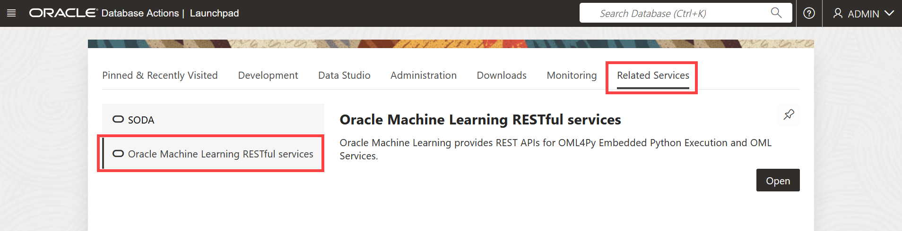

# Create and Run a Data Monitoring Job Using OML Services REST API

## Introduction

 In this lab, you 

Estimated Time: 40 minutes

### About Oracle Machine Learning Services

OML Services extends OML functionality to support model deployment and model lifecycle management for both in-database OML models and third-party Open Neural Networks Exchange (ONNX) machine learning models via REST APIs. These third-party classification, regression or clustering models can be built using tools that support the ONNX format, which includes packages like Scikit-learn and TensorFlow, among several others.

Oracle Machine Learning Services provides REST endpoints through the Oracle Autonomous Database environment. These endpoints enable the storage of machine learning models along with their metadata, the creation of scoring endpoints for the model, and producing scores using these endpoints.

### Objectives

In this lab, you will:
* Create and Run a Data Monitoring Job
    * Create a data monitoring job
    * View the job details
    * Enable the job to run
    * View job output


### Prerequisites

This lab assumes you have:
* OCI Cloud Shell, which has cURL installed by default. If you are using the Workshops tenancy, you get OCI Cloud Shell as part of the reservation. However, if you are in your own OCI tenancy or using a free trial account, ensure you have OCI Cloud Shell or install cURL for your operating system to run the OML Services commands.
* An Autonomous Database instance created in your account/tenancy if you are using your own tenancy or a free trial account. You should have handy the following information for your instance:
    * Your OML user name and password
    * `oml-cloud-service-location-url`
* Completed all previous labs successfully.


## Task 1: Create and Run a Data Monitoring Job

Using the OML Services REST API, you can evaluate how your data evolves over time. It provides you with insights on trends and multivariate dependencies in the data. It also gives you an early warning about data drift.

In this example, you will learn how to:

  * Create a data monitoring job
  * View the job details
  * Update the job (optional)
  * Enable the job to run
  * View job output

  >**Note:** This example uses the `HOUSEHOLD POWER CONSUMPTION` dataset.

**Prerequisites:**

  * A valid authentication token
  * oml-cloud-service-location-url
  * Access to the dataset to monitor
 


To create a data monitoring job:

1. Obtain an authentication token by using your Oracle Machine Learning (OML) account credentials to send requests to OML Services. To authenticate and obtain a token, use `cURL` with the `-d` option to pass the credentials for your Oracle Machine Learning account against the Oracle Machine Learning user management cloud service REST endpoint `/oauth2/v1/token`. Run the following command to obtain the access token: 

    ```
    <copy>
    $ curl -X POST --header 'Content-Type: application/json' --header 'Accept: application/json' -d '{"grant_type":"password", "username":"'<yourusername>'", 
    "password":"' <yourpassword>'"}'"<oml-cloud-service-location-url>/omlusers/api/oauth2/v1/token"
    </copy>
    ```
  Here,  
    * `-X POST` - Specifies to use a POST request when communicating with the HTTP server
    * `-header` - Defines the headers required for the request (application/json)
    * `-d` - Sends the username and password authentication credentials as data in a POST request to the HTTP server
    * `Content-Type` - Defines the response format (JSON)
    * `Accept` - Defines the response format (JSON)
    * `<yourusername>` - This is the user name of a Oracle Machine Learning user with the default OML_DEVELOPER role
    * `<yourpassword>` - This is the password for the user name
    * `<oml-cloud-service-location-url>` This is a URL containing the REST server portion of the Oracle Machine Learning User Management Cloud Service instance URL that includes the tenancy ID and database name. You can obtain the URL from the Development tab in the Service Console of your Oracle Autonomous Database instance.


  In the syntax above, `<oml-cloud-service-location-url>` is the Autonomous Database URL and points to the region where the Autonomous Database instance resides. The URL also contains the database name and tenancy ID. You can obtain this URL information from Oracle Machine Learning RESTful services on the Database Actions page. 
    * On your Oracle ADB instance details page, click **Database actions**  and then click **View all database actions.**

      
        
    * The Database Actions Launchpad opens in a different tab. Here, go to **Related Services** tab and then click **Oracle Machine Learning RESTful services**. The Oracle Machine Learning RESTful Services dialog opens.  

      

    * On the Oracle Machine Learning RESTful Services dialog, copy the URL for your ADB instance. Paste the URL to a text editor, such as Notepad. From the URL, remove the /omlusers/ segment.

      


2. Create a data monitoring job by sending a `POST` request to the `/omlmod/v1/jobs` endpoint in OML Services. 

    >**Note:** OML Services interacts with the `DBMS_SCHEDULER` to perform actions on jobs. 

  The details for data monitoring are specified in `jobProperties` parameter, that includes: 
    * Data monitoring job name and type
    * Autonomous Database service level
    * Table where the data monitoring details will be saved
    * Drift alert trigger
    * Threshold
    * Maximum number of runs
    * Baseline and new data to be used
    * Performance metric
    * Start date (optional ) and end date (optional ) correspond to a `DATE` or `TIMESTAMP` column in the table or view denoted by `newData`, and contained in the `timeColumn` field. If the start and end dates are not specified, the earliest and latest dates and times in the `timeColumn` are used.

  >**Note:** The command uses `jq`, a command-line JSON processor available on Linux and Mac OS systems to extract relevant components from the response. 

  _Example of a data monitoring job request:_
  

  ```
      <copy>
      $ curl -X POST "<oml-cloud-service-location-url>/omlmod/v1/jobs" \
        --header "Authorization: Bearer ${token}" \
        --header 'Content-Type: application/json' \
        --data '{
          "jobSchedule": {

              "jobStartDate": "2024-11-11T20:30:26Z",             
              "repeatInterval": "FREQ=HOURLY",                   
              "jobEndDate": "2024-11-19T23:30:26Z",              
              "maxRuns": "10"                                    
          },
          "jobProperties": {
              "jobName": "HouseholdPowerDataMonitoring",         
              "jobType": "DATA_MONITORING",                      
              "disableJob": false,                      
              "outputData": "householdPowerConsumption",         
              "baselineData": "HOUSEHOLD_POWER_BASE",             
              "newData": "HOUSEHOLD_POWER_NEW",                  
              "inputSchemaName": "OMLUSER",                      
              "outputSchemaName": "OMLUSER",                     
              "jobDescription": "Monitor household power",       
              "jobServiceLevel": "LOW",                          
              "timeColumn": "DATES",                             
              "startDate": "2008-01-01T00:00:00Z",               
              "endDate": "2010-11-26T00:00:00Z",                 
              "frequency": "Year",                               
              "threshold": 0.8,                                  
              "recompute": false,                                
              "caseidColumn": null,                              
              "anchorColumn": null,                              
              "featureList": [                                   
              "jobStartDate": "2024-11-11T20:30:26Z",             
              "repeatInterval": "FREQ=HOURLY",                   
              "jobEndDate": "2024-11-19T23:30:26Z",              
              "maxRuns": "10"                                    
          },
          "jobProperties": {
              "jobName": "HouseholdPowerDataMonitoring",         
              "jobType": "DATA_MONITORING",                      
              "disableJob": false,                               
              "outputData": "householdPowerConsumption",         
              "baselineData": "HOUSEHOLD_POWER_BASE",             
              "newData": "HOUSEHOLD_POWER_NEW",                  
              "inputSchemaName": "OMLUSER",                      
              "outputSchemaName": "OMLUSER",                     
              "jobDescription": "Monitor household power",       
              "jobServiceLevel": "LOW",                          
              "timeColumn": "DATES",                             
              "startDate": "2008-01-01T00:00:00Z",               
              "endDate": "2010-11-26T00:00:00Z",                 
              "frequency": "Year",                               
              "threshold": 0.8,                                  
              "recompute": false,                                
              "caseidColumn": null,                              
              "anchorColumn": null,                              
              "featureList": [                                   

                  "GLOBAL_ACTIVE_POWER",
                  "GLOBAL_REACTIVE_POWER",
                  "VOLTAGE",
                  "SUB_METERING_1",
                  "SUB_METERING_2",
                  "SUB_METERING_3"
                ]
            }
        }' | jq
    

      </copy>
   ```

  The parameters in this command are:
  
  * `jobName` specifies the name of the submitted job.
  * `jobType` specifies the type of job to be run.

    >**Note:** For model monitoring jobs, this parameter is set to `MODEL_MONITORING`
    `outputData` is the output data identifier. The results of the job will be written to a table named `{jobId}_{ouputData}`
  * `baselineData` is a table or view name that contains baseline data to monitor. At least 50 rows per period are required for model monitoring, otherwise analysis is skipped.
  * `newData` is a table or view name with new data to be compared against the baseline. At least 100 rows per period are required for data monitoring, otherwise analysis is skipped.


When your job is submitted successfully, you will receive a response with a `jobid`. 

  >**Note:** the `jobId` to use it in submit requests to retrieve job details or to perform any other actions on the job. 

_Sample Response:_
  Here is an example of a data monitoring job creation response: 

  ```
     {
       "jobId": "OML$7ABB6308_1664_4CB4_84B1_598A6EA599D1",
       "links": [
       {
         "rel": "self",
             "href": "<OML Service URL>/omlmod/v1/jobs/OML%247ABB6308_1664_4CB4_84B1_598A6EA599D1"
       }
     ]
     }
   ```

## Task 2: View Details of the Submitted Job

1. To view details of your submitted job, send a GET request to the `/omlmod/v1/jobs/{jobID}` endpoint. Here, `jobId` is the ID provided in response to the successful submission of your data monitoring job in the previous step. 

  _Example of a GET request to view job details:_


    ```
    <copy>
    $ export jobid='OML$7ABB6308_1664_4CB4_84B1_598A6EA599D1'  

    $ curl -X GET "<oml-cloud-service-location-url>/omlmod/v1/jobs/${jobid}"  \
         --header 'Accept: application/json' \
         --header 'Content-Type: application/json' \
         --header "Authorization: Bearer ${token}" | jq
    </copy>

    ```
  
  _Sample Response:_
  Here is the response of the job details request. If your job has already run once earlier, you will see information returned about the last job run.

    ```
    <copy>
      {
        "jobId": "OML$7ABB6308_1664_4CB4_84B1_598A6EA599D1",
          "jobRequest": {
          "jobSchedule": {
          "jobStartDate": "2024-11-11T20:30:26Z",
          "repeatInterval": "FREQ=HOURLY",
          "jobEndDate": "2024-11-19T23:30:26Z",
          "maxRuns": 3
      },
        "jobProperties": {
          "jobType": "DATA_MONITORING",
          "inputSchemaName": "OMLUSER",
          "outputSchemaName": "OMLUSER",
          "outputData": "householdPowerConsumption",
          "jobDescription": "Monitor household power",
          "jobName": "HouseholdPowerDataMonitoring",
          "disableJob": false,
          "jobServiceLevel": "LOW",
          "baselineData": "HOUSEHOLD_POWER_BASE",
          "newData": "HOUSEHOLD_POWER_NEW",
          "timeColumn": "DATES",
          "startDate": "2008-01-01T00:00:00Z",
          "endDate": "2010-11-26T00:00:00Z",
          "frequency": "Year",
          "threshold": 0.8,
          "recompute": false,
          "caseidColumn": null,
          "featureList": [
            "GLOBAL_ACTIVE_POWER",
            "GLOBAL_REACTIVE_POWER",
            "VOLTAGE",
            "SUB_METERING_1",
            "SUB_METERING_2",
            "SUB_METERING_3"
          ],
            "anchorColumn": null
        }
      },
      "jobStatus": "CREATED",
      "dateSubmitted": "2024-11-19T20:23:31.53651Z",
      "links": [
        {
          "rel": "self",
          "href": "<OML Service URL>/omlmod/v1/jobs/OML%247ABB6308_1664_4CB4_84B1_598A6EA599D1"
        }
      ],
        "jobFlags": [],
        "state": "SCHEDULED",
        "enabled": true,
        "runCount": 0,
        "nextRunDate": "204-11-20T20:30:26Z" 
    }

    </copy>
    ```


## Task 3: Query the Output Table

1. Once your job has run, either according to its schedule or by the RUN action, you can view its output in the table. You specify the table in your job request with the `outputData` parameter. The full name of the table is `{jobid}_{outputData}`. You can check if your job is complete by sending a request to view its details.


  _Example to query the output table associated with this example:_
  
  After you run the query, scroll down the output table to view if there is information for the `baseline` time period and `newdata` time period for each of the dataset features being monitored for drift. Many of the columns may be empty in the baseline rows, as the data monitoring is done on the new data, not the baseline data. 

    ```
    <copy>
    %sql

    SELECT START_TIME, END_TIME, IS_BASELINE, THRESHOLD, HAS_DRIFT, round(DRIFT, 3), 
         FEATURE_NAME, ROUND(IMPORTANCE_VALUE, 3) 
    FROM OML$7ABB6308_1664_4CB4_84B1_598A6EA599D1_householdPowerConsumption
    ORDER BY FEATURE_NAME, IS_BASELINE DESC

    </copy>
    ```


## Learn More

* [REST API for Oracle Machine Learning Services](https://docs.oracle.com/en/database/oracle/machine-learning/omlss/omlss/index.html)
* [Work with Data Monitoring](https://docs.oracle.com/en/database/oracle/machine-learning/omlss/omlss/omls-data-monitoring.html)


## Acknowledgements

* **Author** - Moitreyee Hazarika, Principal UAD, Database User Assistance Development
* **Contributors** -  Mark Hornick, Senior Director, Data Science and Oracle Machine Learning Product Management; Sherry LaMonica, Consulting Member of Technical Staff, Oracle Machine Learning; Marcos Arancibia Coddou, Senior Principal Product Manager, Machine Learning
* **Last Updated By/Date** - Moitreyee Hazarika, February 2025
