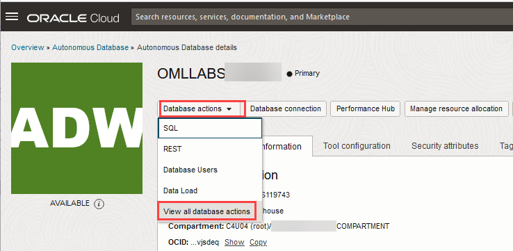

# Create and Run a Model Monitoring Job

## Introduction

 In this lab, you will 

Estimated Time: 40 minutes

### About Oracle Machine Learning Services

OML Services extends OML functionality to support model deployment and model lifecycle management for both in-database OML models and third-party Open Neural Networks Exchange (ONNX) machine learning models via REST APIs. These third-party classification, regression or clustering models can be built using tools that support the ONNX format, which includes packages like Scikit-learn and TensorFlow, among several others.

Oracle Machine Learning Services provides REST endpoints through the Oracle Autonomous Database environment. These endpoints enable the storage of machine learning models along with their metadata, the creation of scoring endpoints for the model, and producing scores using these endpoints.

### Objectives

In this lab, you will:
* Create and Run a Model Monitoring Job
    * Get the Model ID of the model to be used for monitoring
    * Create a model monitoring job
    * View the details of a model monitoring job
    * Enable a model monitoring job
    * View and understand the output of a model monitoring job

### Prerequisites

This lab assumes you have:
* OCI Cloud Shell, which has cURL installed by default. If you are using the Workshops tenancy, you get OCI Cloud Shell as part of the reservation. However, if you are in your own OCI tenancy or using a free trial account, ensure you have OCI Cloud Shell or install cURL for your operating system to run the OML Services commands.
* An Autonomous Database instance created in your account/tenancy if you are using your own tenancy or a free trial account. You should have handy the following information for your instance:
    * Your OML user name and password
    * `oml-cloud-service-location-url`
* Completed all previous labs successfully.

`

## Task 1: Create and Run a Model Monitoring Job

Model monitoring in OML REST Services is supported for classification and regression models. Performance of the model is tracked using model accuracy metrics. For classification, the model quality metrics includes Accuracy, Balanced Accuracy, Recall, Precision, F1 Score, and AUC (Area Under ROC Curve). For regression, model quality metrics includes R2, Mean Squared Error, Mean Absolute Error, and Median Absolute Error.


In this example, you will learn how to: 
 
* Get the Model ID of the model to be used for monitoring
* Create a model monitoring job
* View the details of a model monitoring job
* Enable a model monitoring job
* View and understand the output of a model monitoring job

>**Note:** This example uses the HOUSEHOLD POWER CONSUMPTION dataset.

**Prerequisites:**

* Deploy a model using AutoML UI
* A valid authentication token
* oml-cloud-service-location-url
* `modelID` of the models to be monitored

To monitor your models:

1. Obtain an authentication token by using your Oracle Machine Learning (OML) account credentials to send requests to OML Services. To authenticate and obtain a token, use `cURL` with the `-d` option to pass the credentials for your Oracle Machine Learning account against the Oracle Machine Learning user management cloud service REST endpoint `/oauth2/v1/token`. Run the following command to obtain the access token: 

    ```
    <copy>
    $ curl -X POST --header 'Content-Type: application/json' --header 'Accept: application/json' -d '{"grant_type":"password", "username":"'<yourusername>'", 
    "password":"' <yourpassword>'"}'"<oml-cloud-service-location-url>/omlusers/api/oauth2/v1/token"
    </copy>
    ```
  Here,  
    * `-X POST` - Specifies to use a POST request when communicating with the HTTP server
    * `-header` - Defines the headers required for the request (application/json)
    * `-d` - Sends the username and password authentication credentials as data in a POST request to the HTTP server
    * `Content-Type` - Defines the response format (JSON)
    * `Accept` - Defines the response format (JSON)
    * `<yourusername>` - This is the user name of a Oracle Machine Learning user with the default OML_DEVELOPER role
    * `<yourpassword>` - This is the password for the user name
    * `<oml-cloud-service-location-url>` - This is a URL containing the REST server portion of the Oracle Machine Learning User Management Cloud Service instance URL that includes the tenancy ID and database name. You can obtain the URL from the Development tab in the Service Console of your Oracle Autonomous Database instance.


  In the syntax above, `<oml-cloud-service-location-url>` is the Autonomous Database URL and points to the region where the Autonomous Database instance resides. The URL also contains the database name and tenancy ID. You can obtain this URL information from Oracle Machine Learning RESTful services on the Database Actions page. 
    * On your Oracle ADB instance details page, click **Database actions**  and then click **View all database actions.**

      
        
    * The Database Actions Launchpad opens in a different tab. Here, go to **Related Services** tab and then click **Oracle Machine Learning RESTful services**. The Oracle Machine Learning RESTful Services dialog opens.  

      

    * On the Oracle Machine Learning RESTful Services dialog, copy the URL for your ADB instance. Paste the URL to a text editor, such as Notepad. From the URL, remove the /omlusers/ segment.

      


2. To get the `modelId`, send a `GET` request to the deployment endpoint and specify the model `URI`. 

  _Example of a `GET` Request to obtain the `modelId`:_
  

    ```
    <copy>
    $ curl -X GET "<oml-cloud-service-location-url>/omlmod/v1/deployment/HousePowerNN" \
        --header "Authorization: Bearer ${token}" | jq '.modelId'
    </copy>
    ```

    In this example, the model URI is `HousePowerNN`

  _Sample Response:_

    The GET request returns the following:

    `"modelId": "0bf13d1f-86a6-465d-93d1-8985afd1bbdb"`

3. After obtaining the access token and the `modelId`, you can now create a model monitoring job by sending a POST request to the deployment endpoint and by specifying the model URI. To create a model monitoring job, you require the `model IDs` for the models that you want to monitor. The request body may include a single model, or a list of up to 20 models identified by their model IDs.

  _Example of a POST request to create a model monitoring job:_ 
   

    ```
    <copy>
    $ curl -X POST "<oml-cloud-service-location-url>/omlmod/v1/jobs" \
          --header "Authorization: Bearer ${token}" \
          --header 'Content-Type: application/json' \
          --data '{
              "jobSchedule": {
              "jobStartDate": "2024-11-10T00:30:07Z",            
              "repeatInterval": "FREQ=DAILY",                   
              "jobEndDate": "2024-11-15T20:50:06Z",              
              "maxRuns": "5"                                    
          },
          "jobProperties": {
              "jobName": "MY_MODEL_MONITOR1",                         
              "jobType": "MODEL_MONITORING",                          
              "disableJob": false,                                    
              "jobServiceLevel": "LOW",                               
              "inputSchemaName": "OMLUSER",                           
              "outputSchemaName": "OMLUSER",                          
              "outputData": "Global_Active_Power_Monitor",            
              "jobDescription": "Global active power monitoring job", 
              "baselineData": "HOUSEHOLD_POWER_BASE",                  
              "newData": "HOUSEHOLD_POWER_NEW",                       
              "frequency": "Year",                                    
              "threshold": 0.15,                                      
              "timeColumn": "DATES",                                  
              "startDate": "2008-01-01T00:00:00Z",                    
              "endDate": "2010-11-26T00:00:00Z",                      
              "caseidColumn": null,                                   
              "performanceMetric": "MEAN_SQUARED_ERROR",              
              "modelList": [                                          
                  "0bf13d1f-86a6-465d-93d1-8985afd1bbdb"
              ],
              "recompute": false                                      
              "jobStartDate": "2024-11-10T00:30:07Z",            
              "repeatInterval": "FREQ=DAILY",                   
              "jobEndDate": "2024-11-15T20:50:06Z",              
              "maxRuns": "5"                                    
          },
          "jobProperties": {
              "jobName": "MY_MODEL_MONITOR1",                         
              "jobType": "MODEL_MONITORING",                          
              "disableJob": false,                                    
              "jobServiceLevel": "LOW",                               
              "inputSchemaName": "OMLUSER",                           
              "outputSchemaName": "OMLUSER",                          
              "outputData": "Global_Active_Power_Monitor",            
              "jobDescription": "Global active power monitoring job", 
              "baselineData": "HOUSEHOLD_POWER_BASE",                  
              "newData": "HOUSEHOLD_POWER_NEW",                       
              "frequency": "Year",                                    
              "threshold": 0.15,                                      
              "timeColumn": "DATES",                                  
              "startDate": "2008-01-01T00:00:00Z",                    
              "endDate": "2010-11-26T00:00:00Z",                      
              "caseidColumn": null,                                   
              "performanceMetric": "MEAN_SQUARED_ERROR",              
              "modelList": [                                          
                  "0bf13d1f-86a6-465d-93d1-8985afd1bbdb"
              ],
              "recompute": false                                      
          }
      }' | jq
    </copy>
    ```

  This is an example of a POST request to create a model monitoring job. The job is submitted asynchronously. Therefore, it will run as scheduled and the results can be retrieved when the job completes.

  In the `jobSchedule` parameter, specify the `jobStartDate`, `jobEndDate`, `jobFrequency`, and `maximum number of runs`.
  In the `jobProperty` parameter, specify the model monitoring details such as:
    * Model monitoring job name and job type
    * Autonomous Database service level
    * Table where the model monitoring details will be saved
    * Drift alert trigger
    * Threshold
    * Maximum number of runs
    * Baseline and new data to be used
    * Chosen balanced accuracy for the performance metric
    * Start date (optional ) and end date (optional ) correspond to the DATE or TIMESTAMP column in the table or view denoted by newData, and contained in the timeColumn field. If the start and end dates are not specified, the earliest and latest dates and times in the timeColumn are used.


  The mandatory parameters to run this job are:
    * `jobType`: Specifies the type of job to be run, and is set to `MODEL_MONITORING` for model monitoring jobs
    * `outputData`: The output data identifier. The results of the job is written to a table named `{jobId}_{ouputData}`
    * `baselineData`: The table or view that contains baseline data to monitor. At least 50 rows per period are required for model monitoring, otherwise the analysis is skipped
    * `newData`: The table or view with new data to be compared against the baseline. At least 50 rows per period are required for model monitoring, otherwise the analysis is skipped
    * `modelList`: The list of models to be monitored, identified by their `modelIds`. By default, up to 20 models can be monitored by a single job

  The optional parameters are:
    
    * `disableJob`: A flag to disable the job at submission. If not set, the default is false and the job is enabled at submission.
    * `timeColumn`: The column name containing date or the timestamp column in the new data. If not provided, the entire newData is treated as one period.
    * `frequency`: Indicates the unit of time for which the monitoring is done on with the new data. The frequency can be "day", "week", "month", or "year". If not provided, the entire "new" data is used as a single time period.
    threshold: The threshold to trigger a drift alert.
    * `recompute`: A flag on whether to update the already computed periods. The default is False. This means that only time periods not present in the output result table will be computed.
    performanceMetric: The metric used to measure model performance.

      >**Note:** For regression models, the default is `MEAN_SQUARED_ERROR`. For classification models, the default is `BALANCED_ACCURACY`.
    
    * `caseidColumn`: A case identifier column in the baseline and new data. Providing it improves the reproducibility of results.
    * `startDate`: The start date or timestamp of monitoring in the newData column. The column timeColumn is mandatory for startDate. If startDate is not provided, then startDate depends on whether frequency is provided. If frequency is not provided, then the earliest date in timeColumn is used as the startDate. If both startDate and frequency are not provided, then the most recent of the earliest date in timeColumn and the starting date of the 10th most recent cycle is considered as the startDate.

      >**Note:** The supported date and time format is the ISO-8601 date and time format. For example: 2024-11-12T02:33:16Z
    
    * `endDate`: The end date or timestamp of monitoring in the newData. The column timeColumn is mandatory for endDate. If endDate is not provided, then the most recent date in timeColumn will be used.

      >**Note:** The supported date and time format is the ISO-8601 date and time format. For example: 2024-11-12T02:33:16Z
    
    * `jobDescription`: A text description of the job.
    outputSchemaName: The database schema that owns the output table. If not specified, the output schema will be the same as the input schema.
    * `inputSchemaName`: The database schema that owns the input table or view. If not specified, the input schema will be the same as the username in the request token.
    * `jobServiceLevel`: The service level for the job, which can be LOW, MEDIUM, or HIGH.

## Task 2: View Details of the Submitted Job

1. To view the details of your submitted job, send a `GET` request to the `/omlmod/v1/jobs/{jobId}` endpoint. Here, `jobId` is the ID provided in response to the successful submission of your model monitoring job. 

  _Example of a GET request to view details of a submitted job:_
    

    ```
    <copy>
    $ export jobid='OML$736F509B_FC1A_400A_AC75_553F1D6C5D97'   # define the Job ID as a single-quoted variable 

    $ curl -X GET "<oml-cloud-service-location-url>/omlmod/v1/jobs/${jobid}"  \
        --header 'Accept: application/json' \
        --header 'Content-Type: application/json' \
        --header "Authorization: Bearer ${token}" | jq
    </copy>

    ```
  
  _Sample Response of the GET request:_
  
  Here is a sample output of the job details request. The `jobStatus` `CREATED` indicates that the job has been created. If your job has already run once, you will see information returned about the last job run.
 

    ```
    <copy>
    returns:

  {
    "jobId": "OML$736F509B_FC1A_400A_AC75_553F1D6C5D97",
    "jobRequest": {
      "jobSchedule": {
        "jobStartDate": "2024-11-11T00:30:07Z",
        "repeatInterval": "FREQ=DAILY",
        "jobEndDate": "2024-11-19T00:30:07Z",
        "maxRuns": 5
      },
      "jobProperties": {
        "jobType": "MODEL_MONITORING",
        "inputSchemaName": "OMLUSER",
        "outputSchemaName": "OMLUSER",
        "outputData": "Global_Active_Power_Monitor",
        "jobDescription": "Global active power monitoring job",
        "jobName": "MY_MODEL_MONITOR1",
        "disableJob": false,
        "jobServiceLevel": "LOW",
        "baselineData": "HOUSEHOLD_POWER_BASE",
        "newData": "HOUSEHOLD_POWER_NEW",
        "timeColumn": "DATES",
        "startDate": "2008-01-01T00:00:00Z",
        "endDate": "2010-11-26T00:00:00Z",
        "frequency": "Year",
        "threshold": 0.15,
        "recompute": false,
        "caseidColumn": null,
        "modelList": [
          "0bf13d1f-86a6-465d-93d1-8985afd1bbdb"
        ],
        "performanceMetric": "MEAN_SQUARED_ERROR"
      }
    },
    "jobStatus": "CREATED",
    "dateSubmitted": "2024-11-11T00:26:16.127906Z",
    "links": [
      {
        "rel": "self",
        "href": "<OML Service URL>/omlmod/v1/jobs/OML%24736F509B_FC1A_400A_AC75_553F1D6C5D97"
      }
    ],
    "jobFlags": [],
    "state": "SCHEDULED",
    "enabled": true,
    "runCount": 0,
    "nextRunDate": "2024-11-11T00:30:07Z"
  }

    </copy>
    ```

## Task 3: Query the Output Table  
Once your job has run, either according to its schedule or by the RUN action, you can view its output in the table you specified in your job request with the `outputData` parameter. 

To query the output table: 

1. The full name of the table is `{jobId}_{outputData}`. You can check if your job is complete by sending a request to view its details. If your job has run at least once you should see the `lastRunDetail` parameter with information on that run. 

  _Example of a query view the model monitoring output table:_

    ```
    <copy>
    %sql


    SELECT IS_BASELINE, MODEL_ID, round(METRIC, 4), HAS_DRIFT, round(DRIFT, 4), MODEL_TYPE, 
        THRESHOLD, MODEL_METRICS 
    FROM OML$736F509B_FC1A_400A_AC75_553F1D6C5D97_Global_Active_Power_Monitor

    </copy>

    ```
  The query returns a table with the columns `IS_BASELINE`, `MODEL_ID`, `ROUND (METRIC, 4)`, `HAS_DRIFT`, `ROUND (DRIFT, 4)`, `MODEL_TYPE`, `THRESHOLD`, and `MODEL_METRICS`. Note that the first row of results is the `baseline` time period. As drift is not calculated on data in the `baseline` time period, that is why the columns `HAS_DRIFT` , `ROUND (DRIFT, 4)`, and `THRESHOLD` are empty for this row. 


## Learn More

* [REST API for Oracle Machine Learning Services](https://docs.oracle.com/en/database/oracle/machine-learning/omlss/omlss/index.html)
* [Work with Data Monitoring](https://docs.oracle.com/en/database/oracle/machine-learning/omlss/omlss/omls-data-monitoring.html)
* [Work with Model Monitoring](https://docs.oracle.com/en/database/oracle/machine-learning/omlss/omlss/omls-model-monitoring.html)


## Acknowledgements

* **Author** - Moitreyee Hazarika, Principal UAD, Database User Assistance Development
* **Contributors** -  Mark Hornick, Senior Director, Data Science and Oracle Machine Learning Product Management; Sherry LaMonica, Consulting Member of Technical Staff, Oracle Machine Learning; Marcos Arancibia Coddou, Senior Principal Product Manager, Machine Learning
* **Last Updated By/Date** - Moitreyee Hazarika, February 2025
