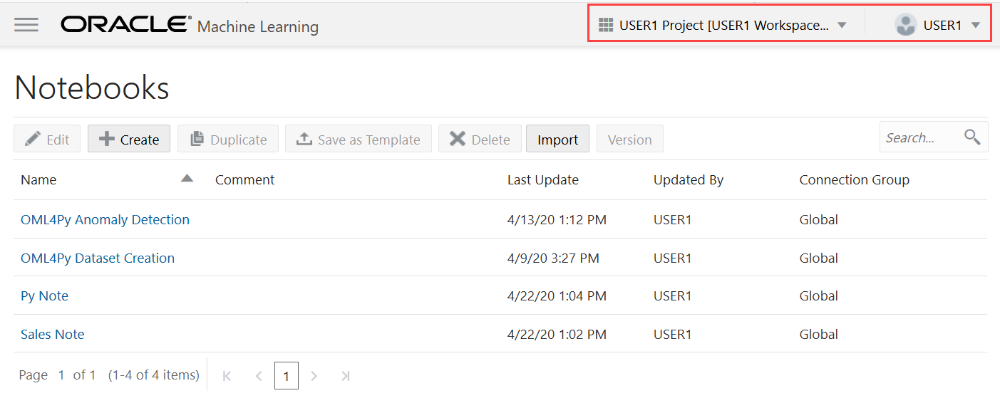
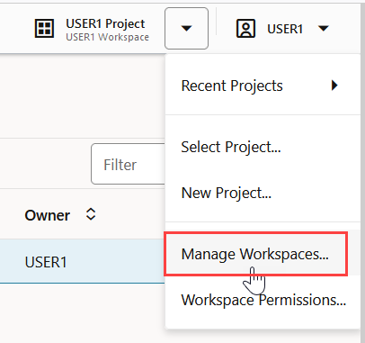
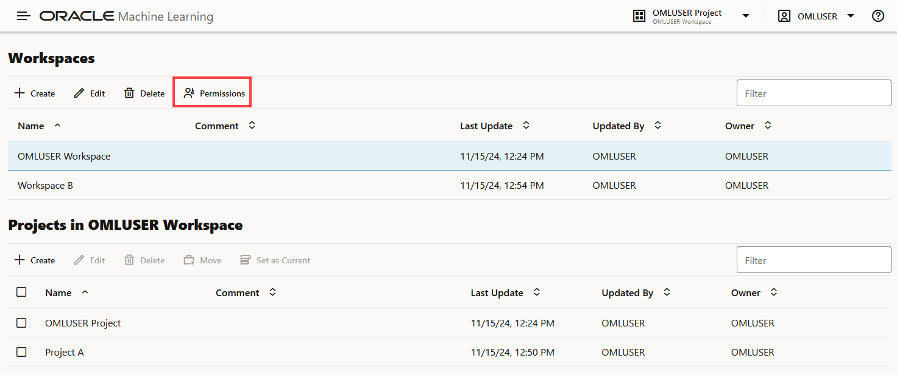
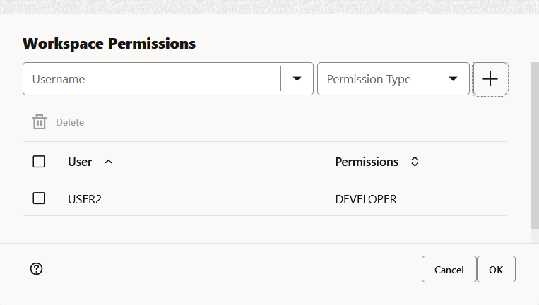
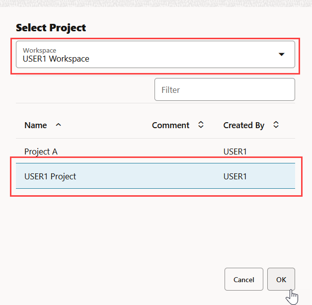
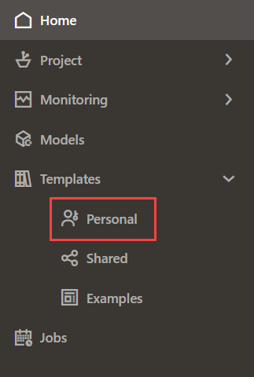

# Oracle® Cloud Collaborate in Oracle Machine Learning Notebooks
## Introduction

This lab shows you how to two or more users can collaborate and share SQL notebooks with other Oracle Machine Learning Notebooks users.

A notebook is a web-based interface for data visualization, machine learning, and collaboration.

### Estimated Time
This lab takes approximately 15 minutes to complete.

### Prerequisites

* Access to your account in Oracle Autonomous Database
* Provide workspace permission to users with whom you want to collaborate
* Two users - `USER1` and `USER2` created.
* A notebook created in your OML account

## Task 1: Collaborate by Granting Access to Projects of Another User

You can collaborate with other users in Oracle Machine Learning Notebooks by granting permissions to access your workspace. Your workspace contains your projects, and the projects contain notebooks. Oracle Machine Learning Notebooks allows three types of permissions. By granting different types of permissions such as Manager, Developer, and Viewer, you can allow other user to view your workspace and perform different tasks in your projects and notebooks such as edit, create, update, delete, run, view notebooks and so on.

**Caution**: If you grant the permission type **Manager** or **Developer** , then the user can also drop tables, create tables, and run any scripts at any time on your account. The user with Viewer permission type can only view your notebooks, and is not authorized to run or make any changes to your notebooks.

This use case demonstrates how two Oracle Machine Learning Notebooks users - USER1 and USER2 collaborate to share notebooks by granting permission to access notebooks in **USER1 Project** under **USER1 Workspace**. For each user, a workspace along with a project are created by default, at the time of user creation. In this tutorial the notebook that USER2 accesses and edits, is in USER1 Project, which is the default project owned by USER1.

This use case demonstrates how:

* USER1 grants USER2 DEVELOPER permission type to access the **USER1 Workspace**, the default workspace owned by USER1. As a result, USER2 is able to access all the notebooks that are present in USER1 Project under USER1 Workspace.
* USER2 accesses **USER1 Project** under **USER1 Workspace** while signing in as USER2. Since, USER2 is granted the DEVELOPER permission type, therefore USER2 can edit and run notebooks in USER1 Project. USER2 can also create new notebooks in USER1 Project.
* USER 2 edits a notebook that is created by USER1 in **USER1 Project**
* USER1 views the changes in the notebook made by USER2.

> **Note:** USER1 Workspace and USER2 Workspace are default workspaces created for USER1 and USER2 respectively.

> USER1 Project and USER2 Project are default projects under USER1 Workspace and USER2 Workspace, respectively.

### USER1 Grants DEVELOPER Permission to USER2

1. Sign into Oracle Machine Learning instance with USER1 credentials.
2. Go to the Notebooks page of USER1 and view the list of notebooks that are available in USER1 Project under USER1 Workspace.

    

3. On the top right corner of the Oracle Machine Learning home page, click **USER1 Project** [USER1 Workspace... drop-down list, and select Manage Workspaces. The Workspaces page opens.  

    

4. Now, you will provide permission to USER2 to the USER1 Workspace. On the Workspaces page, select **USER1 Workspace** and then click **Permissions**. The Workspace Permissions dialog opens.  

    

5.  In the Workspace Permissions dialog, select **USER2** from the Username drop-down list, and select **Developer** from the Permission Type field to grant DEVELOPER permission to USER2. Then click **+** to add permission to this user.
    

6. Once you have added the permission, the user along with the permission type is listed on the dialog. Click **OK.**
The message _Permissions have been updated successfully_ is displayed.

    

  The available permission types are:

  * Manager: A user with the permission type Manager may perform the following tasks:
    * Project - Create, update, delete your projects
    * Workspace - View only
    * Notebooks - Create, update, run, delete, and schedule jobs to run your notebooks
  * Developer: A user with the permission type Developer may perform the following tasks:
    * Project: View only
    * Workspace: View only
    * Notebooks: Create, update, run, and delete jobs to run your notebooks
  * Viewer: A user with the permission type Viewer can only view your workspace, projects, and notebooks.

   >**Note:** To change the permissions of an existing user, simply re-add the same user with the new permissions.

 7. This completes the task of granting the DEVELOPER permission to USER2. To delete a user along with the associated permission, select the workspace and click Permissions. In the Workspace Permissions dialog that opens, select the user and then click **Delete.** Then click **OK.**

    

### USER2 Accesses Project Shared by USER1

1. Sign in to the Oracle Machine Learning instance as USER2.
2. On the top right corner, click **USER2 Project** [USER2 Project... drop-down list. USER2 Project is the default project under USER2 Workspace. Click **Select Project**.

    

3. In the Select Projects dialog, click the Workspace drop-down. Here, you can see two workspaces - **USER1 Workspace** and **USER2 Workspace** (default workspace for User2). Select **USER1 Workspace**. The projects under USER1 Workspace are listed. To access the notebooks under USER1 Workspace, select **USER1 Project** , and click **OK**.

    

4. After clicking OK, note the change in the name of the project-workspace drop-down list at the top. The project-workspace drop-down list name changes to **USER1 Project [USER1 Workspace...** , while you are logged in as USER2. This indicates that USER2 is currently accessing the **USER1 Project** under **USER1 Workspace** while signed in as USER2.

    
Now, in the Workspaces page, click USER1 Workspace in the upper pane. The lower pane lists the projects that are accessible to USER2 in the USER1 Workspace.

    

    Again, in the Workspaces page, click USER2 Workspace in the upper pane. The lower pane lists the projects that are accessible to USER2 in the USER2 Workspace.

    

5. Click **Notebooks** in the Oracle Machine Learning home page. Alternatively, you can go to the navigation menu on the left and click **Notebooks**.

    

6. In the USER2 Notebooks page, you can now see all the notebooks that are owned by USER1 in the USER1 Project, which in USER1 Workspace. This is the same list of notebooks that is available in the **USER1 Project** that you noted in section 1 step 2 of this tutorial. Since USER2 has been granted the DEVELOPER permission, as USER2 you can click any of these notebooks to open, edit, and run the notebooks. As USER2, you can also create a new notebook in USER1 Project.

    

### USER2 Edits Notebook Shared by User1

1. While signed in as USER2, click the **Sales Note** notebook to open it. Observe that the notebook is blank and is connected to the SQL interpreter.

     

2. Type the SQL statement to fetch data from an Oracle Database. For example, type
  `SELECT * from SH.SALES;` where `SH` is the schema name and `SALES` is the table name, as shown in the screenshot:

     

4. Run the paragraph to render the data in a table.

     

5. Sign out of the Oracle Machine Learning instance.

### USER1 Collaborates with USER2 on the Same Notebook in Real-Time</h4>
This section shows how USER1 and USER 2 collaborate on the <strong>Sales
Note</strong> notebook in real-time. Both users have the Sales
Note notebook opened in different browsers, and they work on it
simultaneously. The changes made by the users are dynamically
reflected in the notebook in real-time. To try this example on the same client machine, for example, your laptop, use two different types of browsers such as Chrome and Firefox to enable two different logins. To see changes dynamically, try to position these two browser windows side by side on your screen so that both views are visible.

1. Sign in to the Oracle Machine Learning instance as USER1 in Mozilla Firefox browser. Click <b>Notebooks</b> in the home page to view the list of notebooks. Observe that the entry for <b>Updated By</b> column for **Sales Note** notebook shows USER2.

     

2. Click **Sales Note** to open and view the notebooks. The changes that are made by USER2 are visible to USER1 when you open the same notebook in USER1 Project under USER1 Workspace.

    

3. While signed in as USER1, edit the **Sales Note** by adding `ORDER BY CUST_ID` as shown in the screenshot and click **Run.**
Note the change in display of the data, and also the date and time of edit made by USER1.

    

4. Now, sign in as USER2 in another browser. In this example, it is Google Chrome. As USER2, you can see the edits made by USER1. While signed in as USER2, edit the SQL code to add `where
AMOUNT_SOLD &lt;= 50.68` and click **Run**. The **Sales Note** notebook now displays refined data accordingly.
Note the date and time .

    

5. Now, go to Firebox browser and view the **Sales Note** notebook as USER1. The change made by USER2 is dynamically reflected in Firefox where you are accessing the notebook as USER1, as shown in the screenshot. This is how two or more users can collaborate in real-time on the same notebook.
 Note that you are signed in as USER1 in Firefox and as USER2 in Chrome.

    

## Task 2: Collaborate by Using the Export Option

You can export a notebook as a `.json` (JavaScript Object Notation) file, and later import it in to the same or a different environment.

1. In the Notebook page, click the notebook that you want to export. The notebook opens in the Notebook editor.

2. In the top panel of the notebook editor, click the export icon.

    

3. The Save as Dialog box opens. Navigate to the location in your system where you want to save the notebook. The notebook is saved in your local folder as a `.json` file.

## Task 3: Collaborate by Using Oracle Machine Learning Templates

You can share a notebook by saving an existing notebook as a template in My Library or in Shared location in Oracle Machine Learning Notebook. To save a notebook as a template:

1. In the Notebooks page, select the notebook that you want to save as template and click **Save as Template**. The Save as Template dialog box opens.

    

2. In the **Name** field, enter a name for the notebook template.

3. In the **Comments** field, enter comments, if any.

4. In the **Tags** field, enter tags for the template.

5. In **Save To** field, select **Personal** if you want to save this notebook under <b>Personal</b> templates. Notebooks under **Personal** are visible only to the owner
of the notebook. Select **Shared** if you want to save and share this notebook. The **Shared** template is visible to all users of the system within the scope of the tenant.
**Note:** Notebook templates under <b>Examples</b> are provided by Oracle and are visible to all tenants. Users cannot add notebooks to the Examples template.

     

You may now **proceed to the next lab.**

## Acknowledgements
* **Author** : Mark Hornick, Sr. Director, Data Science / Machine Learning PM; Moitreyee Hazarika, Principal User Assistance Developer, Database User Assistance Development

* **Last Updated By/Date**: Moitreyee Hazarika, March 2023
