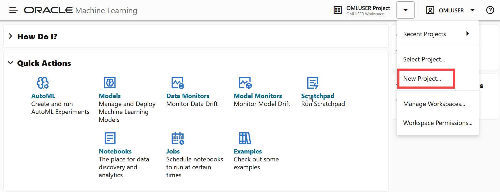

# Oracle® Cloud Create Projects and Workspaces in Oracle Machine Learning Notebooks
## Before You Begin

This lab walks you through the steps to create a project and a workspace in Oracle Machine Learning Notebooks.

>**Note:** The initial workspaces and the default project are created by the Oracle Machine Learning service automatically when you log in to Oracle Machine Learning Notebooks for the first time. The term default applies to the last project that you work on, and it is stored in the browser cache. If you clear the cache, then there would be no default project selected. Then you must select a project to work with notebooks.

This lab explains the steps to

* Create an Oracle Machine Learning user
* Sign into Oracle Machine Learning user interface
* Create your own project, and optionally your workspace.

This lab takes approximately 10 minutes to complete.

### Background
A project is a container for storing your notebooks and other objects such as dashboards and so on. A workspace is a virtual space where your projects reside, and multiple users with the appropriate permission type can work on different projects. While you may own many projects, other workspaces and projects may be shared with you.

### What Do You Need?

Access to your Oracle Machine Learning Notebooks account

## Create an Oracle Machine Learning user

An administrator creates a new user account and user credentials for Oracle Machine Learning in the User Management interface.

>**Note:** You must have the administrator role to access the Oracle Machine Learning User Management interface.

To create a user account:

1. Sign into your OCI account, click the hamburger on the left to open the left navigation pane, and click **Oracle Database**. On the right pane under Autonomous Database, click **Autonomous Data Warehouse**.

	

2. The Autonomous Database dashboard lists all the databases that are provisioned in the tenancy. Click the Oracle Autonomous Database that you have provisioned.

	

3. On the Autonomous Database details page, click **Database Actions**.

	

4. The Oracle Database Actions Launchpad page opens in a separate tab. Scroll down to the Administration section and click **DATABASE USERS**.

	

5. Click **Create User**. The Create User dialog opens.

	

6. On the Create User dialog, enter the following details and click **Create User**:

	

	* **User Name:** Enter the user name OMLUSER.
	* **Password:** Enter a password for this user.
	* **Confirm Password:** Re-enter the password that you entered in the Password field.
	* **Graph:** Select this option to enable graph for this user.
	* **Web Access:** Select this option to allow web access to this user.
	* **OML:** Select this option to allow this user to access Oracle Machine Learning.
	* **Quota of tablespace data:** Click on the drop-down list and select an option. For this lab, 1G is selected.
	* **Password Expired:** Select this option if you want the user to reset the password.
	* **Account is locked:** Select this option to lock the account.

7. After the user is created successfully, the message _User OMLUSER created successfully_ is displayed.

	

	Scroll down the page to view the user. The OMLUSER is listed along with all details. Click  to edit, delete, or disable any of the privileges granted to the user.
	

This completes the task of creating an Oracle Machine Learning user.

## Sign into Oracle Machine Learning Notebooks

A notebook is a web-based interface for data analysis, data discovery, data visualization, and collaboration. You create and run notebooks in Oracle Machine Learning Notebooks. You can access Oracle Machine Learning Notebooks from Autonomous Database.

1. From the tab on your browser with your ADW instance, click **Service Console**, then select **Development** on the left.

	

2. Click **Oracle Machine Learning Notebooks.**

	 

3. Enter your user credentials and click **Sign in**.

	>**Note:** The credential is what you have defined while creating the Oracle Machine Learning user.

	

4. Click **Notebooks** in the Quick Actions section.

	

This completes the task of signing into Oracle Machine Learning user interface.

## Create Project in Oracle Machine Learning Notebooks

To create a project:
1. On the top right corner of the Oracle Machine Learning Notebooks home page, click the project workspace drop-down list. The project name and the workspace, in which the project resides, are displayed here. In this screenshot, the project name is `USER1 Project`, and the workspace name is `USER1 Workspace`. If a default project exists, then the name of the default project is displayed here. To choose a different project, click **Select Project**.

  

2. To create a new project, click **New Project**. The Create Project dialog box opens.

  

3. In the **Name** field, provide a name for your project.

4. In the **Comments** field, enter comments, if any.

5. To choose a different workspace, click the down arrow next to the **Workspace** field and select a workspace from the
  drop-down list. Your project `Project A` is assigned to the selected workspace. In this example, the `USER1 Workspace` is selected.

6. Click **OK**. This completes the task of creating a project and assigning it to a workspace. In this example, the assigned workspace is `USER1 Workspace`.

## Create Workspace in Oracle Machine Learning Notebooks
To create a workspace:

1. On the top right corner of the Oracle Machine Learning Notebooks home page, click the project workspace drop-down list and click **Select Project**. The Select Project dialog box opens.

  

2. In the Select Project dialog box, click **USER1 Workspace** and then click **Create**. The Create Project dialog box opens.

  

3. In the Create Project dialog box, enter `Project B` in the **Name** field, and click the plus icon next to the **Workspace** field. The Create Workspace dialog box opens.

  

4. In the Create Workspace dialog box, enter Workspace A in the **Name** field.

  

5. In the **Comments** field, enter comments, if any.

6. Click **OK.** This completes the task of creating your workspace, and brings you back to the Create Project dialog box.

7. In the Create Project dialog box, click **OK**. This brings you back to the Select Project dialog box. Here, you
   can view all the workspace and the projects in it. The project and workspace that you created in step 3 through 6 is listed in the Select Workspace dialog box, as shown in the screenshot here.

   

8. Click **OK.** This completes the task of creating a project and a workspace, and assigning the project to the workspace.

9. To delete a workspace, click **Manage Workspace** in the Project Workspace drop-down list.

10. In the Manage Workspace dialog box, select the workspace you want to delete and click **Delete**.
  This deletes the selected workspace along with all the projects in it.

  

## Acknowledgements

* **Author** : Mark Hornick, Sr. Director, Data Science / Machine Learning PM; Moitreyee Hazarika, Principal User Assistance Developer, Database User Assistance Development

* **Last Updated By/Date**: Moitreyee Hazarika, September 2022

See an issue?  Please open up a request [here](https://github.com/oracle/learning-library/issues).   Please include the workshop name and lab in your request.
