# Run user-defined functions using the REST API for Embedded Python Execution

## Introduction

This lab walks you through the steps to use the REST API to call OML4Py Embedded Python Execution functions to run custom Python code.

Estimated Time: 20 minutes

Watch the video below for a quick walk-through of the lab.

[Run user-defined functions using Embedded Python Execution](videohub:1_2skqmxjt)

### About Embedded Python Execution
Embedded Python Execution enables you to run user-defined Python functions in Python engines spawned in the Oracle Autonomous Database environment. These engines run alongside an OML Notebooks Python interpreter session.

The OML4Py Embedded Python Execution functions are:

* `oml.do_eval`&mdash;Calls a Python function in Python engines spawned by the Oracle Autonomous Database environment.
* `oml.group_apply`&mdash;Partitions a database table by the values in one or more columns and runs the provided user-defined Python function on each partition.
* `oml.index_apply`&mdash;Calls a Python function multiple times, passing in a unique index of the invocation to the user-defined function.
* `oml.row_apply`&mdash;Partitions a database table into sets of rows and runs the provided user-defined Python function on the data in each set.
* `oml.table_apply`&mdash;Calls a Python function on data in the database as a single pandas.DataFrame in a single Python engine.

> **Note:** Embedded Python Execution functions are also available through the [Oracle Machine Learning for Python REST API for Embedded Python Execution](https://docs.oracle.com/en/database/oracle/machine-learning/oml4py/1/mlepe/rest-endpoints.html).

### Objectives

In this lab, you will:
* Build an open source scikit-learn linear model and scoring script
* Prepare the same script for use with Embedded Python Execution
* Build one model per group using the `group_apply` function
* Return multiple images as a result from Embedded Python Execution
* Create and run SQL and REST user defined functions

### Prerequisites

We need to access and run the OML notebook for this lab.

1. Go back to the main notebooks listing by clicking on the "hamburger" menu (the three lines) on the upper left of the screen, and then select **Notebooks**.

 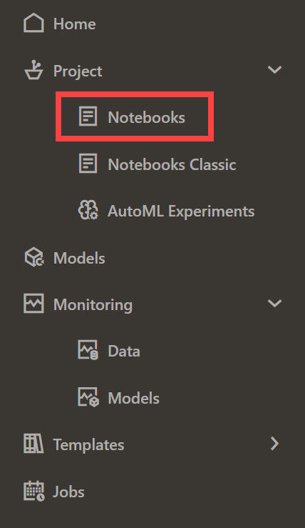

2. Click the **Lab 7 notebook name** to view it.
   <if type="freetier">
    </if>
   <if type="livelabs">
    </if>

  OML Notebooks will create a session and make the notebook available for editing.

  You can optionally click the **Run all paragraphs** () icon, and then click **OK** to confirm to refresh the content with your data, or just scroll down and read the pre-recorded results.  

  

> **NOTE:** If you had problems downloading and extracting the ZIP file for the labs, please [**CLICK HERE** to download the lab7\_embed\_python\_rest.json notebook file](./../notebooks/lab7_embed_python_rest.json?download=1). Download the notebook file for this lab to your local machine and then import it like illustrated in **Lab 1, Task 2**.

## Task 1: Obtain an Access Token

1. Follow the flow of the notebook by scrolling to view and run each paragraph of this lab.

  Scroll down to the beginning of Task 1.

  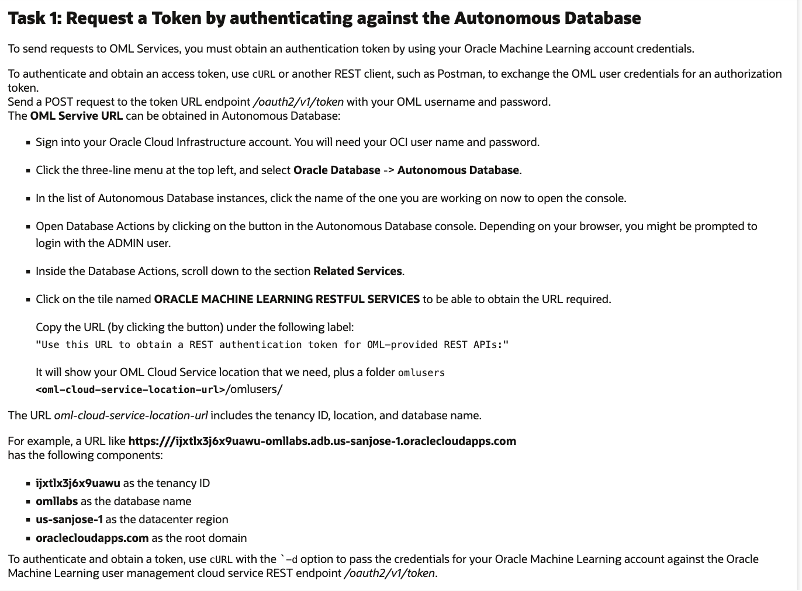

2. Follow the flow of the notebook by scrolling to view and run each paragraph of this lab.

  Scroll down to the beginning of Task 1.1.
  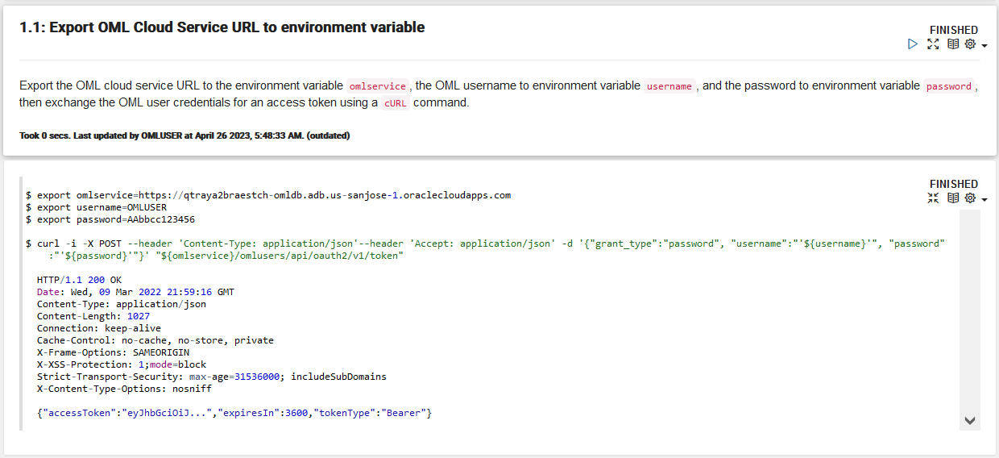

3. Follow the flow of the notebook by scrolling to view and run each paragraph of this lab.

  Scroll down to the beginning of Task 1.2.
  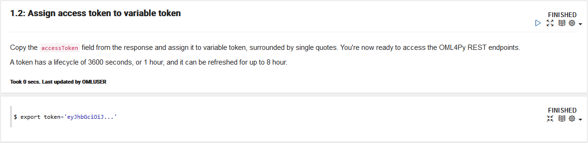

## Task 2:  Obtain a proxy object to the IRIS table
1. Follow the flow of the notebook by scrolling to view and run each paragraph of this lab.

  Scroll down to the beginning of Task 2.

  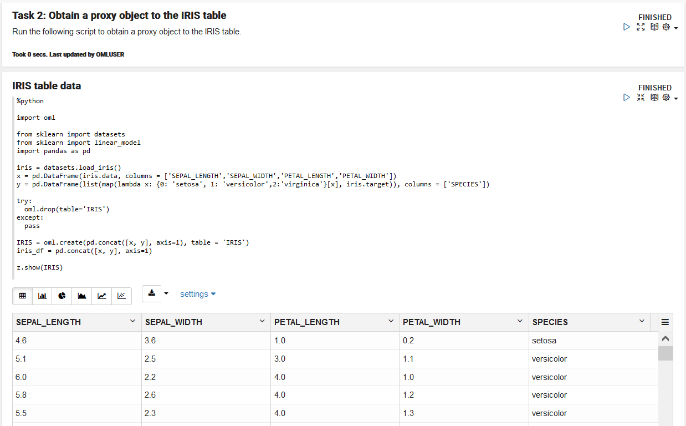

## Task 3: Build a Scikit-Learn Python model using embedded Python execution
1. Follow the flow of the notebook by scrolling to view and run each paragraph of this lab.

  Scroll down to the beginning of Task 3.

  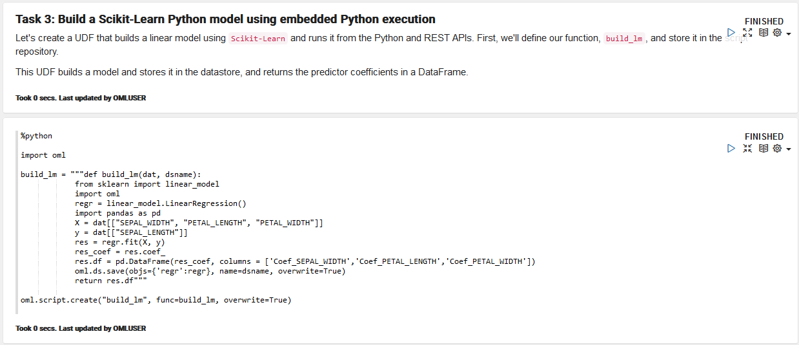

2. Follow the flow of the notebook by scrolling to view and run each paragraph of this lab.

  Scroll down to the beginning of Task 3.1.

  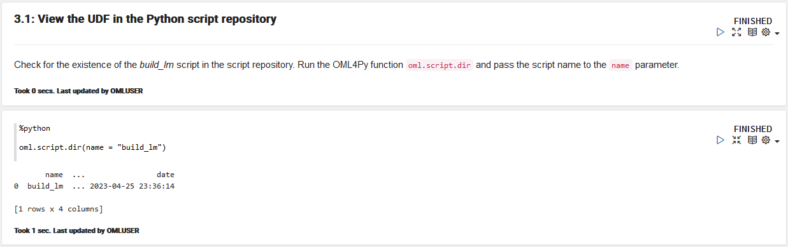

## Task 4: Use the table-apply function to invoke the script from the Python API for embedded Python execution
1. Follow the flow of the notebook by scrolling to view and run each paragraph of this lab.

 Scroll down to the beginning of Task 4.

  

2. Follow the flow of the notebook by scrolling to view and run each paragraph of this lab.

 Scroll down to the beginning of Task 4.1.

  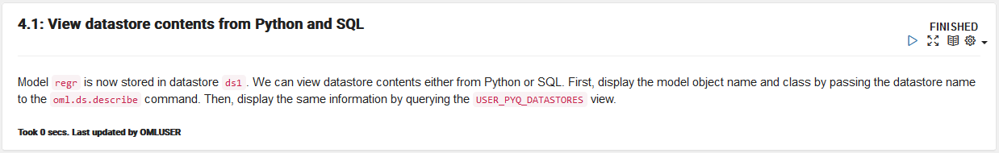

3. Follow the flow of the notebook by scrolling to view and run each paragraph of this lab.

 Scroll down to the beginning of Task 4.2

  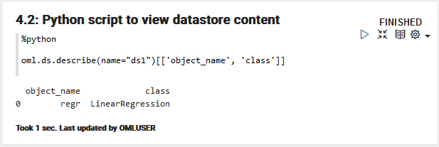

4. Follow the flow of the notebook by scrolling to view and run each paragraph of this lab.

 Scroll down to the beginning of Task 4.3.

  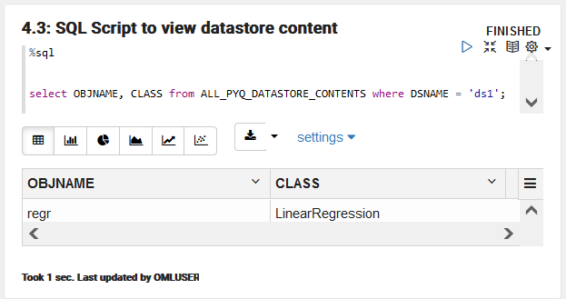

## Task 5: Run the same function using the REST API table function table-apply
1. Follow the flow of the notebook by scrolling to view and run each paragraph of this lab.

   Scroll down to the beginning of Task 5.

  

2. Follow the flow of the notebook by scrolling to view and run each paragraph of this lab.

   Scroll down to the beginning of Task 5.1.

  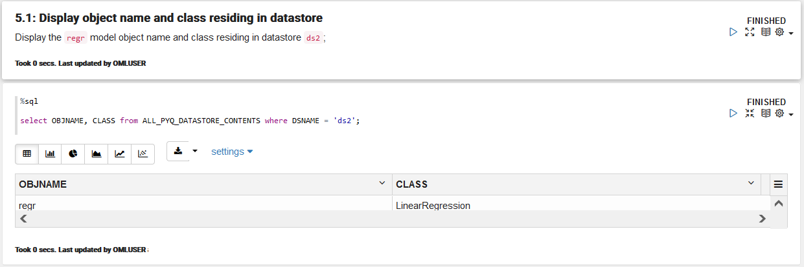

## Task 6: Create a UDF to score using system-supported data-parallelism

1. Follow the flow of the notebook by scrolling to view and run each paragraph of this lab.

   Scroll down to the beginning of Task 6.
   

2. Follow the flow of the notebook by scrolling to view and run each paragraph of this lab.

   Scroll down to the beginning of Task 6.1.
   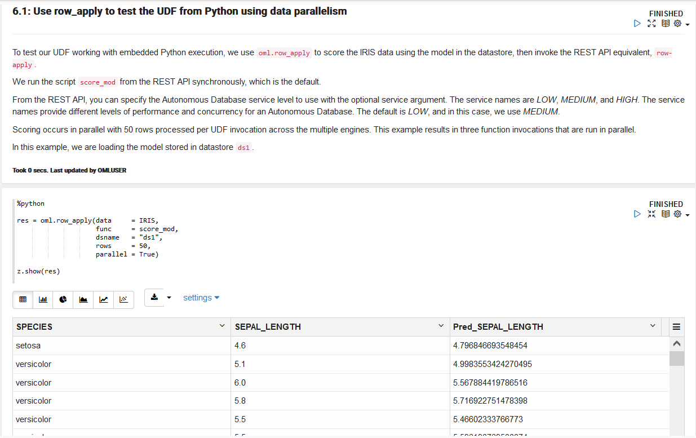

3. Follow the flow of the notebook by scrolling to view and run each paragraph of this lab.

   Scroll down to the beginning of Task 6.2.
   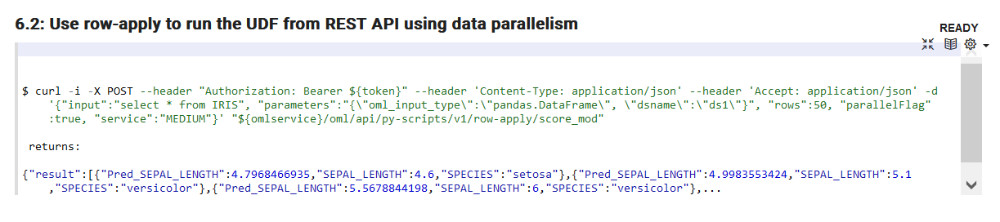

## Task 7: Work with Asynchronous Jobs

1. Follow the flow of the notebook by scrolling to view and run each paragraph of this lab.

   Scroll down to the beginning of Task 7.
   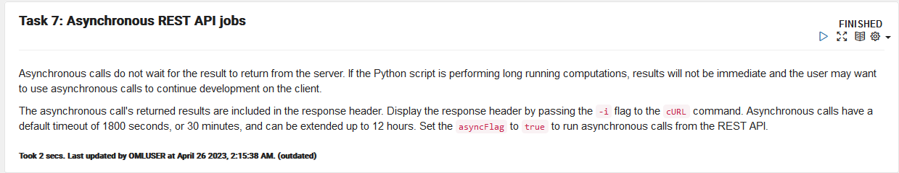

2. Follow the flow of the notebook by scrolling to view and run each paragraph of this lab.

   Scroll down to the beginning of Task 7.1.
   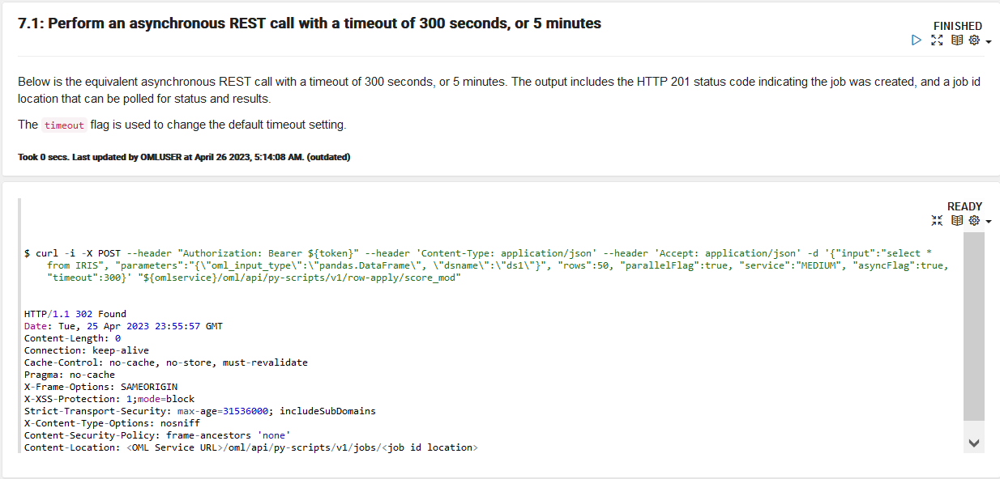

3. Follow the flow of the notebook by scrolling to view and run each paragraph of this lab.

   Scroll down to the beginning of Task 7.2.
   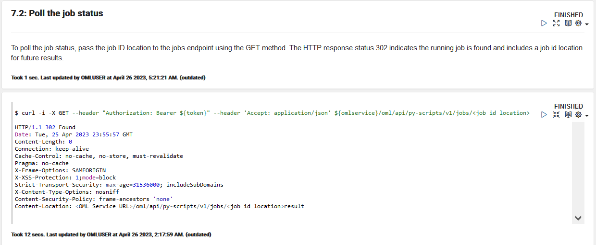

4. Follow the flow of the notebook by scrolling to view and run each paragraph of this lab.

   Scroll down to the beginning of Task 7.3.
   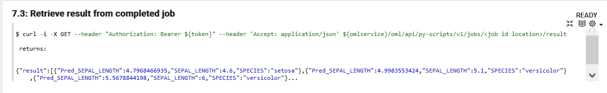

### Congratulations !!!

You reached the end of the lab.  

You can explore additional workshops related to Oracle Machine Learning from the link in the **Learn More** section.  

## Learn more

* [Automated Machine Learning](https://docs.oracle.com/en/database/oracle/machine-learning/oml4py/1/mlpug/automatic-machine-learning.html#GUID-4B240E7A-1A8B-43B6-99A5-7FF86330805A)
* [Oracle Machine Learning Notebooks](https://docs.oracle.com/en/database/oracle/machine-learning/oml-notebooks/)
* [Additional Workshops for Oracle Machine Learning](https://apexapps.oracle.com/pls/apex/dbpm/r/livelabs/livelabs-workshop-cards?c=y&p100_product=70)

## Acknowledgements
* **Authors** - Marcos Arancibia, Product Manager, Machine Learning; Jie Liu, Data Scientist; Moitreyee Hazarika, Principal User Assistance Developer
* **Contributors** -  Mark Hornick, Senior Director, Data Science and Machine Learning; Sherry LaMonica, Principal Member of Tech Staff, Machine Learning
* **Last Updated By/Date** - Marcos Arancibia, Sherry LaMonica, Moitreyee Hazarika May 2023
