# Get started with OML4Py on Oracle Autonomous Database

### Introduction
This lab walks you through the steps of accessing Oracle Machine Learning Notebooks, loading notebooks and running OML4Py scripts.

Estimated Time: 15 minutes

Watch the video below for a quick walk through of the lab.

### Objectives

In this lab, you will learn how to:
* Access Oracle Machine Learning Notebooks
* Get familiar with the Oracle Machine Learning Notebooks toolbar
* Get familiar with the Oracle Machine Learning Notebooks interpreters
* Verify the connection to the Oracle Autonomous Database
<if type="freetier">* Load the datasets necessary to run the workshop</if>
* View help files

## Task 1: Access Oracle Machine Learning Notebooks

You create notebooks in Oracle Machine Learning Notebooks. You can access Oracle Machine Learning Notebooks from Autonomous Database.

1. Sign into your OCI account, click the hamburger on the left to open the left navigation pane, and click **Oracle Database**. On the right pane, click **Autonomous Database**.

    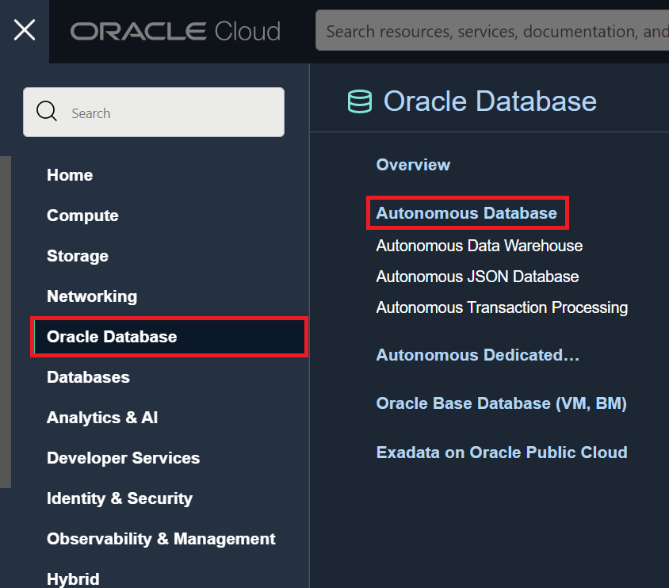

2. The Autonomous Database dashboard lists all the databases that are provisioned in the tenancy. Select the compartment corresponding to the provisioned Live Labs instance, and click the Oracle Autonomous Database name.

    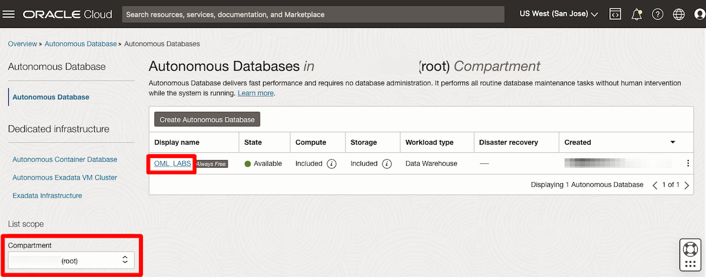
3. On the Autonomous Database details page, click **Database Actions**. The Oracle Database Actions Launchpad page opens in a separate tab.
    

4. On the Database Actions page, go to the **Development** section and click **Oracle Machine Learning**. This opens the Oracle Machine Learning Sign In page.
    

5. <if type="livelabs">Sign in with the **`OMLUSER`** using the password **`AAbbcc123456`**. </if><if type="freetier">Enter the **`OMLUSER`** credentials using the password **`AAbbcc123456`** that was used when creating it with the SQL code.  If you changed the password in the SQL code, use that one here instead. Then click the blue **Sign in** button.</if>

    

6. On the Oracle Machine Learning home page, click **Notebooks** in the Quick Actions menu.

    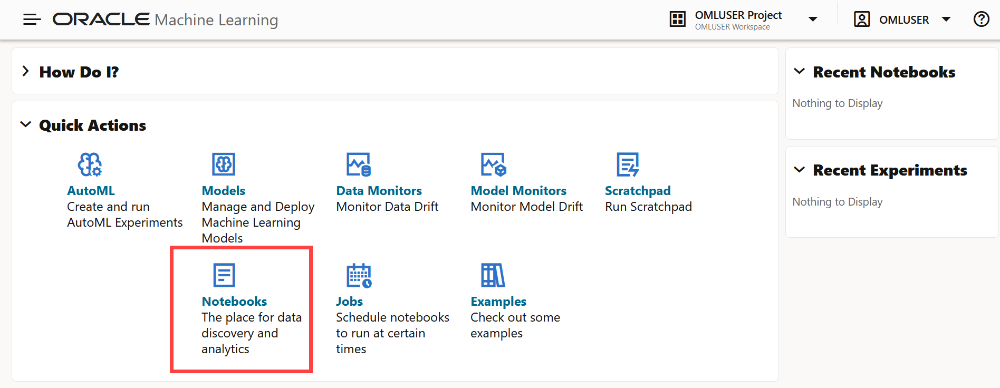

## Task 2: Get familiar with OML Notebooks

<if type="freetier">
1. [**CLICK HERE** to download a ZIP file with all the notebooks we will use for these Labs (in JSON format)](https://objectstorage.us-ashburn-1.oraclecloud.com/p/ObYrokq6yrucExLyb3ZPwhJ59Xv-Gyjwp8t8LlotAdnwSqxs9qQpd3gYScMtDYRB/n/adwc4pm/b/OML_Data/o/oml4py_labs_freetier.zip?download=1) which contain the notebooks for the Labs.  Save it to your local machine and __extract them__ to a memorable place.
  </if>
<if type="livelabs">
1. [**CLICK HERE** to download a ZIP file with all the notebooks we will use for these Labs (in JSON format)](https://objectstorage.us-ashburn-1.oraclecloud.com/p/Lcj3ZhWo5n0vCRZ-XU-2SneV7yipVsGzjm3QX2_TWp9IRxdSsH6htceUJRZmOI31/n/adwc4pm/b/OML_Data/o/oml4py_labs_livelabs.zip?download=1) which contain the notebooks for the Labs.  Save it to your local machine and __extract them__ to a memorable place.
  </if>

> **NOTE:** If you have problems with downloading and extracting the ZIP file, please [**CLICK HERE** to download the "Lab 1: Get Started with OML4Py on Autonomous Database" notebook in JSON format](./../notebooks/lab1_get_started.json?download=1) which contains the notebook version of Lab1, save it to your local machine and import it as illustrated below.

  To import the downloaded notebook files to OML Notebooks:
  - Go to the Notebooks page, and click **Import**.  

  

 - Select all the extracted notebooks at once and click on **Open**.
 <if type="freetier">   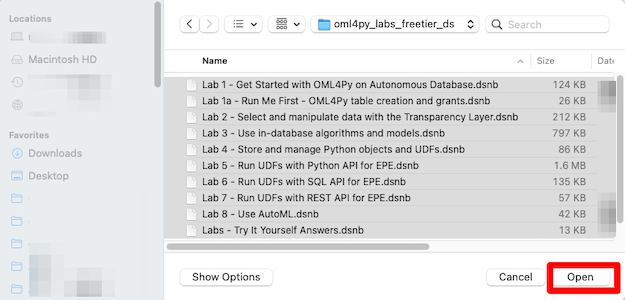</if>
 <if type="livelabs">    </if>

 - After the notebooks are successfully imported, click the Lab 1 notebook to view it.
 <if type="freetier">   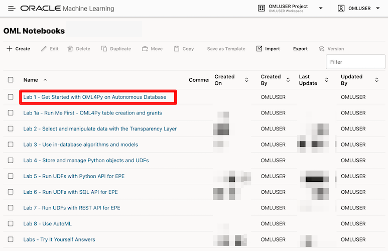 </if>
 <if type="livelabs">    </if>

 OML Notebooks will load a session and make the notebook available for editing.

### About Oracle Machine Learning Notebooks

A notebook is a web-based interface for data analysis, data discovery, data visualization and collaboration.

The Oracle Machine Learning Notebooks toolbar contains buttons to run code in paragraphs, for configuration settings, and display options.

For example, it displays the status and the number of users connected to the notebook. It also contains a menu item for keyboard shortcuts and options to show or hide the markdown editor and paragraph output. Additional settings are shown in the illustration below.
    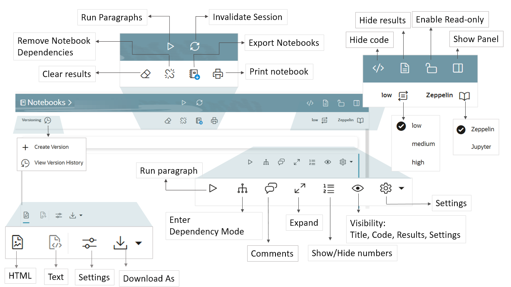

## Task 3: Getting started with OML Notebooks and interpreters

OML Notebooks contain a default list of interpreter bindings, used to run scripts against the Autonomous Database that it is linked to.  For this lab, we will set the interpreter binding to "xxxx_medium", where xxxx is the database name.

Click the interpreter bindings icon () in the upper right-corner of the notebook (the gear) to view the list of available interpreter bindings.
  

The default service is low. Click to bind or unbind an interpreter. Drag-and-drop individual interpreter binding settings up or down to order which binding will be used by default. The first interpreter on the list becomes the default. Those highlighted in blue are active.

As shown in the example, we dragged the **medium** interpreter up so it is the first in the list, and thus becomes the default.

An interpreter is a plug-in that allows you to use a specific data processing language in your Oracle Machine Learning notebook. You can add multiple paragraphs, and each paragraph can be connected to different interpreters such as SQL, PL/SQL or Python.

You create paragraphs with different interpreters based on the code you want to run, and the interpreter is set at the top of each paragraph.
The available interpreters are:

  - `%md`&mdash;To call the Markdown interpreter and generate static html from Markdown plain text
  - `%sql`&mdash;To call the SQL interpreter and run SQL statements
  - `%script`&mdash;To call and run PL/SQL scripts
  - `%python`&mdash;To call the Python interpreter and run Python scripts

## Task 4: Use the Python interpreter

Let's start by running the entire notebook, so that we can see the result of each paragraph.

Click on the **Run all paragraphs** () icon in front of the name of the notebook, and then click **OK** to confirm to refresh the content with your data, as indicated below.

Another option is to just scroll down and read the pre-recorded results contained in the notebooks themselves.

 

Scroll down on the "Lab 1" Notebook to follow along the steps below.

  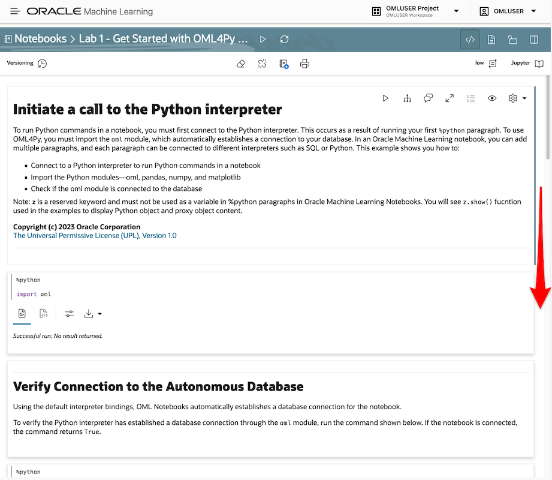

To run Python commands in a notebook, you must make use of the Python interpreter. This occurs as a result of running your first `%python` paragraph. To use OML4Py, you must import the `oml` module, which automatically establishes a connection to your database.
In an Oracle Machine Learning notebook, you can add multiple paragraphs, and each paragraph can be connected to different interpreters such as SQL or Python. This example shows you how to:

* Connect to a Python interpreter to run Python commands in a notebook
* Import the Python modules&mdash;oml, pandas, numpy, and matplotlib
* Check if the `oml` module is connected to the database

**Note:** `z` is a reserved keyword and must not be used as a variable in `%python` paragraphs in Oracle Machine Learning Notebooks. You will see `z.show()` used in the examples to display Python object and proxy object content.

1. To use OML4Py module, you must import the oml module. Type the following Python command to import the `oml` module, and click the **run** icon. Alternatively, you can press Shift+Enter keys to run the notebook.   

  

2. Using the default interpreter bindings, OML Notebooks automatically establishes a database connection for the notebook.  
  To verify the Python interpreter has established a database connection through the `oml` module, run the command:

  

  Once your notebook is connected, the command returns `True`.         

3. The Python `help` function

   The Python `help` function is used to display the documentation of packages, modules, functions, classes, and keywords.

   Scroll down in the notebook to see examples of the use of the `help` function.

<if type="livelabs">
You can now *proceed to the next lab*.</if>

<if type="freetier">
## Task 5: Load sample data into tables and views, and grant access to all users

Labs 2 to 6 of this workshop use tables and views that need to be created upfront.  To create these tables and views, we will open the Notebook "Lab 1a: Run Me First - OML4Py table creation and grants".

> **NOTE:** If you have problems with downloading and extracting the ZIP file, please [**CLICK HERE** to download the "Lab 1a: Run Me First - OML4Py table creation and grants" noteook JSON file](./../notebooks/lab1a_run_me_first.json?download=1). This notebook contains the scripts for creating tables and views, and granting the required access. Save it to your local machine and import it like illustrated in **Task 2, Step 1**.

1. Go back to the main Notebooks listing by clicking on the "hamburger" menu (the three lines) on the upper left of the screen, and then select **Notebooks**.

 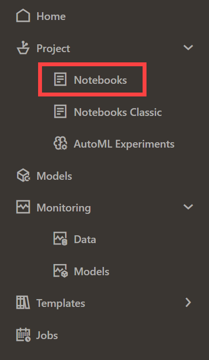

2. Click the **notebook name** to view it.
   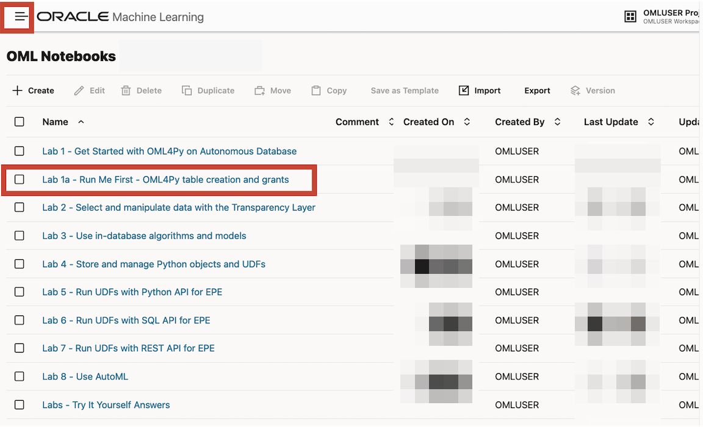

 OML Notebooks will load a session and make the notebook available for editing.

3. Click the **Run all paragraphs** () icon, and then click **OK** to confirm.
  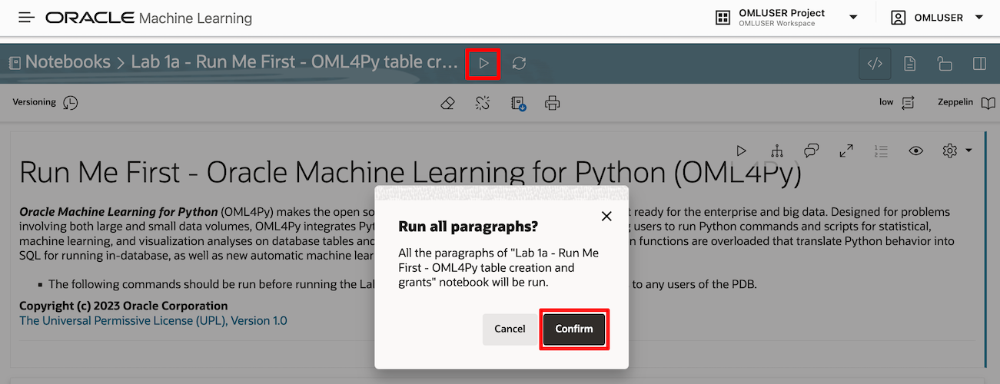

4. Wait until all the paragraphs have finished running and you see your current time in the last paragraph after the message `"PL/SQL procedure successfully completed"`.

  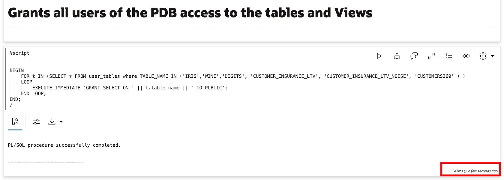

The prerequisite scripts have run successfully.

You can now *proceed to the next lab*.
</if>

## Learn more

* [Get Started with Oracle Machine Learning for Python](https://docs.oracle.com/en/database/oracle/machine-learning/oml4py/1/mlpug/get-started-with-oml4py.html#GUID-B45A76E6-CE48-4E49-B803-D25CA44B09ED)
* [Oracle Machine Learning Notebooks](https://docs.oracle.com/en/database/oracle/machine-learning/oml-notebooks/)

## Acknowledgements
* **Authors** - Marcos Arancibia, Product Manager, Machine Learning; Moitreyee Hazarika, Principal User Assistance Developer
* **Contributors** -  Mark Hornick, Senior Director, Data Science and Machine Learning; Sherry LaMonica, Principal Member of Tech Staff, Machine Learning; Jie Liu, Data Scientist
* **Last Updated By/Date** - Marcos Arancibia and Sherry LaMonica, July 2022
