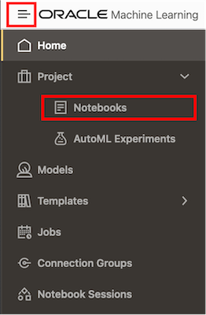
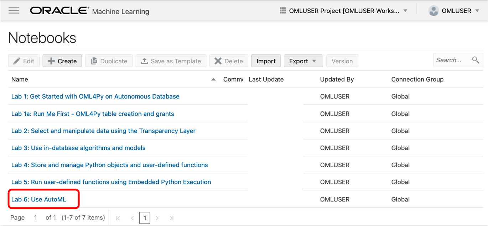
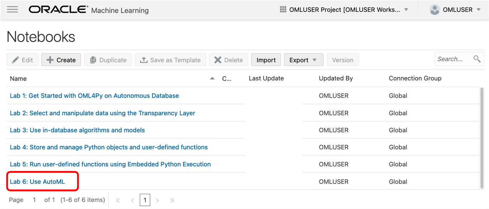
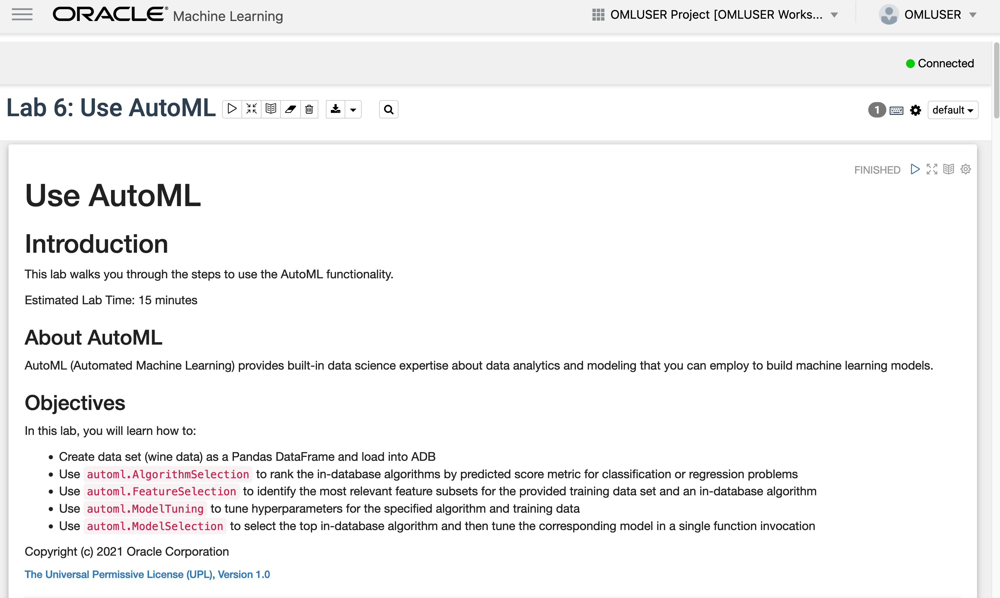
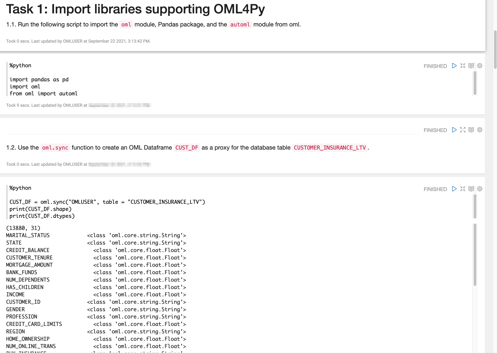
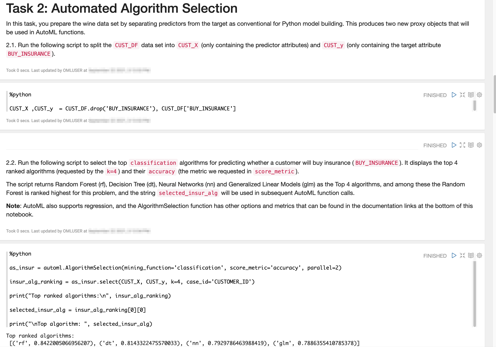
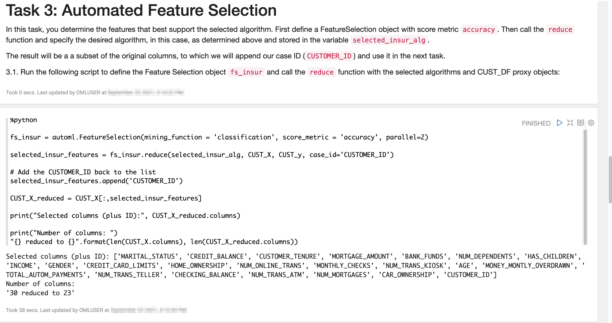
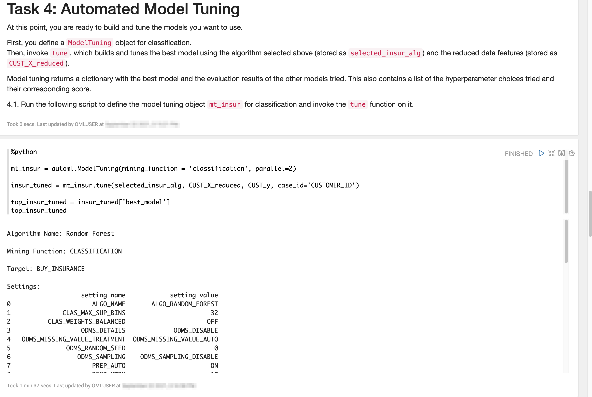
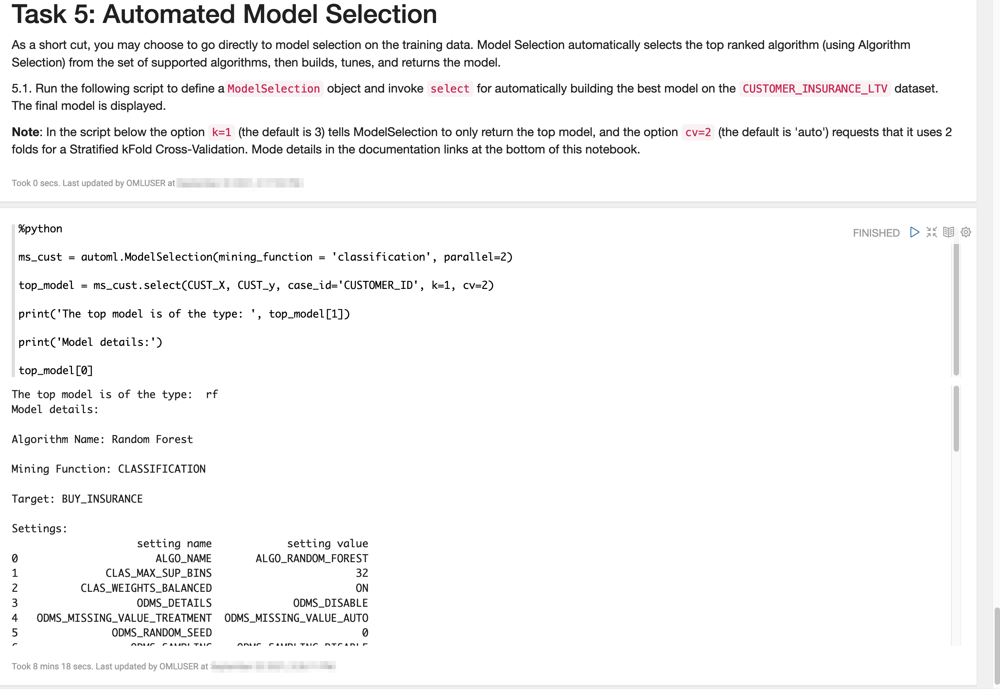

# Use SQL API

## Introduction

Oracle Machine Learning for Python (OML4Py) embedded Python execution allows users to run user-defined Python functions (UDFs) on Python engines spawned and managed by the database environment. Through system-provided data-parallel and task-parallel functionality, embedded Python execution also enables automated and simplified runtime support for greater scalability and performance. OML4Py provides three interfaces for embedded Python execution:
* Python
* SQL
* REST

This lab provides an overview of the OML4Py SQL interface for embedded Python execution on Oracle Autonomous Database.

On Autonomous Database, OML4Py provides SQL interfaces for setting authorization tokens, managing access control list (ACL) privileges, and synchronously and asynchronously running UDFs, also referred to as scripts. Supporting OML4Py embedded Python execution is the ability to store UDFs in the database script repository and Python objects in the database datastore – there are no separate flat files to manage, back up, or secure. The datastore also enables loading saved objects for use in UDFs. Since it’s under database control and invoked through SQL, scheduling Python functions to run is easily achieved using DBMS_SCHEDULER or other scheduling interfaces that invoke SQL.

Estimated Time: 15 minutes

Watch the video below for a quick walk-through of the lab.

[Use AutoML](videohub:1_4wtk31br)

### About SQL API
To use the SQL API, a UDF must reside in the OML4Py script repository, and an Oracle Machine Learning (OML) cloud account username and password must be provided for authentication.

### Objectives

In this lab, you will learn how to:
* Connect to Autonomous Database as the ADMIN user and add the OML user to cloud host ACL list
*  Confirm the host ACL list contains an entry for the OML user
*  Obtain an authorization token to access the SQL API
*  Confirm the token is set
*  Create a UDF and store it in the script repository
*  Run the UDF using embedded Python execution from the OML4Py Python and SQL APIs

### Prerequisites

We need to access and run the OML notebook for this lab.

1. Go back to the main notebooks listing by clicking on the "hamburger" menu (the three lines) on the upper left of the screen, and then select **Notebooks**.

 

2. Click the **Lab 6 notebook name** to view it.
   <if type="freetier">
    </if>
   <if type="livelabs">
    </if>

  OML Notebooks will create a session and make the notebook available for editing.

  You can optionally click the **Run all paragraphs** () icon, and then click **OK** to confirm to refresh the content with your data, or just scroll down and read the pre-recorded results.  

  

> **NOTE:** If you had problems downloading and extracting the ZIP file for the labs, please [**CLICK HERE** to download the lab6\_automl.json notebook file](./../notebooks/lab6_automl.json?download=1). Download the notebook file for this lab to your local machine and then import it like illustrated in **Lab 1, Task 2**.
___

> **NOTE:** Due to the nature of Automated Machine Learning, it is expected that some of the paragraphs will take several minutes to complete.

## Task 1: Import libraries supporting OML4Py and AutoML

1. Follow the flow of the notebook by scrolling to view and run each paragraph of this lab.

Scroll down to the beginning of Task 1.

  

## Task 2: Automated algorithm selection
1. Follow the flow of the notebook by scrolling to view and run each paragraph of this lab.

Scroll down to the beginning of Task 2.

  

## Task 3: Automated feature selection
1. Follow the flow of the notebook by scrolling to view and run each paragraph of this lab.

Scroll down to the beginning of Task 3.

  

## Task 4: Automated model tuning
1. Follow the flow of the notebook by scrolling to view and run each paragraph of this lab.

Scroll down to the beginning of Task 4.

  

## Task 5: Automated model selection
1. Follow the flow of the notebook by scrolling to view and run each paragraph of this lab.

Scroll down to the beginning of Task 5.

  

### Congratulations !!!

You reached the end of the lab.  

You can explore additional workshops related to Oracle Machine Learning from the link in the **Learn More** section.  

## Learn more

* [Automated Machine Learning](https://docs.oracle.com/en/database/oracle/machine-learning/oml4py/1/mlpug/automatic-machine-learning.html#GUID-4B240E7A-1A8B-43B6-99A5-7FF86330805A)
* [Oracle Machine Learning Notebooks](https://docs.oracle.com/en/database/oracle/machine-learning/oml-notebooks/)
* [Additional Workshops for Oracle Machine Learning](https://apexapps.oracle.com/pls/apex/dbpm/r/livelabs/livelabs-workshop-cards?c=y&p100_product=70)

## Acknowledgements
* **Authors** - Marcos Arancibia, Product Manager, Machine Learning; Jie Liu, Data Scientist; Moitreyee Hazarika, Principal User Assistance Developer
* **Contributors** -  Mark Hornick, Senior Director, Data Science and Machine Learning; Sherry LaMonica, Principal Member of Tech Staff, Machine Learning
* **Last Updated By/Date** - Marcos Arancibia and Sherry LaMonica, August 2022
